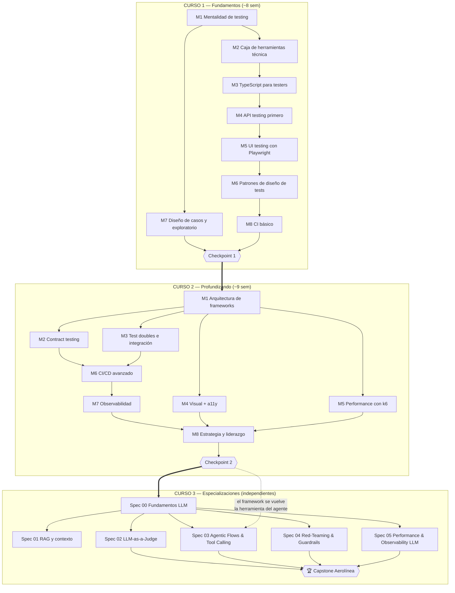
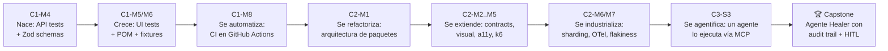

# PROGRAMA.md — Syllabus completo y mapa del programa

## El objetivo en una frase

Al terminar este programa puedes **diseñar, construir, defender en entrevista y liderar** la estrategia de automatización de calidad de una empresa grande de tecnología — incluyendo el testing de sus sistemas de IA y agentes.

---

## Grafo del programa (cómo se conecta todo)

**Lectura del grafo:** las flechas sólidas son prerequisitos. Las especializaciones del Curso 3 solo dependen de Spec 00 entre sí — puedes estudiarlas en cualquier orden o elegir solo algunas. El capstone necesita las specs 02-05.

## El hilo conductor (spine project)

Nada de lo que construyes se tira. Cada módulo refactoriza o extiende el trabajo anterior — así los conceptos de los primeros módulos se **aplican, repiten y profundizan** durante todo el programa.

## Syllabus detallado

### Curso 1 — Fundamentos

| Sem | Módulo | Conceptos clave | Lab (qué construyes) |
|-----|--------|-----------------|----------------------|
| 1 | [M1 — Mentalidad de testing](curso-1-fundamentos/modulo-01-mentalidad-de-testing.md) | Pirámide/trofeo de testing, tipos de testing, riesgo, qué automatizar, costo del bug por fase | Test plan de 1 página de Toolshop priorizado por riesgo |
| 2 | [M2 — Caja de herramientas técnica](curso-1-fundamentos/modulo-02-caja-de-herramientas.md) | HTTP (métodos, status, headers, auth), DevTools, JSON, REST, Git flow de un SDET | Exploración y documentación de la API de Toolshop con curl + DevTools |
| 3 | [M3 — TypeScript para testers](curso-1-fundamentos/modulo-03-typescript-para-testers.md) | Tipos, interfaces, async/await, módulos, npm, lo justo de TS para un SDET | Cliente API tipado mínimo para Toolshop |
| 4 | [M4 — API testing primero](curso-1-fundamentos/modulo-04-api-testing.md) | Playwright APIRequest, Zod schemas, AAA, test independence | **Nace el spine:** suite API con validación de schemas |
| 5 | [M5 — UI testing con Playwright](curso-1-fundamentos/modulo-05-ui-testing-playwright.md) | Locators, auto-waiting, web-first assertions, trace viewer, codegen | Suite UI del flujo crítico de compra |
| 6 | [M6 — Patrones de diseño de tests](curso-1-fundamentos/modulo-06-patrones-de-tests.md) | Page Object Model, fixtures, test data vía API, independencia | Refactor de la suite a POM + fixtures |
| 7 | [M7 — Diseño de casos y exploratorio](curso-1-fundamentos/modulo-07-diseno-de-casos.md) | Equivalence partitioning, boundary values, decision tables, charters, reporte de bugs | Sesión exploratoria + casos formales del checkout |
| 8 | [M8 — CI básico](curso-1-fundamentos/modulo-08-ci-basico.md) | GitHub Actions, triggers, artifacts, reporte HTML | Pipeline que corre la suite en cada push |
| 8 | [✓ Checkpoint 1](curso-1-fundamentos/checkpoint-curso-1.md) | Todo lo anterior, sin guía | Cobertura completa de una feature nueva |

### Curso 2 — Profundizando

| Sem | Módulo | Conceptos clave | Lab (qué construyes) |
|-----|--------|-----------------|----------------------|
| 9 | [M1 — Arquitectura de frameworks](curso-2-profundizando/modulo-01-arquitectura-frameworks.md) | Monorepo, framework-core, custom fixtures/matchers, config multi-ambiente | Refactor del spine a paquetes (eco de la aerolínea) |
| 10 | [M2 — Contract testing](curso-2-profundizando/modulo-02-contract-testing.md) | Consumer-driven contracts, Pact, broker, OpenAPI | Contracts consumer/provider contra la API de Toolshop |
| 11 | [M3 — Test doubles e integración](curso-2-profundizando/modulo-03-test-doubles.md) | Mocks/stubs/fakes, page.route(), Testcontainers, unit vs integration | UI aislada con mocking de red + test con DB en contenedor |
| 12 | [M4 — Visual regression + a11y](curso-2-profundizando/modulo-04-visual-a11y.md) | Snapshots, axe-core, WCAG, cuándo el visual testing vale la pena | Capa visual + a11y como steps reutilizables |
| 13 | [M5 — Performance testing](curso-2-profundizando/modulo-05-performance-k6.md) | k6, smoke/load/stress/soak, percentiles, thresholds | Script k6 del flujo de compra con quality gates |
| 14 | [M6 — CI/CD avanzado](curso-2-profundizando/modulo-06-cicd-avanzado.md) | Sharding, paralelización, flakiness (detección, cuarentena), gates por ambiente | Pipeline con shards + política de retries + reporte de flakiness |
| 15 | [M7 — Observabilidad](curso-2-profundizando/modulo-07-observabilidad.md) | Logs estructurados, métricas, tracing, OpenTelemetry, testing in production | Framework instrumentado con traces OTel |
| 16 | [M8 — Estrategia y liderazgo](curso-2-profundizando/modulo-08-estrategia-liderazgo.md) | Test strategy, DORA, escape rate, shift-left/right, feature flags | Test strategy completa como SDET Lead |
| 17 | [✓ Checkpoint 2](curso-2-profundizando/checkpoint-curso-2.md) | Todo lo anterior | Defensa del framework como en entrevista de system design |

### Curso 3 — Especializaciones (elige tu orden)

| Spec | Módulos | Conceptos clave | Proyecto |
|------|---------|-----------------|----------|
| [00 — Fundamentos LLM](curso-3-especializaciones/spec-00-fundamentos-llm/README.md) *(prerequisito común)* | 2 | Tokens, prompting, temperatura, embeddings, tool use, structured output, no-determinismo | Clasificador de bugs con la API de Anthropic + medición de consistencia |
| [01 — RAG y precisión de contexto](curso-3-especializaciones/spec-01-rag-y-contexto/README.md) | 2 | Chunking, retrieval, RAGAS: context precision/recall, faithfulness, answer relevancy | RAG sobre los docs del spine + evaluación con RAGAS |
| [02 — LLM-as-a-Judge & Metrics](curso-3-especializaciones/spec-02-llm-as-a-judge/README.md) | 2 | Evals deterministas vs model-graded, promptfoo, DeepEval, sesgos del juez, calibración | Suite de evals en CI que falla si las métricas caen |
| [03 — Agentic Flows & Tool Calling](curso-3-especializaciones/spec-03-agentic-flows/README.md) | 3 | Arquitecturas de agentes, LangGraph, MCP, trajectory evals, asserts sobre tool calls | Agente que ejecuta el spine vía MCP y diagnostica fallos |
| [04 — Red-Teaming & Guardrails](curso-3-especializaciones/spec-04-red-teaming-guardrails/README.md) | 2 | Prompt injection, jailbreaks, OWASP LLM Top 10, garak/PyRIT, guardrails | Red-team defensivo del agente propio + guardrails |
| [05 — Performance & Observability LLM](curso-3-especializaciones/spec-05-performance-observability-llm/README.md) | 2 | TTFT, tokens/s, costos, Langfuse, tracing de cadenas, evals en producción | Agente instrumentado con Langfuse + alertas |
| [🏆 Capstone — Aerolínea](curso-3-especializaciones/capstone-aerolinea.md) | 1 | Integra specs 02-05 sobre el spine | Agente Healer con audit trail + human-in-the-loop |

## Plan semanal sugerido (10 h/semana)

| Día | Tiempo | Actividad |
|-----|--------|-----------|
| Día 1 | 1.5 h | 🗺️ Mapa + 📖 Concepto + primera parte del 🔨 Lab |
| Día 2 | 3 h | 🔨 Lab completo (sesión profunda) |
| Día 3 | 3 h | 🎯 Reto (sin mirar el lab) |
| Día 4 | 1.5 h | Terminar reto + ✅ Checklist + commit |
| Día 5 | 1 h | 💬 Preguntas de entrevista en voz alta + 🔗 Conexiones + repaso del mapa |

**Regla de repaso espaciado:** cada 4 módulos, dedica la sesión del Día 5 a re-responder las preguntas de entrevista de los 3 módulos anteriores. Lo que no fluya, se repasa.

## Cómo medir tu progreso

- **Por módulo:** checklist ≥ 80 % + reto terminado + commit en `labs/`.
- **Por curso:** checkpoint completado sin mirar los labs.
- **Global:** al final puedes explicar (y defender) cada decisión del documento `airline-qa-agentic-strategy.md` — y el capstone demuestra que puedes construirlo.
