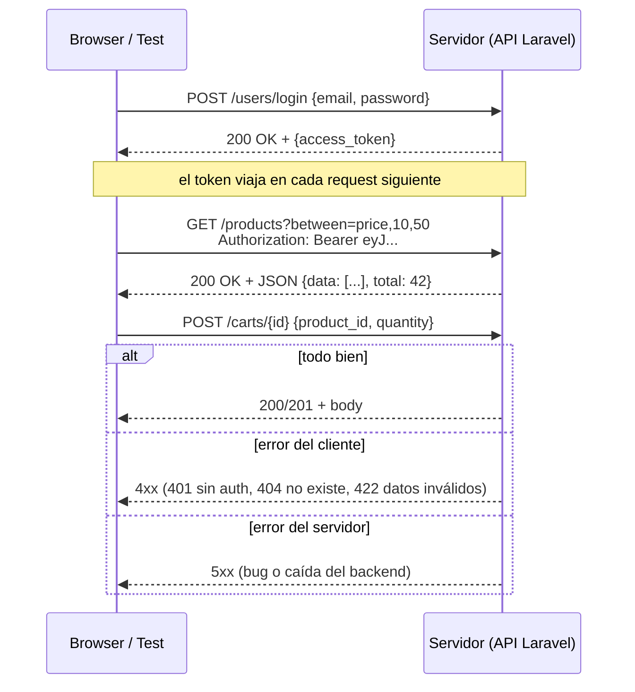
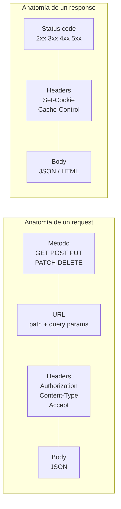

# Módulo 2 — Caja de herramientas técnica

> **Resultado:** la API de Toolshop explorada con curl y DevTools, y 5 endpoints documentados. HTTP deja de ser una caja negra.

## 🗺️ Mapa visual





## 📖 Concepto

### HTTP es EL protocolo de tu carrera

Todo lo que automatizarás — UI, API, contracts, performance — viaja sobre HTTP. Un SDET senior lee un request/response como un médico lee una radiografía.

**Métodos y su semántica** (importa para diseñar tests):

| Método | Para qué | ¿Idempotente? | ¿Safe? |
|--------|----------|---------------|--------|
| GET | Leer | Sí | Sí (no muta estado) |
| POST | Crear / acciones | **No** | No |
| PUT | Reemplazar completo | Sí | No |
| PATCH | Modificar parcial | No garantizado | No |
| DELETE | Borrar | Sí | No |

*Idempotente* = ejecutarlo N veces deja el mismo estado que 1 vez. ¿Por qué le importa a un tester? Porque un retry automático sobre un POST no-idempotente puede crear órdenes duplicadas — bug clásico de producción.

**Status codes que debes leer sin pensar:** `200` OK, `201` creado, `204` sin contenido, `301/302` redirect, `400` request malformado, `401` no autenticado, `403` autenticado pero sin permiso, `404` no existe, `409` conflicto de estado, `422` validación fallida, `429` rate limit, `500` bug del server, `502/503` infraestructura caída. **La distinción 401 vs 403 y 400 vs 422 aparece en entrevistas constantemente.**

**Headers críticos para testing:** `Authorization: Bearer <token>` (auth), `Content-Type: application/json` (qué envío), `Accept` (qué espero), `Set-Cookie`/`Cookie` (sesiones), `Cache-Control` (por qué "no veo mi cambio").

**Auth en APIs modernas:** Toolshop usa **JWT (JSON Web Token)** — el login devuelve un token firmado que se envía en cada request. Un JWT tiene 3 partes separadas por puntos: header.payload.firma (decodificables en [jwt.io](https://jwt.io) — la firma evita alterarlo, no lo encripta: **nunca pongas secretos en un JWT**).

### DevTools: tu microscopio

La pestaña **Network** del browser muestra cada request que la UI hace. Es la herramienta #1 para responder "¿el bug está en el frontend o en el backend?": si la API devuelve datos correctos y la UI muestra mal → frontend; si la API devuelve mal → backend. Esa triada (reproducir → aislar capa → reportar con evidencia) es lo que diferencia un reporte de bug senior de un "no funciona".

### Git para SDETs

Trabajarás con branches y PRs todo el programa. El flujo mínimo: `git switch -c feat/mi-cambio` → commits pequeños con mensaje imperativo → push → PR → review → merge. Lo practicarás en cada lab; en C1-M8 el CI correrá sobre tus PRs.

## 🔨 Lab guiado — Disección de la API de Toolshop

**Paso 0 — Define tu URL base** (vale para todo el programa):

```bash
# Vía local (Docker):
export TOOLSHOP_API=http://localhost:8091
# o vía hospedada:
export TOOLSHOP_API=https://api.practicesoftwaretesting.com
```

**Paso 1 — Swagger primero.** Abre `$TOOLSHOP_API/api/documentation` en el browser. Es la spec OpenAPI de la API: cada endpoint, sus parámetros y schemas. Dedica 15 min a recorrerla. (En C2-M2 esta spec será la base del contract testing.)

**Paso 2 — GET sin auth.**

```bash
curl -s "$TOOLSHOP_API/products?page=1" | python3 -m json.tool | head -40
# Observa: estructura paginada {current_page, data: [...], total}
curl -s "$TOOLSHOP_API/products?between=price,10,50" | python3 -m json.tool | head -20
curl -s -i "$TOOLSHOP_API/products/no-existe" | head -5     # ¿qué status devuelve?
```

La flag `-i` muestra los headers del response. Anota el `Content-Type` y el status de cada caso.

**Paso 3 — Login y captura del token.**

```bash
curl -s -X POST "$TOOLSHOP_API/users/login" \
  -H "Content-Type: application/json" \
  -d '{"email":"customer@practicesoftwaretesting.com","password":"welcome01"}'
# Respuesta: {"access_token":"eyJ...","token_type":"bearer","expires_in":...}

export TOKEN="<pega-aquí-el-access_token>"
```

Pega el token en [jwt.io](https://jwt.io) y mira el payload: ¿qué claims tiene? ¿cuándo expira?

**Paso 4 — Requests autenticados y códigos de error.**

```bash
# Con token → 200
curl -s -i "$TOOLSHOP_API/users/me" -H "Authorization: Bearer $TOKEN" | head -20
# Sin token → ¿401?
curl -s -i "$TOOLSHOP_API/users/me" | head -5
# Cliente intentando endpoint de admin → ¿403?
curl -s -i "$TOOLSHOP_API/users" -H "Authorization: Bearer $TOKEN" | head -5
# Body inválido → ¿422? ¿Qué dice el body del error?
curl -s -X POST "$TOOLSHOP_API/users/register" -H "Content-Type: application/json" -d '{"email":"no-es-email"}' | python3 -m json.tool
```

Acabas de ver en vivo la diferencia 401/403/422. **Esto es oro de entrevista.**

**Paso 5 — La UI por dentro.** Abre la UI de Toolshop con DevTools → Network (filtro: Fetch/XHR). Busca "pliers" en la app y observa el request que dispara. Haz clic derecho sobre él → *Copy as cURL* y ejecútalo en tu terminal. **Lección clave: la UI es solo un cliente más de la API** — todo lo que la UI hace, tú puedes hacerlo (y probarlo) directo contra la API.

**Paso 6 — Documenta 5 endpoints.** Crea `labs/toolshop-tests/docs/api-notes.md` con una tabla por endpoint: método, path, auth requerida, parámetros, status codes observados (el feliz Y los de error), y estructura del response. Estos apuntes son el insumo directo del M3 y M4.

**Paso 7 — Commit** (`C1-M2: exploración y documentación de la API de Toolshop`).

## 🎯 Reto

Sin mirar el lab: usando solo curl, completa el flujo **crear carrito → agregar 2 productos → leer el carrito y verificar el total**. Pistas: `POST /carts` te da un id; el resto está en Swagger. Documenta la secuencia completa (requests + responses) en `api-notes.md`. Pregunta extra: ¿el carrito requiere auth? ¿Qué implica eso para los tests del M4?

## ✅ Checklist de dominio

- [ ] Puedo explicar idempotencia y por qué un retry sobre POST es peligroso
- [ ] Distingo 401 vs 403 y 400 vs 422 con ejemplos
- [ ] Sé leer un JWT y sé qué NO debe contener
- [ ] Puedo usar DevTools → Network para aislar si un bug es de frontend o backend
- [ ] Puedo copiar un request del browser como cURL y modificarlo
- [ ] Entiendo que la UI es un cliente más de la API (y las implicaciones para la pirámide)

## 💬 Preguntas de entrevista

1. *"What's the difference between 401 and 403? And between 400 and 422?"*
2. *"What does idempotency mean and why does it matter for API design and testing?"*
3. *"A user reports 'the page is broken'. Walk me through your triage using DevTools."*
4. *"What's inside a JWT? Can the client tamper with it? Can it read it?"*
5. *"Why would you test business logic at the API layer instead of through the UI?"*

## 🔗 Conexiones

- **Refuerza:** la decisión de capas del [M1](modulo-01-mentalidad-de-testing.md) — ahora viste POR QUÉ la capa API es más estable y rápida.
- **Se reutiliza en:** M3 (el cliente tipado envuelve estos mismos endpoints), M4 (cada curl se convierte en un test), C2-M2 (la spec OpenAPI de Swagger se vuelve contrato verificable), C2-M5 (k6 dispara estos endpoints bajo carga), C3-S0 (las APIs de LLMs son… HTTP + JSON, exactamente esto).
