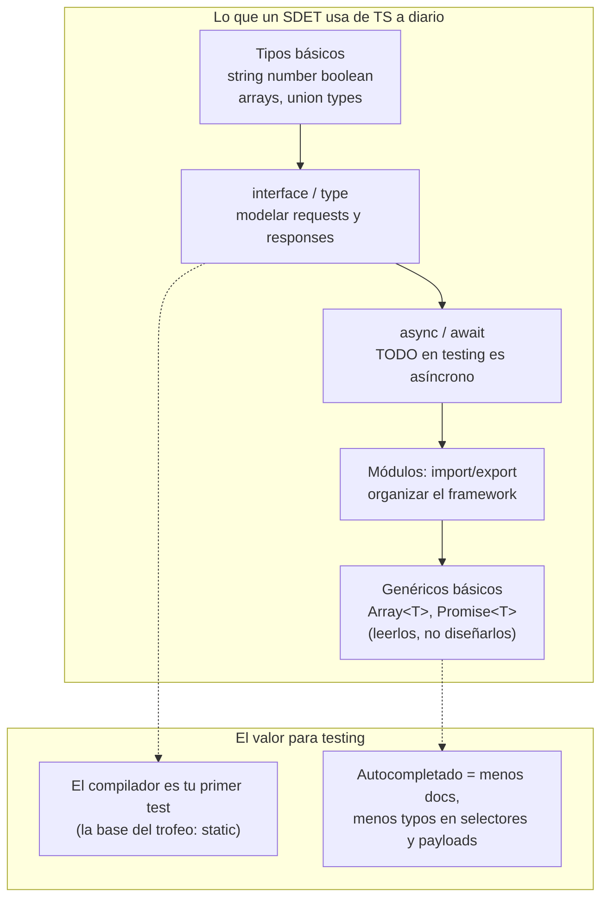

# Módulo 3 — TypeScript para testers

> **Resultado:** un cliente API tipado para Toolshop, escrito por ti, que será la base del spine project. Solo el TypeScript que un SDET usa a diario — nada de teoría de tipos avanzada.

## 🗺️ Mapa visual



## 📖 Concepto

### Por qué TypeScript y no JavaScript

TypeScript = JavaScript + tipos verificados al compilar. Para un SDET, los tipos son **la capa "static" del trofeo de testing** (M1): una categoría completa de bugs (typos, campos que no existen, null inesperado) muere antes de ejecutar nada. Cuando tu framework tenga 200 archivos (C2-M1), renombrar un campo sin tipos sería ruleta rusa; con tipos, el compilador te lista cada lugar a corregir.

### Lo esencial en 6 bloques

**1. Tipos y modelado de datos.** Modela los JSON que viste en M2:

```typescript
interface Product {
  id: string;
  name: string;
  price: number;
  in_stock?: boolean;          // ? = opcional
}
type PaymentMethod = 'cash-on-delivery' | 'credit-card' | 'bank-transfer';  // union: solo estos valores
```

**2. async/await.** Cada acción de testing (request HTTP, clic, espera) devuelve una `Promise<T>` — un valor futuro. `await` pausa hasta que llega. **El bug #1 del principiante: olvidar un `await`**, que produce tests que "pasan" sin verificar nada (la promesa nunca se resolvió antes del assert).

```typescript
const res = await fetch(`${baseUrl}/products`);   // sin await: res sería una Promise, no la respuesta
const body = await res.json();
```

**3. Funciones tipadas.** Parámetros y retorno explícitos en las funciones públicas de tu framework:

```typescript
async function login(email: string, password: string): Promise<string> { /* devuelve el token */ }
```

**4. Módulos.** `export` lo que otros archivos usan, `import` lo que necesitas. Tu framework será decenas de módulos pequeños, no un archivo gigante.

**5. Genéricos (solo leerlos).** `Promise<Product[]>` = "promesa de un array de productos". Playwright y Zod los usan en todas sus firmas; necesitas leerlos con fluidez, no diseñar los tuyos.

**6. El tooling.** `npm` instala dependencias (`package.json` las declara, `package-lock.json` las congela), `tsconfig.json` configura el compilador, `npx tsx archivo.ts` ejecuta TS directamente.

## 🔨 Lab guiado — Cliente API tipado para Toolshop

**Paso 1 — Inicializa el proyecto** (este directorio se convertirá en el spine en M4):

```bash
cd ~/Documents/sdet-mastery/labs/toolshop-tests
npm init -y
npm install -D typescript tsx @types/node
npx tsc --init --target es2022 --module nodenext --strict true --outDir dist
```

`--strict true` no es negociable: sin strict, TypeScript permite `null` silencioso y pierdes la mitad del valor.

**Paso 2 — Modela los tipos a partir de tus notas del M2.** Crea `src/types.ts`:

```typescript
export interface Product {
  id: string;
  name: string;
  description: string;
  price: number;
  is_location_offer: boolean;
  is_rental: boolean;
}

export interface PaginatedResponse<T> {
  current_page: number;
  data: T[];
  total: number;
  per_page: number;
}

export interface LoginResponse {
  access_token: string;
  token_type: string;
  expires_in: number;
}
```

Verifica cada campo contra tus `api-notes.md` — modelar lo que la API REALMENTE devuelve (no lo que crees) es el hábito que en C2-M2 se llama "honrar el contrato".

**Paso 3 — El cliente.** Crea `src/api-client.ts`:

```typescript
import type { LoginResponse, PaginatedResponse, Product } from './types.js';

export class ToolshopClient {
  private token: string | null = null;

  constructor(private readonly baseUrl: string) {}

  async login(email: string, password: string): Promise<void> {
    const res = await fetch(`${this.baseUrl}/users/login`, {
      method: 'POST',
      headers: { 'Content-Type': 'application/json' },
      body: JSON.stringify({ email, password }),
    });
    if (!res.ok) throw new Error(`Login falló: ${res.status} ${await res.text()}`);
    const body = (await res.json()) as LoginResponse;
    this.token = body.access_token;
  }

  async getProducts(params: { page?: number; betweenPrice?: [number, number] } = {}): Promise<PaginatedResponse<Product>> {
    const url = new URL(`${this.baseUrl}/products`);
    if (params.page) url.searchParams.set('page', String(params.page));
    if (params.betweenPrice) url.searchParams.set('between', `price,${params.betweenPrice[0]},${params.betweenPrice[1]}`);
    const res = await fetch(url, { headers: this.authHeaders() });
    if (!res.ok) throw new Error(`GET /products falló: ${res.status}`);
    return (await res.json()) as PaginatedResponse<Product>;
  }

  private authHeaders(): Record<string, string> {
    return this.token ? { Authorization: `Bearer ${this.token}` } : {};
  }
}
```

Lee el código con calma: encapsula el token (estado privado), tipa cada retorno y falla ruidosamente en errores. Son los mismos principios de un Page Object (M6), aplicados a HTTP.

**Paso 4 — Pruébalo.** Crea `src/demo.ts`:

```typescript
import { ToolshopClient } from './api-client.js';

const client = new ToolshopClient(process.env.TOOLSHOP_API ?? 'http://localhost:8091');
const productos = await client.getProducts({ betweenPrice: [10, 50] });
console.log(`Total en rango: ${productos.total}`);
console.log(productos.data.slice(0, 3).map((p) => `${p.name}: $${p.price}`));
```

```bash
npx tsx src/demo.ts
```

**Paso 5 — Siente el valor de los tipos.** Haz estos experimentos y observa que el ERROR APARECE ANTES DE EJECUTAR:

1. Escribe `productos.dta` → el editor lo subraya al instante.
2. Cambia `price: number` a `price: string` en `types.ts` → mira cuántos lugares protesta el compilador (`npx tsc --noEmit` los lista todos).
3. Quita el `await` de `client.getProducts(...)` → ¿qué dice el compilador cuando accedes a `.total`?

**Paso 6 — Commit** (`C1-M3: cliente API tipado de Toolshop`).

## 🎯 Reto

Extiende el cliente con tres métodos, sin mirar el lab: `register(usuario)` (modela tú el tipo del payload desde Swagger), `createCart(): Promise<string>` y `addToCart(cartId, productId, quantity)`. Luego escribe `src/demo-cart.ts` que ejecute el flujo completo del reto del M2 — pero ahora tipado. Si el compilador no protesta ni una vez al primer intento, no estás usando suficiente el sistema de tipos.

## ✅ Checklist de dominio

- [ ] Puedo modelar un response JSON como interface sin mirar ejemplos
- [ ] Puedo explicar qué pasa si olvido un `await` y por qué es peligroso en tests
- [ ] Entiendo union types y para qué sirven en test data
- [ ] Puedo leer `Promise<PaginatedResponse<Product>>` con fluidez
- [ ] Sé qué hace `strict: true` y por qué un framework de tests lo necesita
- [ ] Entiendo la diferencia entre error de compilación y error de runtime

## 💬 Preguntas de entrevista

1. *"Why TypeScript for a test framework instead of plain JavaScript?"*
2. *"What happens if you forget an `await` in a test? Why is that dangerous?"* (test que pasa sin verificar = false negative, conecta con M1)
3. *"How do types act as a first layer of testing?"* (trofeo: static)
4. *"What's the difference between `interface` and `type` in TypeScript?"* (casi intercambiables; interface es extensible, type permite uniones)
5. *"How would you model an API response that can be either a success payload or an error payload?"* (union discriminada)

## 🔗 Conexiones

- **Refuerza:** los endpoints y códigos del [M2](modulo-02-caja-de-herramientas.md) ahora viven en código; la capa "static" del trofeo del [M1](modulo-01-mentalidad-de-testing.md) dejó de ser teoría.
- **Se reutiliza en:** M4 reemplaza el `as Type` (confianza ciega) por validación real con Zod; M6 aplica esta misma encapsulación a Page Objects; C2-M1 convierte estos tipos en el paquete `shared-types` del monorepo — exactamente como en la arquitectura de la aerolínea.
