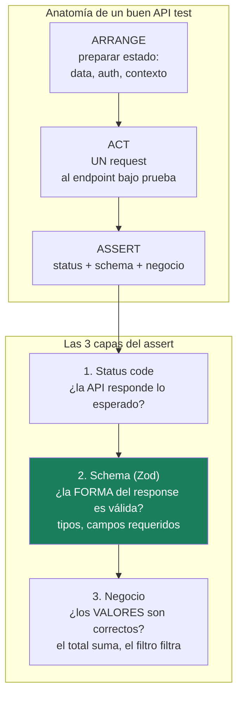
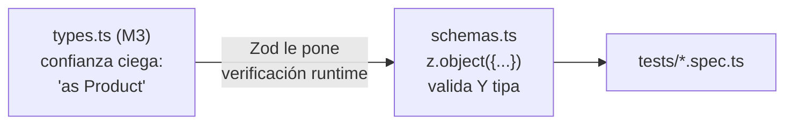

# Módulo 4 — API testing primero

> **Resultado:** 🌱 **nace el spine project** — una suite de API tests con Playwright + Zod que validará schemas, status codes y lógica de negocio de Toolshop. Esta suite crecerá durante TODO el programa.

## 🗺️ Mapa visual





## 📖 Concepto

### Por qué Playwright para API testing

Playwright trae `APIRequestContext`: un cliente HTTP integrado al test runner. Ventaja estratégica sobre tener Postman/Jest aparte: **un solo runner, un solo reporte, una sola config** para API y UI — y en M6 los tests de UI usarán requests API para preparar data. Es la decisión del stack de la aerolínea ("API entre capas: Playwright APIRequest + Zod") y la práctica dominante en la industria.

### El test runner: conceptos núcleo

- `test('nombre', async ({ request }) => {...})` — cada test recibe **fixtures** (aquí `request`, un APIRequestContext limpio). Las fixtures son EL mecanismo de Playwright; en M6 crearás las tuyas.
- `expect(valor).toBe(...)` / `expect(res).toBeOK()` — assertions.
- Los tests **corren en paralelo por defecto** → cada test debe ser independiente (no asumir orden ni estado compartido). Esto te obliga desde el día 1 al hábito que salva suites enteras.

### Zod: del tipo "decorativo" al contrato verificado

En M3 escribiste `(await res.json()) as Product` — un **cast**: le juras al compilador que el JSON tiene esa forma, sin verificar nada. Si la API cambia `price` a string, tu test no se entera. Zod invierte eso: defines el schema una vez, y `schema.parse(json)` **valida en runtime Y deriva el tipo estático**:

```typescript
import { z } from 'zod';

export const ProductSchema = z.object({
  id: z.string(),
  name: z.string(),
  price: z.number().positive(),
  is_rental: z.boolean(),
});
export type Product = z.infer<typeof ProductSchema>;   // el tipo sale DEL schema
```

Si la API rompe la forma, `parse()` lanza un error con el detalle exacto del campo que cambió. Acabas de construir un **detector de regresiones de contrato** — la semilla conceptual del contract testing formal (C2-M2).

### AAA: la estructura de todo test

**Arrange** (preparar), **Act** (UNA acción), **Assert** (verificar). Un test que hace login + busca + agrega al carrito + paga y "assertea" por el camino no es un test: son cuatro, y cuando falle no sabrás cuál. Regla práctica: si el nombre del test necesita la palabra "y", probablemente son dos tests.

## 🔨 Lab guiado — La suite API del spine

**Paso 1 — Instala Playwright sobre el proyecto del M3:**

```bash
cd ~/Documents/sdet-mastery/labs/toolshop-tests
npm install -D @playwright/test zod
npx playwright install chromium
```

**Paso 2 — Configura.** Crea `playwright.config.ts`:

```typescript
import { defineConfig } from '@playwright/test';

export default defineConfig({
  testDir: './tests',
  use: {
    baseURL: process.env.TOOLSHOP_API ?? 'http://localhost:8091',
  },
  reporter: [['html'], ['list']],
});
```

**Paso 3 — Migra los tipos del M3 a schemas Zod.** Crea `src/schemas.ts` con `ProductSchema`, `PaginatedProductsSchema` y `LoginResponseSchema` (usa tus `types.ts` y `api-notes.md` como referencia; deriva los tipos con `z.infer`). Ejemplo del paginado:

```typescript
export const PaginatedProductsSchema = z.object({
  current_page: z.number().int(),
  data: z.array(ProductSchema),
  total: z.number().int(),
  per_page: z.number().int(),
});
```

**Paso 4 — Primer test con las 3 capas de assert.** Crea `tests/api/products.spec.ts`:

```typescript
import { test, expect } from '@playwright/test';
import { PaginatedProductsSchema } from '../../src/schemas.js';

test.describe('GET /products', () => {
  test('devuelve la primera página con schema válido', async ({ request }) => {
    const res = await request.get('/products');                 // Act
    expect(res.status()).toBe(200);                             // Assert 1: status
    const body = PaginatedProductsSchema.parse(await res.json()); // Assert 2: schema
    expect(body.data.length).toBeGreaterThan(0);                // Assert 3: negocio
    expect(body.current_page).toBe(1);
  });

  test('filtra por rango de precio', async ({ request }) => {
    const res = await request.get('/products?between=price,10,50');
    expect(res.status()).toBe(200);
    const body = PaginatedProductsSchema.parse(await res.json());
    for (const p of body.data) {
      expect(p.price).toBeGreaterThanOrEqual(10);   // ¿el filtro FILTRA?
      expect(p.price).toBeLessThanOrEqual(50);
    }
  });

  test('producto inexistente devuelve 404', async ({ request }) => {
    const res = await request.get('/products/id-que-no-existe');
    expect(res.status()).toBe(404);
  });
});
```

```bash
npx playwright test
npx playwright show-report   # mira el reporte HTML
```

**Paso 5 — Tests de auth (los casos del M2, ahora automatizados).** Crea `tests/api/auth.spec.ts` con cuatro tests: login válido devuelve token con schema correcto; login con password errónea devuelve 401; `GET /users/me` sin token devuelve 401; `GET /users/me` con token devuelve el perfil del customer. Para el último necesitas encadenar login → request autenticado:

```typescript
test('GET /users/me con token devuelve el perfil', async ({ request }) => {
  const login = await request.post('/users/login', {
    data: { email: 'customer@practicesoftwaretesting.com', password: 'welcome01' },
  });
  const { access_token } = LoginResponseSchema.parse(await login.json());   // Arrange
  const res = await request.get('/users/me', {
    headers: { Authorization: `Bearer ${access_token}` },                   // Act
  });
  expect(res.status()).toBe(200);                                           // Assert
  expect((await res.json()).email).toBe('customer@practicesoftwaretesting.com');
});
```

¿Notas que el login se repetirá en cada test autenticado? **Aguanta la incomodidad**: en M6 las fixtures eliminan esa duplicación. Sentir el dolor antes de conocer la cura es parte del diseño del curso.

**Paso 6 — Rompe el contrato a propósito.** En `ProductSchema` cambia `price: z.number()` por `z.string()` y corre la suite. Lee con calma el error de Zod: te dice el path exacto del campo inválido. Eso verás el día que el backend rompa el contrato de verdad. Revierte el cambio.

**Paso 7 — Commit** (`C1-M4: suite API con Playwright + Zod (nace el spine)`).

## 🎯 Reto

Automatiza el flujo de carrito que hiciste con curl en el M2, como suite `tests/api/cart.spec.ts`:

1. `POST /carts` crea un carrito (assert: 201 y schema del response).
2. Agregar un producto refleja la cantidad correcta al leer el carrito.
3. Agregar el MISMO producto dos veces: ¿suma cantidades o duplica líneas? (descúbrelo y assertea el comportamiento real).
4. Un `product_id` inexistente: ¿qué devuelve la API? ¿Es razonable? Si crees que es un bug, documéntalo en `docs/api-notes.md` (en M7 aprenderás a reportarlo formalmente).

Restricciones: cada test independiente (crea SU propio carrito), schemas Zod para cada response nuevo, cero `as`.

## ✅ Checklist de dominio

- [ ] Puedo explicar las 3 capas de assert (status, schema, negocio) y qué bug detecta cada una
- [ ] Entiendo la diferencia entre un cast de TS y una validación Zod en runtime
- [ ] Escribo tests AAA con una sola acción bajo prueba
- [ ] Mis tests corren en paralelo sin pisarse (independencia real)
- [ ] Puedo leer un error de Zod y localizar el campo roto en segundos
- [ ] Sé por qué probar la API antes que la UI (estabilidad, velocidad, contratos)

## 💬 Preguntas de entrevista

1. *"How do you validate an API response beyond the status code?"*
2. *"Your API tests pass but the schema changed and broke a mobile client. How would you have caught it?"* (puente directo a contract testing, C2-M2)
3. *"How do you keep API tests independent when they need shared state like a logged-in user?"*
4. *"What's the AAA pattern and why does 'one act per test' matter for debugging?"*
5. *"Where would you test that a price filter works: UI or API? Why?"*

## 🔗 Conexiones

- **Refuerza:** los endpoints y errores del [M2](modulo-02-caja-de-herramientas.md) ahora son tests ejecutables; los tipos del [M3](modulo-03-typescript-para-testers.md) evolucionaron a schemas con validación real; la estrategia "API primero" del [M1](modulo-01-mentalidad-de-testing.md) se materializó.
- **Se reutiliza en:** M5 añade la capa UI sobre el mismo runner; M6 convierte el login repetido en fixture y usa estos requests para preparar data de tests UI; M8 corre esta suite en CI; C2-M2 formaliza los schemas como contratos Pact; C3-S3 expone esta suite como herramienta MCP para que un agente la ejecute.
