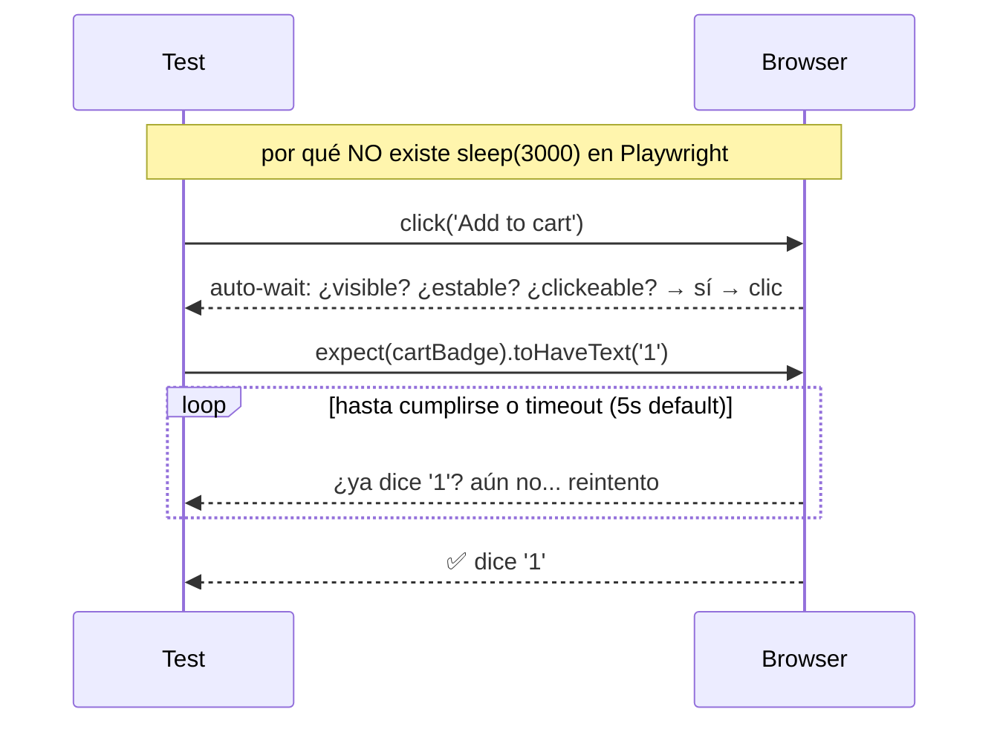

# Módulo 5 — UI testing con Playwright

> **Resultado:** la suite UI del flujo crítico de compra de Toolshop (búsqueda → carrito → checkout), con locators robustos y cero esperas manuales. El spine ahora cubre API + UI.

## 🗺️ Mapa visual

```mermaid
flowchart TB
    subgraph "Cómo Playwright ejecuta un paso UI"
        L["Locator<br/>getByRole('button', {name:'Add to cart'})"] --> AW["Auto-waiting<br/>espera: visible, estable,<br/>habilitado, sin overlay"]
        AW --> ACT["Acción<br/>click / fill / selectOption"]
        ACT --> WFA["Web-first assertion<br/>expect(locator).toBeVisible()<br/>REINTENTA hasta timeout"]
    end
    subgraph "Jerarquía de locators (de mejor a peor)"
        R1["1. getByRole — rol accesible + nombre"] --> R2["2. getByLabel / getByPlaceholder — formularios"]
        R2 --> R3["3. getByText — contenido visible"]
        R3 --> R4["4. getByTestId — data-test estable"]
        R4 --> R5["5. CSS / XPath — último recurso ⚠️"]
    end
```





## 📖 Concepto

### Auto-waiting: el fin del `sleep()`

La causa #1 histórica de flakiness en UI testing son las esperas: la app tarda 800 ms y el test esperó 500, o esperó 5 s fijos y desperdició 4.2. Playwright elimina la espera manual con dos mecanismos:

1. **Actionability checks**: antes de cada acción, espera automáticamente a que el elemento esté visible, estable (no animándose), habilitado y no tapado.
2. **Web-first assertions**: `expect(locator).toHaveText(...)` no evalúa una vez — **reintenta hasta que se cumpla o venza el timeout**.

Regla de oro del módulo: **si escribes `waitForTimeout()`, estás encubriendo un problema, no resolviéndolo.** (Hay excepciones legítimas; sabrás reconocerlas en C2-M6 cuando midas flakiness.)

### Locators: prueba como el usuario percibe

Un locator es una **receta para encontrar un elemento, evaluada en el momento de uso** (no una referencia que se vuelve obsoleta). La jerarquía del mapa no es estética — es estratégica:

- `getByRole('button', { name: 'Add to cart' })` usa el **árbol de accesibilidad**: lo que un lector de pantalla "ve". Si el dev cambia el CSS o reestructura los divs, el test sobrevive; solo se rompe si cambia lo que el usuario percibe — que es exactamente cuando DEBE romperse.
- `getByTestId` (Toolshop usa atributos `data-test`; configúralo) es el plan B estable cuando no hay rol/texto razonable.
- CSS profundo (`div.row > div:nth-child(2) span`) se rompe con cualquier refactor visual: tests frágiles, mantenimiento eterno. En la estrategia de la aerolínea, los selectores son lo ÚNICO que el agente Healer puede auto-reparar — porque son el punto de fragilidad conocido. Tu trabajo hoy es minimizar esa fragilidad.

### Las herramientas de diagnóstico (tu superpoder de productividad)

- **UI Mode** (`npx playwright test --ui`): corre tests con time-travel — ves cada paso, su DOM y su consola.
- **Trace viewer** (`npx playwright show-trace`): la "caja negra del avión" de un test fallido — screenshots, DOM, network y consola de cada paso. En CI será tu única evidencia (M8).
- **Codegen** (`npx playwright codegen`): graba clics y genera código. Úsalo para DESCUBRIR locators, nunca para producir tests finales (genera código sin estructura).

## 🔨 Lab guiado — El flujo crítico de compra

Según tu test plan del M1, el flujo de mayor riesgo es búsqueda → carrito → checkout. Eso automatizas hoy.

**Paso 1 — Configura el proyecto UI junto al API.** En `playwright.config.ts` separa dos *projects* (así `npx playwright test --project=ui` corre solo UI):

```typescript
import { defineConfig, devices } from '@playwright/test';

export default defineConfig({
  testDir: './tests',
  use: { testIdAttribute: 'data-test' },     // Toolshop marca elementos con data-test
  reporter: [['html'], ['list']],
  projects: [
    {
      name: 'api',
      testMatch: /api\/.*\.spec\.ts/,
      use: { baseURL: process.env.TOOLSHOP_API ?? 'http://localhost:8091' },
    },
    {
      name: 'ui',
      testMatch: /ui\/.*\.spec\.ts/,
      use: {
        baseURL: process.env.TOOLSHOP_UI ?? 'http://localhost:4200',
        ...devices['Desktop Chrome'],
        trace: 'retain-on-failure',          // la caja negra, solo cuando falla
      },
    },
  ],
});
```

**Paso 2 — Descubre los locators con codegen:**

```bash
npx playwright codegen http://localhost:4200
```

Busca un producto, agrégalo al carrito. Observa qué locators genera — y cuáles puedes mejorar con la jerarquía del mapa. Inspecciona también el DOM: encontrarás atributos `data-test` por toda la app (`search-query`, `search-submit`, `add-to-cart`…).

**Paso 3 — Primer test UI.** Crea `tests/ui/search.spec.ts`:

```typescript
import { test, expect } from '@playwright/test';

test.describe('Búsqueda de productos', () => {
  test('buscar "pliers" muestra solo resultados relevantes', async ({ page }) => {
    await page.goto('/');
    await page.getByTestId('search-query').fill('pliers');
    await page.getByTestId('search-submit').click();

    const cards = page.locator('a.card');
    await expect(cards.first()).toBeVisible();          // web-first: espera a que carguen
    const nombres = await cards.locator('[data-test^="product-name"]').allTextContents();
    expect(nombres.length).toBeGreaterThan(0);
    for (const n of nombres) expect(n.toLowerCase()).toContain('pliers');
  });

  test('búsqueda sin resultados muestra mensaje vacío', async ({ page }) => {
    await page.goto('/');
    await page.getByTestId('search-query').fill('zzzznoexiste');
    await page.getByTestId('search-submit').click();
    await expect(page.getByText('There are no products found.')).toBeVisible();
  });
});
```

Córrelo en UI Mode y recorre los pasos con el time-travel:

```bash
npx playwright test --project=ui --ui
```

**Paso 4 — El flujo de carrito.** Crea `tests/ui/cart.spec.ts`: ir al detalle de un producto → `add-to-cart` → assert del badge del nav (`cart-quantity`) → abrir el carrito → assert de nombre, cantidad y precio del line item. Usa solo locators de la jerarquía 1-4. Si un assert de texto falla por render asíncrono, recuerda: web-first assertion sobre el locator, no `expect(await locator.textContent())` (esa forma evalúa UNA vez y pierde el retry).

**Paso 5 — Checkout con login.** Crea `tests/ui/checkout.spec.ts` — el E2E de revenue de tu test plan: producto → carrito → *Proceed* → login con `customer@practicesoftwaretesting.com` / `welcome01` → dirección de facturación → método de pago *Cash on Delivery* → confirmar → assert del mensaje de éxito de la orden. Es largo: está bien, es EL E2E que justifica su costo (M1). Vas a repetir el login que ya hiciste… otra vez. El dolor crece — M6 lo cura.

**Paso 6 — Autopsia de un fallo.** Rompe un locator a propósito (cambia `search-query` por `search-querry`), corre sin UI Mode y abre el trace del fallo:

```bash
npx playwright test --project=ui tests/ui/search.spec.ts || npx playwright show-trace test-results/*/trace.zip
```

Aprende a leer el trace AHORA, con un fallo que entiendes — en CI será tu única ventana al fallo.

**Paso 7 — Commit** (`C1-M5: suite UI del flujo crítico de compra`).

## 🎯 Reto

Automatiza el **registro de un usuario nuevo** end-to-end: formulario de registro → login con ese usuario → assert de la cuenta creada. Problema a resolver tú: el email debe ser único en cada ejecución (pista: `Date.now()`), porque el test correrá miles de veces. Restricciones: cero `waitForTimeout`, cero selectores CSS posicionales, y el test debe pasar 3 veces seguidas (`--repeat-each=3`) — tu primera prueba de no-flakiness.

## ✅ Checklist de dominio

- [ ] Puedo explicar auto-waiting y web-first assertions, y por qué eliminan el `sleep()`
- [ ] Aplico la jerarquía de locators y sé justificar por qué `getByRole` > CSS
- [ ] Distingo `expect(locator).toHaveText()` de `expect(await locator.textContent()).toBe()` y sé cuál reintenta
- [ ] Sé leer un trace de Playwright para diagnosticar un fallo sin re-ejecutar
- [ ] Sé usar codegen como descubridor de locators, no como generador de tests
- [ ] Mi suite UI pasa con `--repeat-each=3`

## 💬 Preguntas de entrevista

1. *"How does Playwright avoid the flakiness that plagued Selenium suites?"* (auto-waiting + web-first assertions + locators evaluados al uso)
2. *"What's your locator strategy and why?"*
3. *"A test fails only in CI, never locally. What's your debugging process?"* (trace viewer; profundiza en C2-M6)
4. *"When is a UI test the wrong tool?"* (lógica verificable por API/unit — conecta con M1/M4)
5. *"How do you make tests repeatable when they create data, like user registration?"*

## 🔗 Conexiones

- **Refuerza:** la decisión de capas del [M1](modulo-01-mentalidad-de-testing.md) (solo UN E2E de checkout); el DOM y DevTools del [M2](modulo-02-caja-de-herramientas.md); async/await del [M3](modulo-03-typescript-para-testers.md) en cada línea.
- **Se reutiliza en:** M6 refactoriza estos tests a Page Objects y elimina el login repetido; M7 deriva casos formales del checkout; C2-M4 añade snapshots visuales y a11y sobre estas mismas páginas; C2-M6 mide la flakiness de esta suite; el Healer del 🏆 capstone repara exactamente el tipo de locator que hoy aprendiste a escribir bien.
