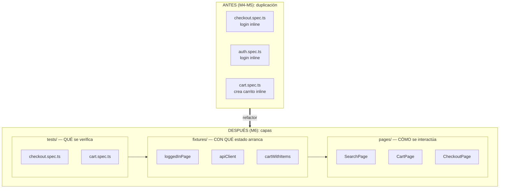
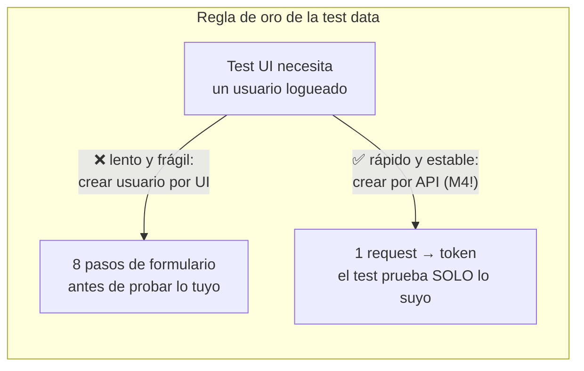

# Módulo 6 — Patrones de diseño de tests

> **Resultado:** el spine refactorizado a Page Objects + fixtures personalizadas, con test data creada vía API. El login duplicado muere hoy. Tu suite empieza a parecer un framework.

## 🗺️ Mapa visual





## 📖 Concepto

### Page Object Model: encapsular el CÓMO

Un **Page Object** es una clase que representa una página (o componente) y expone **acciones de negocio**, escondiendo los locators:

```typescript
// pages/search.page.ts
import type { Page, Locator } from '@playwright/test';

export class SearchPage {
  readonly query: Locator;
  readonly submit: Locator;
  readonly productCards: Locator;

  constructor(private readonly page: Page) {
    this.query = page.getByTestId('search-query');
    this.submit = page.getByTestId('search-submit');
    this.productCards = page.locator('a.card');
  }

  async goto() { await this.page.goto('/'); }

  async search(termino: string) {
    await this.query.fill(termino);
    await this.submit.click();
  }
}
```

El valor no es estético: cuando el locator `search-query` cambie, lo arreglas en UN archivo y 40 tests se curan a la vez. **En la arquitectura de la aerolínea, `pages/` es "Page Objects estrictos (lint enforced)"** — la disciplina que hoy adoptas por convención, allá se hace regla de máquina.

Dos reglas que separan un POM senior de uno amateur:

1. **Los asserts viven en el test, no en el page object.** El page object dice CÓMO interactuar; el test dice QUÉ debe ser cierto. (Excepción aceptada: asserts de navegación dentro de acciones compuestas.)
2. **Métodos = lenguaje de negocio.** `checkoutPage.payWith('cash-on-delivery')`, no `clickThirdDropdownOption()`.

### Fixtures: el sistema de inyección de Playwright

Una fixture define **cómo se construye (y destruye) una pieza de contexto** que los tests piden por nombre:

```typescript
// fixtures/index.ts
import { test as base } from '@playwright/test';
import { SearchPage } from '../pages/search.page.js';

type Fixtures = {
  searchPage: SearchPage;
  customerToken: string;
};

export const test = base.extend<Fixtures>({
  searchPage: async ({ page }, use) => {
    await use(new SearchPage(page));
  },
  customerToken: async ({ request }, use) => {
    const res = await request.post(`${process.env.TOOLSHOP_API ?? 'http://localhost:8091'}/users/login`, {
      data: { email: 'customer@practicesoftwaretesting.com', password: 'welcome01' },
    });
    const { access_token } = await res.json();
    await use(access_token);            // antes de use() = setup; después = teardown
  },
});
export { expect } from '@playwright/test';
```

Los tests importan `test` desde TUS fixtures y piden lo que necesitan: `test('...', async ({ searchPage, customerToken }) => ...)`. Ventajas sobre `beforeEach`: composición (una fixture usa otra), pereza (solo se construye si el test la pide) y teardown garantizado en el mismo lugar del setup.

### Test data: el problema que mata suites

Los tres pecados: depender de data que "ya está" en el ambiente (muere cuando alguien la borra), crear data por UI (lento y frágil), y compartir data entre tests (rompe el paralelismo). La doctrina:

> **Crea por API lo que pruebas por UI. Cada test crea SU data o usa data inmutable de seed. Nada asume orden de ejecución.**

Aquí los módulos se encadenan: tu cliente API del M3-M4 se convierte en la **fábrica de test data** de tus tests UI. Y este problema, escalado, es el "Test Data Service" y el "data harvester" de la aerolínea — la misma idea con infraestructura.

## 🔨 Lab guiado — El gran refactor

**Paso 1 — Estructura.** Crea las carpetas `pages/` y `fixtures/` dentro de `labs/toolshop-tests/`:

```
labs/toolshop-tests/
├── fixtures/index.ts
├── pages/{search,product,cart,checkout,login}.page.ts
├── src/{api-client,schemas}.ts
└── tests/{api,ui}/...
```

**Paso 2 — Page Objects.** Escribe `SearchPage` (arriba), y luego tú mismo: `ProductPage` (con `addToCart()`), `CartPage` (con `proceedToCheckout()` y locators de line items), `LoginPage` (`login(email, password)`) y `CheckoutPage` (`fillBillingAddress(...)`, `payWith(...)`, `confirm()`). Mantén las dos reglas: sin asserts, lenguaje de negocio.

**Paso 3 — Fixtures de páginas + auth.** Crea `fixtures/index.ts` como arriba, agregando una fixture por page object. Añade la fixture estrella, `loggedInPage`: una página donde el usuario YA está logueado — haciendo el login por API y siguiendo el patrón que la app use para la sesión (Toolshop guarda el token en localStorage; inyectarlo con `page.addInitScript` evita pasar por el formulario). Si la inyección se complica, el fallback pragmático: fixture que hace login por UI UNA vez con `LoginPage` — lo importante es que el test ya no lo repita.

**Paso 4 — Refactoriza los specs del M5.** Reescribe `search.spec.ts`, `cart.spec.ts` y `checkout.spec.ts` usando fixtures y page objects. El checkout debe quedar legible como guion de negocio:

```typescript
import { test, expect } from '../../fixtures/index.js';

test('compra completa con cash on delivery', async ({ loggedInPage, productPage, cartPage, checkoutPage }) => {
  await productPage.gotoFirstProduct();
  await productPage.addToCart();
  await cartPage.goto();
  await cartPage.proceedToCheckout();
  await checkoutPage.fillBillingAddress(DIRECCION_DEMO);
  await checkoutPage.payWith('cash-on-delivery');
  await checkoutPage.confirm();
  await expect(checkoutPage.confirmationMessage).toBeVisible();
});
```

Corre TODA la suite y compárala con el M5: misma cobertura, menos líneas, cero logins duplicados.

**Paso 5 — Test data por API.** Refactoriza el test de carrito UI para que el carrito con productos se cree **vía API** (fixture `cartWithItems` que usa tu `ToolshopClient`) y la UI solo verifique que se muestra bien. Siente la diferencia de velocidad.

**Paso 6 — Verifica el paralelismo.** `npx playwright test --workers=4 --repeat-each=2`. Si algo se pisa (data compartida, usuario duplicado), arréglalo ahora: es la deuda más cara de pagar después.

**Paso 7 — Commit** (`C1-M6: refactor a POM + fixtures + test data por API`).

## 🎯 Reto

Tu reto del M5 (registro de usuario) sigue escrito "a mano". Refactorízalo con un patrón nuevo: una **factory de test data** `src/factories/user.factory.ts` que genere usuarios únicos válidos (`buildUser(overrides?)`), una fixture `freshUser` que registre el usuario por API y lo entregue al test, y el spec reducido a: login por UI con `freshUser` + assert del perfil. Pregunta de diseño que debes responder en un comentario del PR: ¿la factory debe borrar el usuario en teardown? ¿Qué pasa si no lo hace, mil ejecuciones después? (Bienvenido al problema de la higiene de test data.)

## ✅ Checklist de dominio

- [ ] Puedo explicar qué encapsula un Page Object y dónde viven los asserts (y por qué)
- [ ] Puedo escribir una fixture con setup y teardown y explicar su ventaja sobre beforeEach
- [ ] Aplico "crea por API lo que pruebas por UI" y puedo justificarlo con números de velocidad
- [ ] Mis tests corren con `--workers=4 --repeat-each=2` sin pisarse
- [ ] Puedo explicar los tres pecados de la test data y cómo los evita mi suite
- [ ] Distingo cuándo un patrón ayuda y cuándo es sobre-ingeniería (un POM para una página de 1 botón no paga su costo)

## 💬 Preguntas de entrevista

1. *"Walk me through your test framework architecture. Why Page Objects?"*
2. *"Where should assertions live: in the page object or the test? Defend your answer."*
3. *"How do you manage test data in a suite that runs in parallel across environments?"*
4. *"Your suite takes 40 minutes because every UI test logs in through the form. Fix it."*
5. *"What are Playwright fixtures and how do they compare to setup/teardown hooks?"*

## 🔗 Conexiones

- **Refuerza:** la encapsulación del [M3](modulo-03-typescript-para-testers.md) (el POM es al DOM lo que el ToolshopClient a HTTP); el cliente API del [M4](modulo-04-api-testing.md) ascendió a fábrica de test data; los locators del [M5](modulo-05-ui-testing-playwright.md) ahora tienen UNA casa.
- **Se reutiliza en:** M8 corre esta estructura en CI; C2-M1 la eleva a monorepo con `framework-core` y fixtures compartidas; C2-M3 inyecta mocks vía fixtures; la estructura `pages/` + `flows/` + `fixtures/` de la aerolínea es EXACTAMENTE esto, endurecido con lint rules — y el capstone 🏆 hace que un agente repare locators DENTRO de esta estructura sin tocar asserts (por eso importa tanto dónde viven).
