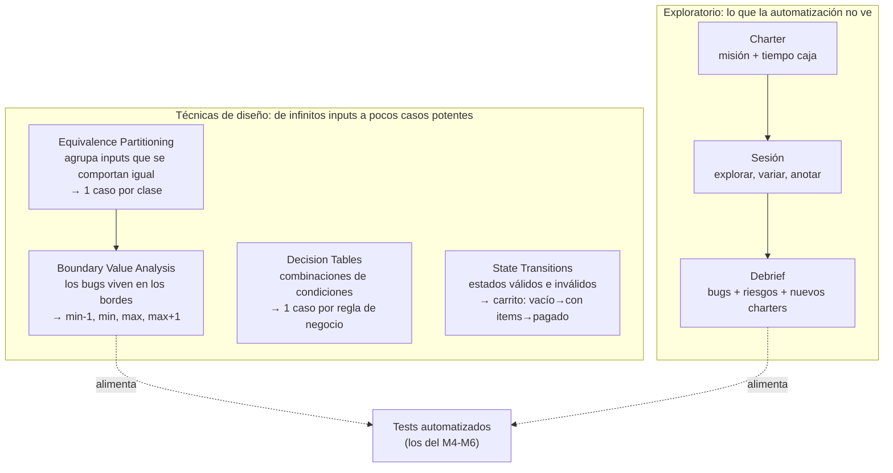
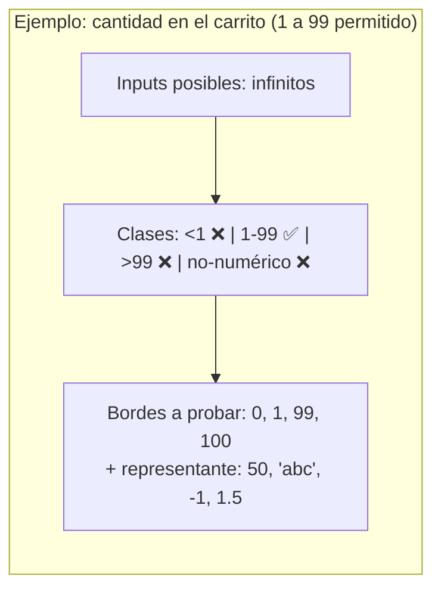

# Módulo 7 — Diseño de casos y testing exploratorio

> **Resultado:** casos de prueba derivados con técnicas formales (equivalence partitioning, boundary values, decision tables) sobre el checkout, una sesión exploratoria con charter, y tu primer reporte de bug profesional.

## 🗺️ Mapa visual





## 📖 Concepto

### Por qué técnicas formales (cuando ya sabes automatizar)

Hasta ahora elegiste QUÉ probar por intuición. La intuición de un senior es buena — pero no es **defendible ni completa**. Las técnicas formales convierten "se me ocurrieron estos casos" en "derivé estos casos y puedo demostrar que cubren las clases de comportamiento". En entrevista, la diferencia entre contestar con 4 casos sueltos y derivar sistemáticamente 12 con sus clases es la diferencia entre mid y senior.

**Equivalence Partitioning (EP):** divide los inputs en clases donde el sistema *debería* comportarse igual; un representante por clase basta. Si cantidad 5 funciona y cantidad 50 funciona, probar 6,7,8… no agrega información.

**Boundary Value Analysis (BVA):** los bugs se concentran en los límites (`>=` vs `>`, off-by-one). Para cada borde: el valor del borde y sus vecinos. EP+BVA juntas: representante de cada clase + todos los bordes.

**Decision Tables:** cuando el comportamiento depende de COMBINACIONES de condiciones (tipo de usuario × método de pago × monto), una tabla con una columna por regla garantiza que no olvidas combinaciones — y cada columna es un caso de test directo.

**State Transition:** modela estados y transiciones válidas/inválidas. ¿Se puede pagar un carrito vacío? ¿Editar una orden ya pagada? Las transiciones INVÁLIDAS son donde viven los bugs de seguridad y de negocio.

### Testing exploratorio: disciplina, no improvisación

Exploratorio ≠ "clickear a ver qué pasa". Es **aprendizaje simultáneo al diseño y la ejecución de tests**, estructurado en sesiones:

- **Charter:** misión de una frase. *"Explorar el manejo de cantidades extremas en el carrito para descubrir problemas de validación"*.
- **Time-box:** 45-90 min, sin distracciones.
- **Notas en vivo:** qué probaste, qué viste, qué te sorprendió.
- **Debrief:** bugs encontrados, riesgos nuevos, charters derivados, qué merece automatizarse.

La automatización verifica lo CONOCIDO; el exploratorio descubre lo DESCONOCIDO. Un SDET senior defiende presupuesto para ambos. (Y en C3-S4 verás al exploratorio renacer con esteroides: el red-teaming de LLMs es testing exploratorio adversarial.)

### El reporte de bug que un dev agradece

Título que resume el problema en una línea. Pasos mínimos de reproducción. Resultado actual vs esperado. **Evidencia** (screenshot, response de la API, trace). Severidad (impacto) separada de prioridad (urgencia). Y el sello senior: **aislamiento de capa** — "el endpoint devuelve X, por lo tanto es backend" (tu skill del M2).

## 🔨 Lab guiado — Diseño formal + sesión exploratoria sobre el checkout

**Paso 1 — EP + BVA sobre el formulario de registro.** Crea `labs/toolshop-tests/docs/test-design.md`. Toma 3 campos del registro de Toolshop (email, password, fecha de nacimiento) y deriva la tabla:

```markdown
## Registro — EP + BVA
| Campo | Clases válidas | Clases inválidas | Bordes |
|-------|----------------|------------------|--------|
| email | formato válido | sin @, vacío, >255 chars, duplicado | 255/256 chars |
| password | cumple política | corta, vacía, solo espacios | longitud mín-1, mín |
| fecha nacimiento | edad válida | futura, <límite de edad, formato inválido | exactamente 18 años hoy |
```

Descubre la política real probando contra la API (`POST /users/register` — los 422 del M2 te dicen las reglas). **La spec es lo que el sistema hace, documentado; tus clases deben salir de evidencia, no de suposición.**

**Paso 2 — Automatiza los casos derivados.** Crea `tests/api/register-validation.spec.ts` usando un patrón nuevo — **tests parametrizados**:

```typescript
import { test, expect } from '@playwright/test';
import { buildUser } from '../../src/factories/user.factory.js';

const casosInvalidos = [
  { caso: 'email sin arroba', overrides: { email: 'sin-arroba.com' }, campoEsperado: 'email' },
  { caso: 'password de 1 caracter', overrides: { password: 'a' }, campoEsperado: 'password' },
  { caso: 'fecha de nacimiento futura', overrides: { dob: '2030-01-01' }, campoEsperado: 'dob' },
  // ... completa con TU tabla
];

for (const { caso, overrides, campoEsperado } of casosInvalidos) {
  test(`registro rechaza: ${caso}`, async ({ request }) => {
    const res = await request.post('/users/register', { data: buildUser(overrides) });
    expect(res.status()).toBe(422);
    expect(await res.json()).toHaveProperty(campoEsperado);
  });
}
```

Tu factory del reto M6 ahora paga dividendos: `buildUser(overrides)` hace trivial generar variantes. Así se ve el refuerzo entre módulos.

**Paso 3 — Decision table del checkout.** En `test-design.md`, modela: usuario (invitado/registrado) × carrito (vacío/con items) × pago (3 métodos). ¿Qué combinaciones permiten completar la orden? Marca cuáles ya cubre tu E2E del M6 y cuáles NO valen la pena automatizar (justifica con riesgo, M1).

**Paso 4 — Sesión exploratoria (60 min, time-box real).** Charter: *"Explorar el carrito y checkout con inputs extremos y secuencias inusuales para descubrir problemas de validación y estado"*. Ideas de variación: cantidades (0, negativas, 9999, decimales, texto), editar el carrito en dos pestañas a la vez, volver atrás a mitad del checkout, manipular el request de `POST /carts` con un precio alterado (¿la API confía en el cliente? — pregunta de seguridad seria). Notas en vivo en `docs/exploratory-session-01.md`.

**Paso 5 — Reporta el mejor hallazgo.** Toolshop tiene bugs reales sembrados. Escribe tu mejor hallazgo como issue formal en `docs/bugs/BUG-001.md` con la estructura del concepto: título, pasos, actual vs esperado, evidencia (incluye el response de la API si aislaste capa), severidad/prioridad.

**Paso 6 — Debrief y cierre del ciclo.** Al final de `exploratory-session-01.md`: 3 riesgos nuevos descubiertos, 1-2 casos que MERECEN automatizarse (agrégalos a la suite si son de API — baratos), y el charter que harías la próxima vez.

**Paso 7 — Commit** (`C1-M7: diseño formal de casos + sesión exploratoria + BUG-001`).

## 🎯 Reto

La decision table tiene una fila polémica: **invitado + carrito con items + checkout**. Investiga a fondo cómo Toolshop maneja al usuario no registrado en el checkout (¿lo bloquea? ¿lo invita a registrarse? ¿pierde el carrito al loguearse?). Deriva con state transitions el diagrama de estados del carrito a través del login, encuentra al menos una transición dudosa, y decide: ¿bug, mejora de UX, o comportamiento aceptable? Documenta tu veredicto con evidencia. (Esta clase de ambigüedad — "¿es bug o es spec?" — es pan de cada día de un senior.)

## ✅ Checklist de dominio

- [ ] Puedo derivar clases de equivalencia y bordes para cualquier campo en una entrevista, en vivo
- [ ] Puedo construir una decision table y convertir cada columna en un caso
- [ ] Sé estructurar una sesión exploratoria con charter, time-box y debrief
- [ ] Mi reporte de bug aísla la capa y trae evidencia, no solo síntomas
- [ ] Distingo severidad de prioridad con un ejemplo (typo en home: severidad baja, prioridad alta)
- [ ] Sé decidir qué hallazgos exploratorios merecen automatizarse y cuáles no

## 💬 Preguntas de entrevista

1. *"Design test cases for a field that accepts ages 18 to 65."* (la clásica — respóndela con EP+BVA en voz alta, cronometrado)
2. *"How do you test a discount engine where the rules depend on user tier, cart total and coupon type?"* (decision table)
3. *"What's the role of exploratory testing in a heavily automated team?"*
4. *"Tell me about the best bug you ever found. How did you find it and how did you report it?"* (tu BUG-001 es tu historia)
5. *"Severity vs priority: give me an example where they diverge."*

## 🔗 Conexiones

- **Refuerza:** el riesgo del [M1](modulo-01-mentalidad-de-testing.md) ahora decide QUÉ columnas de la decision table se automatizan; la factory del [M6](modulo-06-patrones-de-tests.md) potencia los tests parametrizados; el aislamiento de capa del [M2](modulo-02-caja-de-herramientas.md) es el corazón del reporte de bug.
- **Se reutiliza en:** el checkpoint exige derivar casos formales para una feature nueva; en C2-M8 estas técnicas suben de altitud (de diseñar casos a diseñar estrategias); en C3-S2 los "casos" se convierten en datasets de evaluación de LLMs (mismas clases de equivalencia, nuevo dominio); en C3-S4 el exploratorio adversarial se automatiza con garak/PyRIT.
