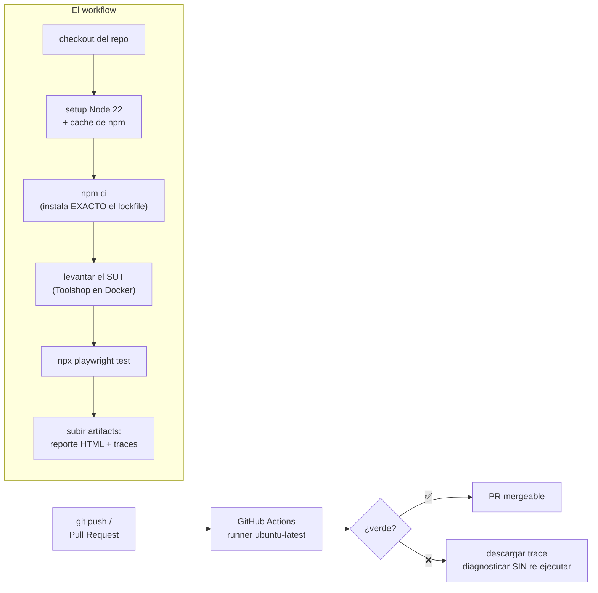
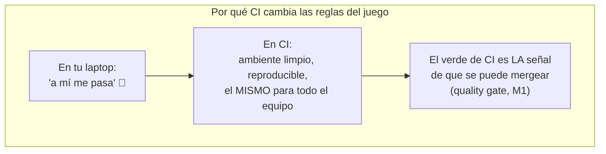

# Módulo 8 — CI básico

> **Resultado:** tu suite completa (API + UI) corre automáticamente en GitHub Actions en cada push, con reporte HTML y traces descargables. El spine deja de depender de tu laptop.

## 🗺️ Mapa visual





## 📖 Concepto

### CI: la suite que corre sin que nadie se acuerde

**Continuous Integration** = cada cambio se integra y verifica automáticamente. Para un SDET, CI es donde tu trabajo cobra valor real: una suite que solo corre en tu laptop protege a UNA persona; en CI protege a todo el equipo, en cada cambio, para siempre. Conceptos que debes manejar con precisión:

- **Workflow** (`.github/workflows/*.yml`): pipeline declarado en YAML. **Triggers** (`on:`): qué lo dispara — `push`, `pull_request`, `schedule` (cron), `workflow_dispatch` (botón manual).
- **Job**: conjunto de steps en un runner (máquina limpia). Los jobs corren en paralelo salvo `needs:`.
- **`npm ci` vs `npm install`**: `ci` instala EXACTAMENTE el `package-lock.json` y falla si no cuadra — builds reproducibles. En CI, siempre `npm ci`.
- **Artifacts**: archivos que sobreviven al runner (reportes, traces). Sin artifacts, un fallo en CI es una caja negra.
- **Secrets**: credenciales fuera del YAML (`${{ secrets.X }}`). Tokens en texto plano en un workflow = incidente de seguridad.

### El SUT en CI: la decisión de arquitectura

Tu suite necesita una Toolshop contra la cual correr. Opciones, con su trade-off:

| Opción | Pro | Contra |
|--------|-----|--------|
| **Levantar el SUT en el runner (Docker)** ✅ hoy | Aislado, reproducible, sin dependencias externas | Minutos de arranque; el runner necesita recursos |
| Apuntar a un ambiente desplegado (dev/staging) | Realista, prueba integración real | Compartido: data sucia, caídas ajenas = rojos falsos |
| Instancia hospedada pública | Cero setup | Sin control: rate limits, data impredecible |

En empresas reales coexisten: PR → SUT efímero; nightly → staging. Es exactamente la matriz de gates por ambiente de la aerolínea (`gate-dev`, `gate-uat`…) que diseñarás en C2-M6.

### El contrato social del CI

1. **Rojo se atiende ya** — una suite roja que se ignora entrena al equipo a ignorarla (y un false negative pasará caminando).
2. **Verde debe ser confiable** — cada flaky erosiona la señal (C2-M6 ataca esto con datos).
3. **Rápido o ignorado** — feedback >15 min en PR = devs que mergean sin esperar.

## 🔨 Lab guiado — El pipeline del spine

**Paso 0 — Sube el repo a GitHub** (si no lo has hecho): crea el repo `sdet-mastery` en tu cuenta y `git remote add origin ... && git push -u origin main`. Hacerlo público convierte todo tu progreso en portfolio.

**Paso 1 — El workflow.** Crea `.github/workflows/tests.yml` en la RAÍZ del repo (GitHub Actions solo mira ahí):

```yaml
name: Toolshop test suite

on:
  push:
    branches: [main]
  pull_request:
  workflow_dispatch:

jobs:
  test:
    runs-on: ubuntu-latest
    timeout-minutes: 25
    defaults:
      run:
        working-directory: labs/toolshop-tests
    steps:
      - uses: actions/checkout@v4

      - name: Levantar Toolshop (SUT)
        working-directory: .
        run: |
          git clone --depth 1 https://github.com/testsmith-io/practice-software-testing.git /tmp/sut
          cd /tmp/sut && docker compose up -d
          # esperar a que la API responda (máx ~3 min)
          timeout 180 bash -c 'until curl -sf http://localhost:8091/status; do sleep 5; done'
          docker compose exec -T laravel-api php artisan migrate:fresh --seed

      - uses: actions/setup-node@v4
        with:
          node-version: 22
          cache: npm
          cache-dependency-path: labs/toolshop-tests/package-lock.json

      - run: npm ci
      - run: npx playwright install --with-deps chromium

      - name: Correr la suite
        run: npx playwright test
        env:
          TOOLSHOP_API: http://localhost:8091
          TOOLSHOP_UI: http://localhost:4200

      - name: Subir reporte y traces
        if: always()                       # también (sobre todo) cuando falla
        uses: actions/upload-artifact@v4
        with:
          name: playwright-report
          path: labs/toolshop-tests/playwright-report/
          retention-days: 14
```

Detalles que importan (y que se preguntan): `timeout-minutes` evita runners colgados facturando; el health-check con `until curl` evita el clásico "los tests corrieron antes de que el SUT arrancara"; `if: always()` en los artifacts — el reporte importa MÁS cuando falla; el cache de npm ahorra minutos por run. Nota: si el endpoint `/status` no existe en la versión actual del SUT, usa cualquier GET barato (p. ej. `/brands`) como health-check.

**Paso 2 — Push y observa.** `git push` y ve a la pestaña *Actions* del repo. Lee el log de cada step. Primer run: el arranque del SUT tardará unos minutos — anota la duración total (la optimizarás en C2-M6).

**Paso 3 — Provoca un fallo y diagnostica SOLO con artifacts.** Rompe un locator, push, espera el rojo. Descarga el artifact `playwright-report`, ábrelo (`npx playwright show-report <carpeta>`) y navega hasta el trace del test fallido. **Diagnostica sin correr nada localmente** — esta habilidad es la diferencia entre "no sé, en CI falla" y un senior. Revierte y push del verde.

**Paso 4 — El flujo de PR completo.** Crea una branch (`git switch -c feat/ci-badge`), agrega el badge del workflow al `README.md` del repo, abre un PR y observa el check correr ANTES del merge. En *Settings → Branches*, crea una branch protection rule para `main` que requiera el check verde: acabas de construir tu primer **quality gate** real.

**Paso 5 — Commit/merge del PR** (`C1-M8: pipeline de CI con quality gate`).

## 🎯 Reto

El equipo pide dos mejoras y un análisis:

1. **Smoke vs full:** etiqueta tus 3-4 tests más críticos con `@smoke` (tag de Playwright en el título o `tag:`) y modifica el workflow: en `pull_request` corre solo smoke (`--grep @smoke`); el push a `main` corre todo. Mide cuánto feedback time ahorraste en PR.
2. **Nightly:** agrega un trigger `schedule` que corra la suite completa cada noche a las 2 a.m. UTC.
3. **Análisis:** escribe en `docs/ci-notes.md` qué problema NUEVO introduce el modelo smoke-en-PR (pista: ¿qué pasa si un cambio rompe un test de regresión no-smoke y se mergea?) y cómo lo mitigarías. No hay respuesta única; hay trade-offs defendidos.

## ✅ Checklist de dominio

- [ ] Puedo escribir un workflow de GitHub Actions desde cero sin plantilla
- [ ] Entiendo `npm ci` vs `npm install` y por qué CI exige el primero
- [ ] Puedo diagnosticar un fallo de CI solo con artifacts (sin re-ejecutar local)
- [ ] Sé levantar un SUT efímero en el runner y esperar su health-check
- [ ] Configuré una branch protection rule y puedo explicar qué es un quality gate
- [ ] Conozco los trade-offs entre SUT efímero, staging compartido y servicio hospedado

## 💬 Preguntas de entrevista

1. *"Walk me through your ideal CI pipeline for a test suite. What runs on PR vs nightly, and why?"*
2. *"A test fails in CI but passes locally. Give me five hypotheses, ordered by likelihood."* (timing/recursos del runner, data del ambiente, paralelismo, versión de browser, variables de entorno)
3. *"How do you keep PR feedback under 10 minutes as the suite grows?"* (smoke + sharding — profundizas en C2-M6)
4. *"What's a quality gate? Who should be able to bypass it and when?"*
5. *"Why `npm ci` instead of `npm install` in CI?"*

## 🔗 Conexiones

- **Refuerza:** el quality gate materializa la decisión de "¿podemos deployar?" del [M1](modulo-01-mentalidad-de-testing.md); los traces del [M5](modulo-05-ui-testing-playwright.md) ahora son tu única evidencia remota; los tags smoke salen de tu matriz de riesgo del M1.
- **Se reutiliza en:** Checkpoint 1 exige PR con CI verde; C2-M6 industrializa esto (sharding, flakiness, gates por ambiente — la matriz `gate-dev`→`gate-uat` de la aerolínea); C2-M7 instrumenta estos runs con OpenTelemetry; C3-S2 mete evals de LLM en este mismo pipeline; el capstone 🏆 hace que el agente Healer abra PRs que pasan por ESTE gate — el framework manda, el agente sirve.
