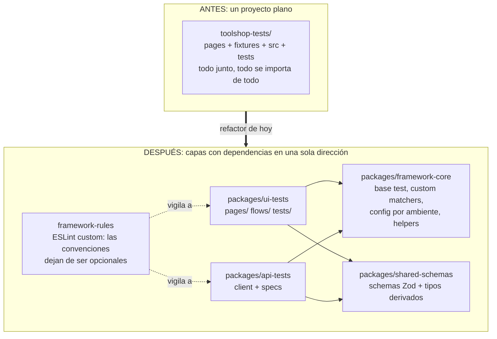
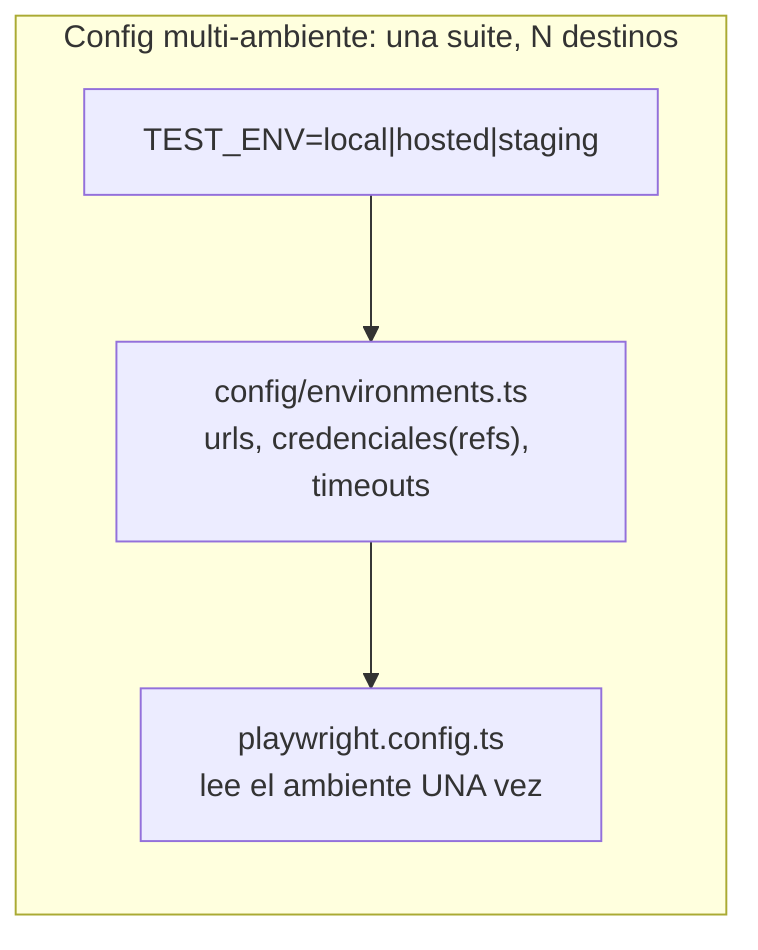

# Módulo 1 — Arquitectura de frameworks

> **Resultado:** el spine refactorizado a una arquitectura de paquetes con `framework-core`, config multi-ambiente, custom matchers y reglas de lint que protegen las convenciones — el eco directo del monorepo de la aerolínea.

## 🗺️ Mapa visual





## 📖 Concepto

### Cuándo un framework necesita arquitectura (y cuándo no)

Tu spine funciona. ¿Por qué tocarlo? Porque las fuerzas que rompen frameworks no son técnicas sino de escala: 3 SDETs → 20 devs escribiendo tests → 400 specs. Sin capas, cada quien importa lo que quiere, copia patrones a medias y en un año el framework es un pantano que nadie quiere tocar. La arquitectura existe para que **el camino correcto sea el camino fácil**. Pero ojo — la respuesta senior incluye el otro lado: para un proyecto de 30 tests y 2 personas, esta estructura es sobre-ingeniería. Sabrás justificar AMBAS decisiones.

### Las piezas de un framework de escala

**1. `framework-core`: la base compartida.** Todo lo que hoy está repetido o regado: la fixture base (`test` extendido), helpers de auth, lectura de config. Regla de dependencias en UNA dirección: los paquetes de tests dependen de core; core no conoce a nadie. Así un cambio en un page object jamás rompe el core.

**2. Config multi-ambiente.** Tu suite hoy lee `TOOLSHOP_API` suelto. A escala necesitas ambientes nombrados (la aerolínea tiene 5: dev→prod) con TODO resuelto por nombre:

```typescript
// framework-core/src/environments.ts
const ENVIRONMENTS = {
  local:  { apiUrl: 'http://localhost:8091', uiUrl: 'http://localhost:4200' },
  hosted: { apiUrl: 'https://api.practicesoftwaretesting.com', uiUrl: 'https://practicesoftwaretesting.com' },
} as const;

export function getEnv() {
  const name = (process.env.TEST_ENV ?? 'local') as keyof typeof ENVIRONMENTS;
  const env = ENVIRONMENTS[name];
  if (!env) throw new Error(`Ambiente desconocido: ${name}. Válidos: ${Object.keys(ENVIRONMENTS).join(', ')}`);
  return env;
}
```

Las credenciales NUNCA viven aquí: viven en variables de entorno/secrets (M8 del C1); la config solo referencia sus nombres.

**3. Custom matchers: el vocabulario de asserts del dominio.** En vez de repetir tres expects en cada test de API:

```typescript
// framework-core/src/matchers.ts
import { expect as base } from '@playwright/test';
import type { APIResponse } from '@playwright/test';
import type { z } from 'zod';

export const expect = base.extend({
  async toMatchSchema(res: APIResponse, schema: z.ZodTypeAny) {
    const body = await res.json();
    const result = schema.safeParse(body);
    return {
      pass: result.success,
      message: () => result.success
        ? 'Response cumple el schema'
        : `Schema violado:\n${JSON.stringify(result.error.issues, null, 2)}`,
    };
  },
});
// uso: await expect(res).toMatchSchema(ProductSchema)
```

**4. Reglas como código (la idea más importante del módulo).** Las convenciones que en C1 eran disciplina personal ("asserts en tests, no en pages") se convierten en **lint rules que fallan el build**. Eso es el `framework-rules` de la aerolínea, y la razón por la que su principio #1 es *"el framework manda, el agente sirve"*: una regla que una máquina verifica no depende de la memoria ni de la buena voluntad — ni de un humano apurado, ni de un LLM alucinando. **Estás construyendo hoy las barandillas que en el capstone contendrán a un agente.**

## 🔨 Lab guiado — El gran refactor arquitectónico

**Paso 1 — npm workspaces.** Reorganiza `labs/toolshop-tests/` (mueve con `git mv` para preservar historia):

```
labs/toolshop-tests/
├── package.json                  # raíz: workspaces
├── playwright.config.ts
├── packages/
│   ├── framework-core/src/{base-test.ts, environments.ts, matchers.ts}
│   ├── shared-schemas/src/schemas.ts
│   ├── api-tests/{src/api-client.ts, tests/}
│   └── ui-tests/{pages/, flows/, tests/}
└── docs/
```

En el `package.json` raíz: `"workspaces": ["packages/*"]`. Cada paquete tiene su `package.json` con nombre con scope (`@toolshop/framework-core`) y los tests importan `from '@toolshop/framework-core'` en vez de rutas relativas de tres niveles.

**Paso 2 — `framework-core`.** Mueve fixtures → `base-test.ts` (exporta el `test` extendido y el `expect` con matchers), crea `environments.ts` (arriba) y haz que `playwright.config.ts` lea `getEnv()` UNA vez. Verifica: `TEST_ENV=hosted npx playwright test --project=api` corre contra la instancia pública sin tocar código.

**Paso 3 — `flows/`: el nivel sobre los page objects.** La aerolínea separa `pages/` (una página) de `flows/` (viaje multi-página reutilizable). Crea `flows/purchase.flow.ts` que orquesta product→cart→checkout usando los page objects, y reescribe el E2E de checkout sobre el flow. Los flows tampoco assertean: orquestan.

**Paso 4 — Custom matchers.** Implementa `toMatchSchema` y refactoriza 3 tests de API para usarlo. Escribe un segundo matcher tuyo: `toBeWithinRange(min, max)` para los tests del filtro de precios.

**Paso 5 — Reglas como código.** Instala ESLint con `typescript-eslint` y configura en `eslint.config.js` reglas que protegen tus convenciones con `no-restricted-syntax` y `no-restricted-imports`:

- ❌ `page.waitForTimeout` en cualquier lugar (`"selector": "CallExpression[callee.property.name='waitForTimeout']"`).
- ❌ importar `@playwright/test` directamente en los specs (deben usar `@toolshop/framework-core` — así el matcher y las fixtures llegan siempre): regla `no-restricted-imports` aplicada solo a `packages/*/tests/**`.
- ❌ `expect(` dentro de `pages/**` (asserts fuera de page objects).

Corre `npx eslint .` y arregla lo que proteste. Agrega el lint como step del workflow de CI ANTES de los tests — las reglas ahora son un gate.

**Paso 6 — Prueba la arquitectura.** El test definitivo de un refactor: agrega un test nuevo (cualquier endpoint no cubierto) y cuenta cuántos archivos tocaste. Debería ser UNO (el spec). Si tocaste más, la arquitectura tiene fricción — ajústala.

**Paso 7 — Commit/PR** (`C2-M1: arquitectura de paquetes + config multi-ambiente + reglas como código`).

## 🎯 Reto

Un equipo nuevo quiere escribir tests de la API de admin de Toolshop (productos CRUD) usando tu framework. Simúlalo tú: crea `packages/admin-tests/` desde cero usando SOLO lo que el framework expone. Mientras lo haces, anota cada fricción que encuentres (¿faltó un helper de auth de admin en core? ¿la config no contemplaba roles?) y arregla el framework — no el paquete — para eliminarla. Entrega: el paquete nuevo + un `docs/framework-feedback.md` con las fricciones y cómo las resolviste. (Ese ciclo — usar tu propio framework como cliente y limarlo — es el trabajo real de un SDET senior de plataforma.)

## ✅ Checklist de dominio

- [ ] Puedo dibujar la arquitectura de mi framework y justificar cada capa y cada flecha de dependencia
- [ ] Puedo explicar cuándo esta arquitectura es sobre-ingeniería
- [ ] Sé configurar npm workspaces y paquetes con scope
- [ ] Escribí un custom matcher y sé cuándo amerita crear uno
- [ ] Convertí al menos 3 convenciones en lint rules que fallan el build
- [ ] Mi suite corre contra dos ambientes cambiando UNA variable

## 💬 Preguntas de entrevista

1. *"Design a test framework for an org with 10 teams and 3 environments. Walk me through the architecture."* (LA pregunta de system design de SDET — el checkpoint del curso es exactamente esto)
2. *"How do you enforce conventions in a test framework beyond code review?"*
3. *"How do you handle environment-specific configuration and secrets?"*
4. *"A team complains your framework is too rigid. How do you respond?"* (fricción como feedback, no como insulto — tu reto de hoy)
5. *"What's the difference between a page object and a flow, and why separate them?"*

## 🔗 Conexiones

- **Refuerza:** la encapsulación de [C1-M6](../curso-1-fundamentos/modulo-06-patrones-de-tests.md) sube de altitud (de clases a paquetes); los schemas de [C1-M4](../curso-1-fundamentos/modulo-04-api-testing.md) ahora son un paquete compartido — el `shared-types` de la aerolínea; el CI de [C1-M8](../curso-1-fundamentos/modulo-08-ci-basico.md) gana su segundo gate (lint).
- **Se reutiliza en:** TODOS los módulos siguientes extienden esta arquitectura (contracts en M2, doubles en M3, visual/a11y en M4, k6 en M5); las lint rules son la semilla de las barandillas del capstone 🏆 — donde un agente podrá tocar `pages/` pero el lint+CI le impedirá tocar asserts. El principio "el framework manda, el agente sirve" nace HOY.
