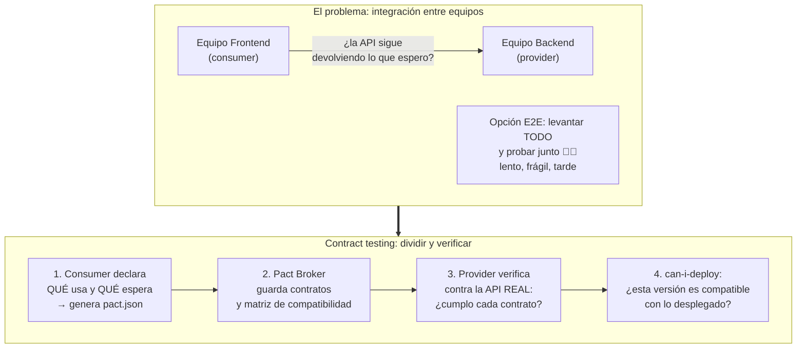
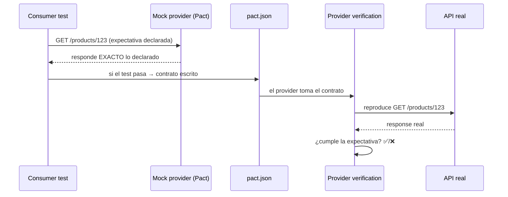

# Módulo 2 — Contract testing

> **Resultado:** contratos Pact entre un consumer (tu cliente TypeScript, jugando el rol del frontend) y el provider (la API de Toolshop), verificados en ambos lados. Entenderás por qué los E2E no escalan entre equipos y qué los reemplaza.

## 🗺️ Mapa visual





## 📖 Concepto

### El hueco que tus schemas Zod no cubren

En C1-M4 detectas cambios de contrato… **cuando tu suite corre contra la API ya desplegada** — tarde, y solo del lado consumer. El contract testing invierte la responsabilidad: el **backend se entera de que va a romper a un consumidor ANTES de mergear**, porque verifica los contratos de sus consumidores en SU propio CI, sin levantar ningún frontend.

**Consumer-driven contracts (CDC):** cada consumidor declara qué endpoints usa y qué forma espera (solo los campos que usa — eso da al provider libertad de evolucionar el resto). El contrato es la intersección real de uso, no la spec completa.

### Las piezas de Pact

- **Consumer test:** corre contra un *mock provider* local que responde exactamente lo declarado. Verifica que TU código (el cliente) maneja bien esa respuesta — y como subproducto escribe el `pact.json`.
- **Matchers de Pact:** `like(5.99)` = "un número, no me importa el valor"; `eachLike({...})` = "array de cosas con esta forma". Un contrato sobre-específico (valores exactos) se rompe con cada seed de datos: matchea FORMAS, no valores.
- **Provider verification:** Pact reproduce cada interacción del contrato contra la API real y compara. **Provider states** ("given a product with id X exists") le dicen al provider qué estado preparar antes de cada interacción.
- **Pact Broker:** repositorio central de contratos + matriz de qué versión de consumer es compatible con qué versión de provider. Su comando estrella, `can-i-deploy`, responde la pregunta del millón antes de un deploy. En la aerolínea: *"version compatibility matrix consultable por el agente"* — los agentes del capstone consultarán esta matriz.

### OpenAPI vs Pact (pregunta de entrevista garantizada)

La spec OpenAPI (el Swagger del C1-M2) dice lo que la API *ofrece*; el contrato Pact dice lo que un consumidor *realmente usa y necesita*. Son complementarios: OpenAPI como documentación y fuente de validación de schema; CDC como red de seguridad entre equipos con deploys independientes. Si solo hay UN consumidor y UN equipo, CDC es probablemente sobre-ingeniería — di eso también en la entrevista.

## 🔨 Lab guiado — Contrato consumer/provider sobre Toolshop

Jugarás ambos roles: tu `ToolshopClient` será el consumer "frontend-web"; la API local de Toolshop, el provider.

**Paso 1 — Paquete nuevo en el monorepo** (la arquitectura del M1 paga):

```bash
cd ~/Documents/sdet-mastery/labs/toolshop-tests
mkdir -p packages/contract-tests/src
cd packages/contract-tests && npm init -y   # nómbralo @toolshop/contract-tests
npm install -D @pact-foundation/pact vitest
```

(Pact corre mejor en un runner liviano como Vitest que dentro de Playwright; un framework maduro usa la herramienta correcta por capa.)

**Paso 2 — Consumer test.** Crea `src/products.consumer.pact.spec.ts`:

```typescript
import { PactV4, MatchersV3 } from '@pact-foundation/pact';
import { describe, it, expect } from 'vitest';
import { ToolshopClient } from '@toolshop/api-tests/src/api-client.js';

const { like, eachLike } = MatchersV3;

const pact = new PactV4({ consumer: 'frontend-web', provider: 'toolshop-api' });

describe('GET /products', () => {
  it('devuelve productos paginados con la forma que el frontend usa', () =>
    pact
      .addInteraction()
      .given('products exist')
      .uponReceiving('a request for the first page of products')
      .withRequest('GET', '/products')
      .willRespondWith(200, (builder) =>
        builder.jsonBody({
          current_page: like(1),
          total: like(50),
          data: eachLike({
            id: like('01HXXXXXXXXXXXXXXXXXXX'),
            name: like('Combination Pliers'),
            price: like(14.15),
          }),
        }),
      )
      .executeTest(async (mockServer) => {
        const client = new ToolshopClient(mockServer.url);   // ¡apunta al MOCK!
        const res = await client.getProducts();
        expect(res.data[0].name).toBeTruthy();               // tu cliente entiende la respuesta
      }));
});
```

Corre `npx vitest run`. Mira el contrato generado en `pacts/frontend-web-toolshop-api.json` — léelo entero: ESO es lo que viaja entre equipos. Nota fina: declara solo `id`, `name`, `price` — los campos que "tu frontend" usa — aunque la API devuelva 15 campos. Esa es la esencia de CDC.

**Paso 3 — Dos interacciones más.** Agrega al consumer: `GET /products/{id}` con `given('a product with id X exists')`, y el caso de error `GET /products/{id}` inexistente → 404 (los contratos también cubren errores — los consumers dependen de la FORMA del error).

**Paso 4 — Provider verification contra la API real.** Crea `src/verify.provider.spec.ts`:

```typescript
import { Verifier } from '@pact-foundation/pact';
import { describe, it } from 'vitest';

describe('Pact provider verification', () => {
  it('toolshop-api cumple los contratos de frontend-web', () =>
    new Verifier({
      providerBaseUrl: process.env.TOOLSHOP_API ?? 'http://localhost:8091',
      pactUrls: [new URL('../pacts/frontend-web-toolshop-api.json', import.meta.url).pathname],
      stateHandlers: {
        'products exist': async () => { /* el seed ya garantiza productos */ },
        'a product with id X exists': async () => {
          // resuelve un id real consultando la API y guárdalo donde la interacción lo use
        },
      },
    }).verifyProvider());
});
```

El state handler de "id X" te obliga a resolver el problema clásico: el contrato menciona un id que debe EXISTIR en el provider. Resuélvelo consultando `GET /products` primero y usando un id real (o sembrando uno). Documenta tu solución — es pregunta de entrevista.

**Paso 5 — Rompe el contrato y observa el sistema funcionar.** Cambia en el consumer la expectativa `price: like(14.15)` por `price: like('14.15')` (string), regenera el pact y corre la verificación del provider: falla mostrando exactamente qué interacción y qué campo. Ese error, en el CI del BACKEND, es el valor de todo esto: el backend sabría que rompe al frontend sin haberlo levantado jamás. Revierte.

**Paso 6 — Conéctalo al CI** como job nuevo del workflow (consumer tests + provider verification con el SUT en Docker). Broker real queda fuera del alcance del lab (necesita servicio aparte) — pero documenta en `docs/contract-notes.md` dónde entraría y qué aporta `can-i-deploy`.

**Paso 7 — Commit/PR** (`C2-M2: contract testing consumer/provider con Pact`).

## 🎯 Reto

El "equipo de la app móvil" (tú, con otro sombrero) crea su propio contrato `mobile-app → toolshop-api`: usa los MISMOS endpoints pero campos distintos (la app móvil solo usa `id`, `name` y una imagen). Genera el segundo pact y verifica ambos contra el provider. Luego responde en `contract-notes.md`: el backend quiere renombrar `name` → `title`. ¿Qué consumers rompe? ¿Cómo lo descubre el broker ANTES del deploy? ¿Cómo se coordina la migración (expand-contract)? Esa respuesta es nivel staff.

## ✅ Checklist de dominio

- [ ] Puedo explicar CDC y en qué se diferencia de validar schemas en mis propios tests
- [ ] Sé por qué el contrato declara solo los campos que el consumer USA
- [ ] Puedo escribir un consumer test con matchers de forma (like/eachLike), no de valores
- [ ] Entiendo provider states y cómo resolver el problema de la data que debe existir
- [ ] Puedo explicar qué aporta un broker y `can-i-deploy`
- [ ] Sé cuándo CDC es sobre-ingeniería

## 💬 Preguntas de entrevista

1. *"Your company has 30 microservices and integration bugs keep reaching production. E2E tests take 3 hours. What do you propose?"* (LA pregunta que contract testing responde)
2. *"What's the difference between schema validation, OpenAPI spec testing, and consumer-driven contracts?"*
3. *"How do provider states work? How do you handle test data for contract verification?"*
4. *"The backend wants to rename a field. Walk me through the safe migration with contracts in place."*
5. *"When would you NOT use contract testing?"*

## 🔗 Conexiones

- **Refuerza:** los schemas Zod de [C1-M4](../curso-1-fundamentos/modulo-04-api-testing.md) eran contract testing embrionario — ahora ves el sistema completo; la spec Swagger de [C1-M2](../curso-1-fundamentos/modulo-02-caja-de-herramientas.md) encuentra su lugar (documentación, no contrato); la arquitectura del [M1](modulo-01-arquitectura-frameworks.md) absorbió un paquete nuevo sin fricción.
- **Se reutiliza en:** M6 mete la verificación de contratos como gate por ambiente; en la aerolínea, Pact+Broker es la fila "Contract testing" del stack y la matriz de compatibilidad que los agentes consultan; en C3-S3 verás la idea de contrato renacer donde menos lo esperas: los JSON Schemas de las tools de un agente SON contratos — y se testean igual.
