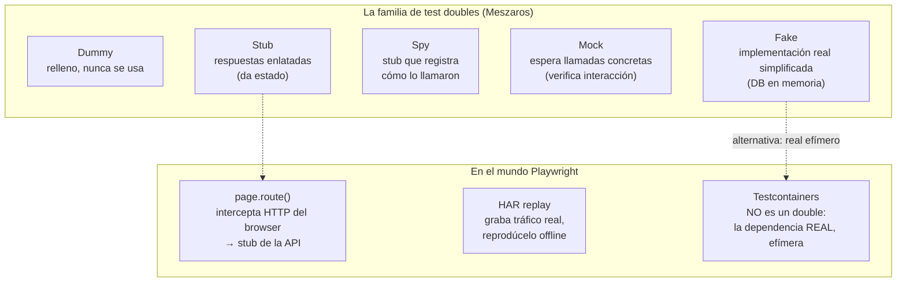
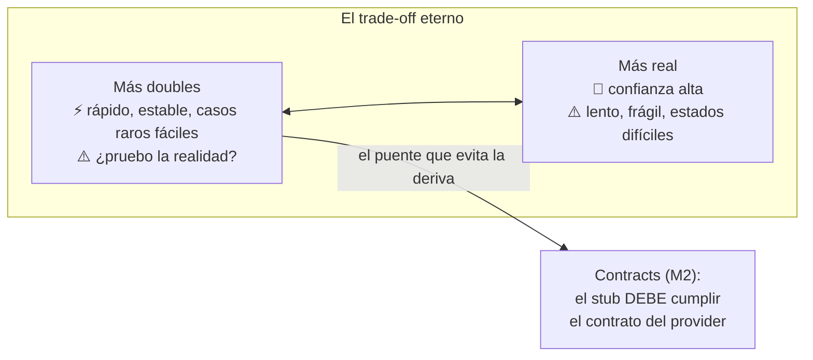

# Módulo 3 — Test doubles e integración

> **Resultado:** tests de UI que corren SIN backend (mocking de red), un test de integración con base de datos real en contenedor efímero, y el criterio para decidir cuándo doblar y cuándo no.

## 🗺️ Mapa visual





## 📖 Concepto

### Por qué doblar dependencias

Hay comportamientos que NO puedes probar contra el sistema real: la API caída (¿la UI muestra un error digno o pantalla blanca?), el response de 30 segundos, el carrito con 10.000 items, el 500 intermitente. Y hay un costo que ya conoces: cada test E2E paga el precio de TODO el stack. Los **test doubles** sustituyen una dependencia por una versión controlada para probar TU componente en aislamiento.

La taxonomía del mapa importa menos que la distinción central — **estado vs interacción**: un *stub* responde lo que le programaste (pruebas cómo tu código maneja esa respuesta); un *mock* verifica que tu código lo llamó como debía (pruebas la interacción misma). El abuso de mocks de interacción produce tests acoplados a la implementación que se rompen con cada refactor sin atrapar bugs — el error clásico que un senior sabe nombrar.

### `page.route()`: la UI en una burbuja

Playwright intercepta las requests del browser ANTES de que salgan:

```typescript
await page.route('**/products*', (route) =>
  route.fulfill({ status: 200, contentType: 'application/json', body: JSON.stringify(productosFake) }),
);
```

Con esto, la UI deja de necesitar backend: pruebas estados imposibles de provocar (vacíos, errores, lentitud con `route.fallback()` retardado) en milisegundos. **El riesgo:** tu stub puede mentir — responder una forma que la API real jamás devolvería — y tus tests verdes prueban una fantasía. La cura ya la construiste: **los stubs deben respetar los schemas Zod / contratos Pact del M2**. Stub + contrato = velocidad sin deriva. Esa conexión es la tesis del módulo.

### Testcontainers: la tercera vía

¿Y si en lugar de fingir la base de datos usas… una real, recién nacida, tuya? **Testcontainers** levanta un contenedor Docker efímero (MariaDB, Redis, lo que sea) por test suite, espera a que esté listo y lo destruye al final. No es un double: es la dependencia real sin los problemas del ambiente compartido (data sucia de otros, caídas ajenas). Es el patrón moderno para tests de integración de backend y la respuesta senior a "¿unit con todo mockeado o integración lenta?": integración RÁPIDA con dependencias reales efímeras.

### El mapa de decisión (memorízalo)

| Quiero probar | Uso |
|---------------|-----|
| Lógica pura de mi código | Unit test, doubles solo en los bordes |
| Mi UI ante CUALQUIER respuesta de la API (incl. errores) | `page.route()` + stubs que cumplen contrato |
| Mi código contra una DB/queue real | Testcontainers |
| Que el proveedor cumple lo que espero | Contract testing (M2) |
| El sistema completo integrado | E2E — pocos, los del M1 del C1 |

## 🔨 Lab guiado — La UI en aislamiento + DB efímera

**Parte A — Estados imposibles de la UI (page.route).**

**Paso 1 —** En `packages/ui-tests`, crea `tests/isolated/search-states.spec.ts`. Primero, el stub honesto: crea `fixtures/stubs/products.stub.ts` que genere responses **validados contra `PaginatedProductsSchema`** del paquete compartido:

```typescript
import { PaginatedProductsSchema } from '@toolshop/shared-schemas';

export function stubProductsPage(products: Partial<Product>[] = []) {
  const body = {
    current_page: 1, total: products.length, per_page: 9,
    data: products.map((p, i) => ({ id: `fake-${i}`, name: `Producto ${i}`, price: 9.99, ...p })),
  };
  return PaginatedProductsSchema.parse(body);   // si el stub miente, EXPLOTA aquí
}
```

**Paso 2 — Los cuatro estados.** Escribe cuatro tests, cada uno interceptando `**/products*`:

1. **Vacío:** `stubProductsPage([])` → assert del mensaje "There are no products found."
2. **Error 500:** `route.fulfill({ status: 500 })` → ¿qué muestra la UI? (Descúbrelo: puede que nada — eso es un hallazgo para `docs/bugs/`).
3. **Lentitud:** retarda el fulfill 3 s (`await new Promise(r => setTimeout(r, 3000))`) → ¿hay spinner/skeleton?
4. **Datos extremos:** un producto con nombre de 300 caracteres y precio 999999.99 → ¿el layout sobrevive? (semilla del visual testing, M4).

Corre la suite `isolated` SIN levantar el backend Docker. Siente la velocidad — y entiende el precio que pagaste (nada de esto toca la API real).

**Paso 3 — HAR replay (grabar la realidad).** Graba una sesión real y reprodúcela offline:

```bash
npx playwright open --save-har=fixtures/stubs/toolshop.har --save-har-glob="**/api/**" http://localhost:4200
```

Luego en un test: `await page.routeFromHAR('fixtures/stubs/toolshop.har', { url: '**/api/**' })`. Discute en `docs/doubles-notes.md`: ¿cuándo prefieres HAR (realismo congelado) vs stub a mano (control total)? ¿Qué pasa cuando la API evoluciona y el HAR queda viejo? (Pista: es el mismo problema de deriva — y el contrato vuelve a ser la respuesta.)

**Parte B — Testcontainers.**

**Paso 4 —** Toolshop usa MariaDB. Crea `packages/integration-tests` con Vitest + `testcontainers`:

```typescript
import { GenericContainer, Wait } from 'testcontainers';
import { beforeAll, afterAll, describe, it, expect } from 'vitest';
import mysql from 'mysql2/promise';

let container, conn;
beforeAll(async () => {
  container = await new GenericContainer('mariadb:11')
    .withEnvironment({ MARIADB_ROOT_PASSWORD: 'test', MARIADB_DATABASE: 'toolshop_test' })
    .withExposedPorts(3306)
    .withWaitStrategy(Wait.forLogMessage(/ready for connections/))
    .start();
  conn = await mysql.createConnection({
    host: container.getHost(), port: container.getMappedPort(3306),
    user: 'root', password: 'test', database: 'toolshop_test',
  });
}, 120_000);
afterAll(async () => { await conn?.end(); await container?.stop(); });

describe('reglas de datos de productos', () => {
  it('rechaza precios negativos si el schema tiene la constraint', async () => {
    await conn.execute(`CREATE TABLE products (id INT PRIMARY KEY AUTO_INCREMENT,
      name VARCHAR(120) NOT NULL, price DECIMAL(8,2) NOT NULL CHECK (price >= 0))`);
    await expect(conn.execute(`INSERT INTO products (name, price) VALUES ('martillo', -5)`)).rejects.toThrow();
  });
});
```

El punto pedagógico no es SQL: es ver una dependencia real nacer para tu test y morir después, sin ambiente compartido. Anota la duración del arranque — ese costo es el trade-off contra un fake en memoria.

**Paso 5 — Commit/PR** (`C2-M3: UI en aislamiento + HAR replay + Testcontainers`).

## 🎯 Reto

El flujo de **checkout** depende de la API en cinco momentos (carrito, login, dirección, pago, confirmación). Constrúyele un "modo demo": el flujo completo de checkout corriendo 100 % con `page.route()` (todos los stubs honestos validados por schema), incluyendo el caso que NUNCA podrías probar contra el backend real: **el pago devuelve 503 en el último paso** — ¿el usuario pierde su carrito? ¿hay reintento? Documenta el comportamiento real encontrado. Pregunta final en `doubles-notes.md`: este test aislado verde + el contrato del M2 verde, ¿equivalen al E2E real? ¿Qué hueco queda exactamente? (Respuesta esperada: la integración de configuración/red/infra real — por eso el E2E de humo sobrevive, pero UNO.)

## ✅ Checklist de dominio

- [ ] Puedo explicar stub vs mock (estado vs interacción) y el riesgo de abusar de mocks
- [ ] Sé interceptar red con `page.route()` y probar estados de error/lentitud/vacío
- [ ] Mis stubs se validan contra schemas/contratos — puedo explicar por qué eso evita la deriva
- [ ] Sé cuándo usar HAR replay y cuál es su problema de envejecimiento
- [ ] Levanté una dependencia real con Testcontainers y entiendo qué problema resuelve
- [ ] Puedo recitar el mapa de decisión (qué técnica para qué pregunta)

## 💬 Preguntas de entrevista

1. *"What's the difference between a stub and a mock? When is mocking interactions a smell?"*
2. *"How do you test how your frontend handles API errors and timeouts?"*
3. *"Your mocked tests are green but production broke because the API changed. What was missing in your strategy?"* (deriva de stubs → contratos, la tesis del módulo)
4. *"Unit tests with everything mocked vs slow integration tests — how do you escape that false dilemma?"* (Testcontainers)
5. *"If you can test the whole checkout with mocks, why keep any E2E at all?"*

## 🔗 Conexiones

- **Refuerza:** los contratos del [M2](modulo-02-contract-testing.md) son lo que mantiene honestos a los stubs de hoy; los schemas de [C1-M4](../curso-1-fundamentos/modulo-04-api-testing.md) reaparecen por tercera vez (tests → contratos → stubs); la decisión de capas de [C1-M1](../curso-1-fundamentos/modulo-01-mentalidad-de-testing.md) gana su herramienta más fina.
- **Se reutiliza en:** M4 usa stubs para congelar data en los snapshots visuales (determinismo); M6 explota la suite aislada como capa rápida del pipeline; en C3, doblar dependencias se vuelve doblar EL MODELO (respuestas LLM grabadas para tests deterministas de agentes — mismo patrón, nuevo actor) y Testcontainers vuelve para levantar Langfuse en C3-S5.
