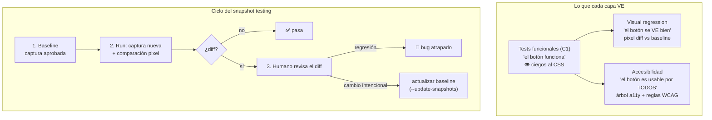
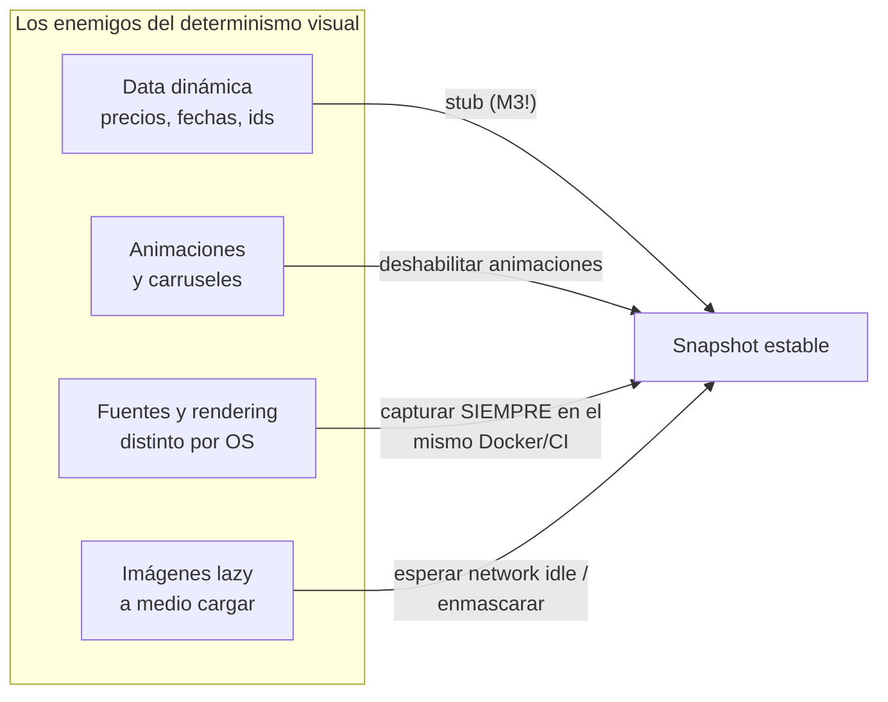

# Módulo 4 — Visual regression + accesibilidad

> **Resultado:** una capa de visual regression con snapshots deterministas y chequeos de accesibilidad (axe-core) integrados como steps reutilizables del framework — y el criterio de cuándo el visual testing paga y cuándo es una fábrica de falsos rojos.

## 🗺️ Mapa visual





## 📖 Concepto

### Visual regression: el bug que ningún assert ve

`expect(boton).toBeVisible()` pasa aunque el botón esté montado sobre el precio, en blanco sobre blanco, o desbordando el viewport móvil. Una regresión de CSS global puede destruir la UI con TODA tu suite funcional verde. El snapshot testing compara screenshots contra una **baseline aprobada** y falla ante cualquier diferencia de píxeles.

Playwright lo trae integrado: `await expect(page).toHaveScreenshot('home.png')` — primera ejecución crea la baseline; las siguientes comparan (con `maxDiffPixelRatio` configurable).

**La economía del visual testing** (esto es lo que se evalúa en seniors): cada snapshot es un assert potentísimo pero **indiscriminado** — no sabe distinguir "cambió el bug" de "cambió el banner de la campaña". Su costo real es el flujo de revisión humana de diffs. Por eso: (a) snapshots de **componentes/regiones estables**, no de páginas enteras con data viva; (b) determinismo brutal (mapa de arriba — nota cómo los stubs del M3 reaparecen como herramienta de determinismo); (c) baselines capturadas SIEMPRE en el mismo ambiente (CI/Docker), porque macOS y Linux renderizan fuentes distinto. Herramientas como Chromatic/Percy industrializan la revisión de diffs con UI de aprobación — en la aerolínea, Chromatic es el paso de review visual antes de que el agente auto-repare.

### Accesibilidad: calidad legal y moralmente no-opcional

**WCAG** (Web Content Accessibility Guidelines) define los criterios; leyes como el European Accessibility Act (aplicable desde 2025) los vuelven obligatorios para e-commerce en la UE — relevante si apuntas a empresas europeas. Lo esencial:

- Los niveles: A (mínimo), **AA (el estándar contractual de facto)**, AAA.
- Las cuatro categorías (POUR): Perceptible, Operable, Comprensible, Robusto.
- **axe-core** (el motor estándar) detecta automáticamente ~30-40 % de los problemas WCAG: contraste, labels faltantes, jerarquía de headings, atributos ARIA inválidos. El resto (orden de foco lógico, textos alt ÚTILES, navegación real con teclado) requiere verificación humana o tests funcionales específicos. Decir "corro axe y soy accesible" es señal de junior; conocer el límite del 30-40 % es señal de senior.

Bonus que ya ganaste sin saberlo: tus locators `getByRole` del C1-M5 SON tests de accesibilidad implícitos — si `getByRole('button', { name: 'Add to cart' })` no encuentra el botón, un lector de pantalla tampoco.

## 🔨 Lab guiado — Las dos capas nuevas del spine

**Parte A — Visual regression.**

**Paso 1 — El primer snapshot (y su fragilidad).** En `packages/ui-tests`, crea `tests/visual/home.visual.spec.ts`:

```typescript
import { test, expect } from '@toolshop/framework-core';

test('la home se ve como la baseline', async ({ page }) => {
  await page.goto('/');
  await expect(page).toHaveScreenshot('home.png', { fullPage: true });
});
```

Córrelo dos veces (la primera crea la baseline). Ahora córrelo 5 veces más: ¿flakea? La home de Toolshop tiene data de seed estable, así que probablemente pase — pero estás a UN producto nuevo en la DB de un falso rojo. Esa fragilidad es la lección.

**Paso 2 — Snapshot determinista (la forma correcta).** Reescríbelo combinando las armas del M3:

```typescript
test('grid de productos — determinista', async ({ page }) => {
  await page.route('**/products*', (route) =>
    route.fulfill({ json: stubProductsPage(PRODUCTOS_FIJOS) }));   // data congelada (M3)
  await page.emulateMedia({ reducedMotion: 'reduce' });            // sin animaciones
  await page.goto('/');
  await expect(page.locator('[data-test="filters"]')).toBeVisible();
  await expect(page.locator('.container')).toHaveScreenshot('product-grid.png', {
    mask: [page.locator('[data-test="product-price"]')],           // enmascara lo volátil
  });
});
```

Región acotada + data stubbeada + animaciones off + máscara sobre lo volátil = snapshot que solo falla cuando el CSS cambia de verdad.

**Paso 3 — Atrapa una regresión real.** Inyecta CSS roto antes del snapshot (`await page.addStyleTag({ content: '.card { margin-left: 40px }' })`) y corre: mira el diff de tres paneles (expected/actual/diff) en el reporte HTML. Esto es lo que tu suite funcional JAMÁS habría visto. Quita la inyección.

**Paso 4 — Baselines y CI.** Las baselines van al repo (`git add *.png`) pero **capturadas en el ambiente del CI**. Agrega al workflow la variante: si los snapshots fallan en CI por diferencia de rendering local-vs-CI, regenera las baselines DESDE el CI (artifact con `--update-snapshots` y commit de esas). Documenta la política en `docs/visual-notes.md`: quién aprueba un diff, cuándo se actualiza baseline. (Política sin proceso = snapshots que todos actualizan a ciegas — y entonces no testean nada.)

**Parte B — Accesibilidad.**

**Paso 5 — axe como step del framework.** `npm install -D @axe-core/playwright` y crea el helper en `framework-core` (es un step de dominio, exactamente para eso existe core):

```typescript
// framework-core/src/a11y.ts
import AxeBuilder from '@axe-core/playwright';
import type { Page } from '@playwright/test';

export async function checkA11y(page: Page, etiqueta: string) {
  const results = await new AxeBuilder({ page })
    .withTags(['wcag2a', 'wcag2aa', 'wcag21aa'])
    .analyze();
  if (results.violations.length) {
    console.log(`\n♿ Violaciones en ${etiqueta}:`);
    for (const v of results.violations)
      console.log(`  [${v.impact}] ${v.id}: ${v.help} (${v.nodes.length} nodos)`);
  }
  return results.violations;
}
```

**Paso 6 — Auditoría de las 4 páginas críticas.** Crea `tests/a11y/critical-pages.a11y.spec.ts` que recorra home, detalle de producto, carrito y login, llame `checkA11y` y assertee cero violaciones `critical`/`serious` (las `moderate` repórtalas sin fallar — *presupuesto de deuda* explícito). Toolshop TIENE violaciones reales: encontrarás material. Reporta la peor como `docs/bugs/BUG-A11Y-001.md` explicando el impacto en un usuario real (p. ej. "un usuario de lector de pantalla no puede saber el precio").

**Paso 7 — Lo que axe no ve.** Test funcional de teclado: desde la home, SOLO con `page.keyboard.press('Tab')` y `Enter`, llega al primer producto y agrégalo al carrito. Si el orden de foco lo hace imposible — hallazgo mayor que cualquier reporte de axe. Commit/PR (`C2-M4: visual regression determinista + capa a11y`).

## 🎯 Reto

Diseña la **matriz visual responsive**: el grid de productos y el checkout en 3 viewports (mobile 375, tablet 768, desktop 1280) usando Playwright projects para parametrizar. Restricciones: snapshots deterministas (stub + máscaras), nombres de archivo que incluyan viewport, y UNA decisión documentada: ¿corren en cada PR o solo nightly? Justifica con el costo de revisión de diffs vs riesgo de regresión responsive. Bonus: agrega el chequeo axe a los 3 viewports y compara — ¿hay violaciones que SOLO aparecen en mobile?

## ✅ Checklist de dominio

- [ ] Puedo explicar qué bugs atrapa el visual testing que los asserts funcionales no ven
- [ ] Sé las 4 fuentes de no-determinismo visual y su mitigación
- [ ] Entiendo por qué las baselines deben capturarse en el ambiente de CI
- [ ] Puedo explicar qué % de WCAG cubre axe y qué requiere humanos
- [ ] Distingo niveles A/AA/AAA y sé cuál es el estándar de facto
- [ ] Integré ambas capas como steps reutilizables de framework-core, no como copy-paste

## 💬 Preguntas de entrevista

1. *"Your visual tests fail on every PR and the team started auto-approving diffs. What went wrong and how do you fix it?"* (determinismo + política de revisión + scope)
2. *"How would you add accessibility testing to a CI pipeline? What can't be automated?"*
3. *"Why might a screenshot test pass locally and fail in CI with identical code?"* (rendering de fuentes/OS)
4. *"The product team says a11y 'isn't a priority'. Make the case."* (legal EU + mercado + getByRole gratis)
5. *"Full-page snapshots vs component snapshots: trade-offs?"*

## 🔗 Conexiones

- **Refuerza:** los stubs del [M3](modulo-03-test-doubles.md) son la herramienta de determinismo visual; los `getByRole` de [C1-M5](../curso-1-fundamentos/modulo-05-ui-testing-playwright.md) revelan su segunda identidad (a11y); el helper en core valida la arquitectura del [M1](modulo-01-arquitectura-frameworks.md).
- **Se reutiliza en:** M6 decide en qué gate corre cada capa (visual en nightly, a11y crítica en PR — tu reto de hoy alimenta esa matriz); en la aerolínea, "Playwright snapshots + Chromatic" y "@axe-core/playwright como step en cada test" son filas literales del stack; en el capstone 🏆, el diff visual es una de las EVIDENCIAS que el agente Healer adjunta a su audit trail antes de proponer una auto-reparación.
