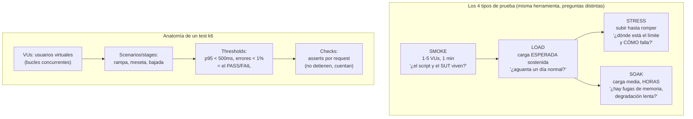
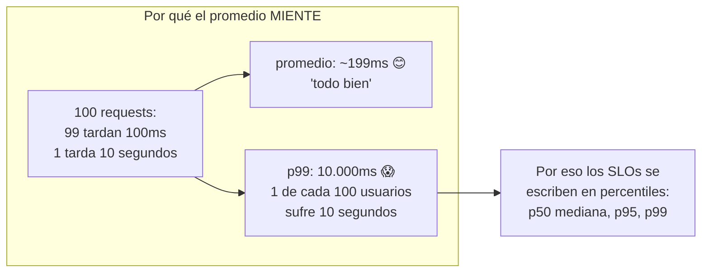

# Módulo 5 — Performance testing con k6

> **Resultado:** load tests del flujo de compra con k6, thresholds que actúan como quality gate, y la alfabetización en percentiles que distingue a quien "corrió JMeter una vez" de quien diseña pruebas de carga con intención.

## 🗺️ Mapa visual





## 📖 Concepto

### Performance es un requisito funcional disfrazado

Una búsqueda que tarda 8 segundos ES un bug aunque devuelva los resultados correctos: los usuarios abandonan, el revenue cae. El performance testing responde preguntas de negocio con números: ¿aguantamos el Black Friday (load)? ¿dónde está el techo y cómo degrada (stress)? ¿sobrevivimos el fin de semana sin reiniciar (soak)? Nota la conexión con tu matriz del C1-M1: cada tipo de prueba es una pregunta de riesgo distinta.

### k6: load testing como código

k6 (Grafana) ejecuta scripts JavaScript con un runtime Go capaz de miles de VUs desde tu laptop. Por qué k6 sobre JMeter para un SDET moderno: scripts en código versionable y revisable en PR (no XML de GUI), thresholds nativos como criterio de fallo (= integrables a CI como gate), y métricas pensadas para percentiles. Es la fila "Performance/load" del stack de la aerolínea, orquestado allá por un agente especializado.

Conceptos núcleo:

- **VU (virtual user):** un bucle que ejecuta tu script concurrentemente. 50 VUs ≠ 50 usuarios reales — un VU sin pausas dispara más requests que un humano; por eso existe `sleep()` (think time).
- **Stages:** perfil de carga — rampa de subida (¿el sistema escala?), meseta (¿se sostiene?), bajada (¿se recupera?).
- **Thresholds:** `http_req_duration: ['p(95)<500']` — si se viola, k6 sale con código ≠ 0 → CI rojo. **El threshold convierte "se siente lento" en un contrato verificable.**
- **Checks:** asserts no-bloqueantes por request (status 200, body con datos). Bajo carga no detienes la prueba por un fallo: lo CUENTAS (`checks` rate) — el fallo bajo carga ES el dato.

### Leer resultados sin engañarte

Tres trampas de quien empieza: (1) **el promedio** — mapa de arriba; reporta p95/p99; (2) **probar contra localhost y extrapolar a producción** — tu laptop comparte CPU entre SUT y generador de carga; los números absolutos de hoy NO son capacidad real, son **baseline relativa** (su valor: comparar contra la misma medición de mañana); (3) **ignorar la saturación del generador**: si k6 mismo se queda sin CPU, mide su propia agonía, no la del SUT.

## 🔨 Lab guiado — Del smoke al gate de performance

**Paso 1 — Setup.** Instala k6 (`brew install k6`) y crea `packages/perf-tests/` en el monorepo (k6 corre fuera de Node — el paquete guarda scripts y docs, no npm deps).

**Paso 2 — Smoke test (siempre primero).** Crea `scenarios/smoke.js`:

```javascript
import http from 'k6/http';
import { check, sleep } from 'k6';

const BASE = __ENV.TOOLSHOP_API || 'http://localhost:8091';

export const options = {
  vus: 2,
  duration: '30s',
  thresholds: {
    http_req_duration: ['p(95)<800'],
    http_req_failed: ['rate<0.01'],
  },
};

export default function () {
  const res = http.get(`${BASE}/products`);
  check(res, {
    'status 200': (r) => r.status === 200,
    'devuelve productos': (r) => r.json('data').length > 0,
  });
  sleep(1);   // think time: un humano no martilla la API
}
```

`k6 run scenarios/smoke.js`. Lee el resumen COMPLETO: `http_req_duration` (avg vs p90 vs p95 — ¿qué tan lejos están? esa distancia es la variabilidad), `http_reqs` (throughput), `checks`. Anota el p95: es tu baseline.

**Paso 3 — El user journey realista.** La carga real no es un endpoint: es un viaje. Crea `scenarios/browse-and-buy.js` que recorra el flujo del usuario típico (los endpoints de tus `api-notes.md` del C1-M2): home products → búsqueda → detalle → crear carrito → agregar item, con `group()` por paso para métricas separadas y think time entre pasos:

```javascript
import { group } from 'k6';
// dentro de default function:
group('búsqueda', () => { /* GET /products/search?q=pliers */ });
group('detalle', () => { /* GET /products/{id} con un id de la respuesta anterior */ });
group('carrito', () => { /* POST /carts + POST /carts/{id} */ });
```

Detalle senior: el id del producto sale de la RESPUESTA de la búsqueda (correlación), no hardcodeado — data realista, como el data harvester de la aerolínea pero en miniatura.

**Paso 4 — Load test con perfil.** `scenarios/load.js` reutiliza el journey con stages:

```javascript
export const options = {
  stages: [
    { duration: '1m', target: 20 },   // rampa
    { duration: '3m', target: 20 },   // meseta: la carga "esperada"
    { duration: '1m', target: 0 },    // bajada
  ],
  thresholds: {
    http_req_duration: ['p(95)<1000', 'p(99)<2500'],
    http_req_failed: ['rate<0.02'],
    'http_req_duration{group:::carrito}': ['p(95)<1500'],   // threshold por paso crítico
  },
};
```

Mientras corre, abre `docker stats` en otra terminal: mira la CPU/memoria de los contenedores del SUT. **Correlacionar la métrica del cliente (latencia) con la del servidor (recursos) es el hábito que el M7 va a formalizar.** ¿El p95 de la meseta es estable o crece minuto a minuto? Si crece: el sistema no está en equilibrio — eso, en horas, es lo que el soak detecta.

**Paso 5 — Encuentra el techo (stress).** Copia el load, sube stages hasta 100→200 VUs. En algún punto: errores, timeouts o latencias absurdas. Las preguntas que importan: ¿CÓMO falla? (¿errores limpios 503 o conexiones colgadas?) ¿se RECUPERA al bajar la carga? Documenta el patrón de fallo en `docs/perf-notes.md` — "cómo falla" vale más que "cuánto aguanta".

**Paso 6 — El gate en CI.** Agrega el job `perf-smoke` al workflow: instala k6, corre `smoke.js` contra el SUT efímero. Solo el smoke en PR (los load/stress distorsionarían en runners compartidos y tardan — corren nightly o en infra dedicada). El threshold violado = PR rojo: acabas de convertir performance en quality gate, la fila que faltaba de tu matriz del M1 del C1. Commit/PR (`C2-M5: perf testing con k6 + gate de smoke`).

## 🎯 Reto

El equipo de producto pregunta: **"¿cuántos usuarios simultáneos aguanta la búsqueda antes de degradarse?"**. Diséñalo y respóndelo con rigor: define "degradado" PRIMERO (un SLO: p95 > X ms o errores > Y %), construye un stress escalonado que suba VUs por etapas medibles, identifica el punto de quiebre, y entrega `docs/perf-report-busqueda.md` de UNA página con: metodología, gráfica/tabla de VUs vs p95, el número-respuesta con sus caveats (localhost ≠ producción), y una recomendación accionable. La habilidad evaluada: convertir una pregunta vaga de negocio en un experimento con criterios definidos ANTES de medir.

## ✅ Checklist de dominio

- [ ] Puedo explicar smoke/load/stress/soak y qué pregunta responde cada uno
- [ ] Sé por qué el promedio miente y reporto en percentiles
- [ ] Escribo journeys realistas con correlación de datos y think time
- [ ] Sé qué es un threshold y cómo convierte performance en gate de CI
- [ ] Sé qué invalida una medición (generador saturado, localhost, sin baseline)
- [ ] Puedo describir el patrón de fallo de un sistema bajo stress, no solo el número

## 💬 Preguntas de entrevista

1. *"Design a load test for a checkout flow before Black Friday. Walk me through everything."* (perfil de carga basado en datos reales, journey, SLOs, ambiente)
2. *"What's wrong with reporting average response time?"*
3. *"Your p95 is fine but users complain it's slow. What do you look at?"* (p99, endpoints específicos, percepción de frontend vs API — puente al M7)
4. *"How would you integrate performance testing into CI without flaky noise?"* (smoke con thresholds holgados en PR; load en infra dedicada nightly)
5. *"What's the difference between 100 VUs and 100 real users?"*

## 🔗 Conexiones

- **Refuerza:** los endpoints documentados de [C1-M2](../curso-1-fundamentos/modulo-02-caja-de-herramientas.md) son tu mapa de journey; la matriz de riesgo de [C1-M1](../curso-1-fundamentos/modulo-01-mentalidad-de-testing.md) decide qué flujos se cargan; los gates de [C1-M8](../curso-1-fundamentos/modulo-08-ci-basico.md) ganan la dimensión performance.
- **Se reutiliza en:** M6 ubica cada escenario k6 en su gate (smoke en PR, load nightly); M7 te da la otra mitad de la película (qué pasaba DENTRO del SUT mientras k6 empujaba — traces e infra); en C3-S5, estos mismos conceptos (p95, throughput, thresholds) se aplican a LLMs con métricas nuevas (TTFT, tokens/s, costo por request) — el músculo es idéntico, cambia la unidad.
