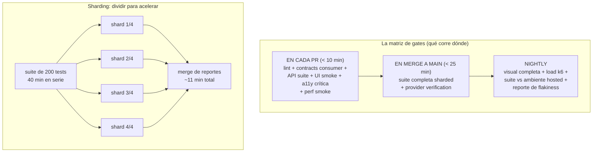
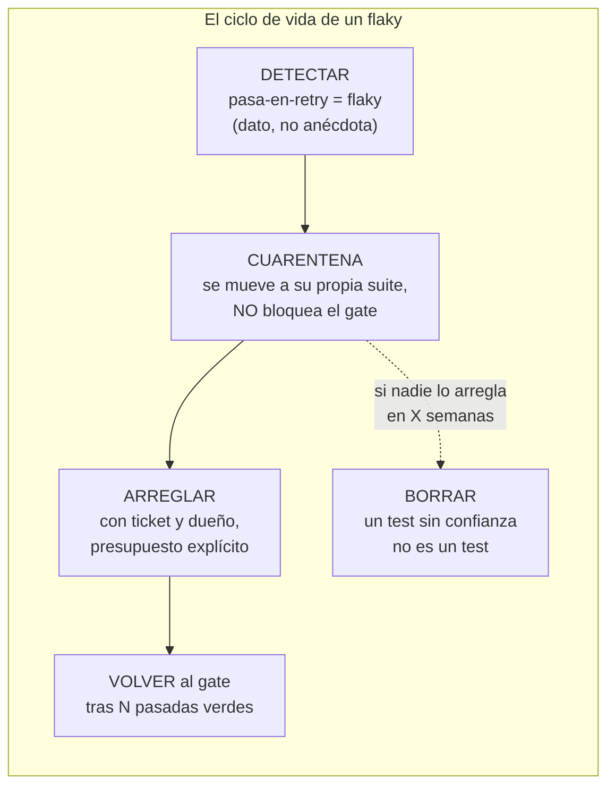

# Módulo 6 — CI/CD avanzado

> **Resultado:** un pipeline industrial — sharding paralelo, capas que corren en el gate correcto, política de retries justificada y un sistema de detección de flakiness con datos. La suite deja de ser "los tests" y se vuelve **la señal de calidad** de la organización.

## 🗺️ Mapa visual





## 📖 Concepto

### La economía de la señal

Un pipeline maduro optimiza UNA cosa: **confianza por minuto**. Cada gate responde "¿puedo avanzar?" con la máxima certeza al mínimo costo de espera. De ahí las tres palancas de este módulo:

**1. Sharding.** Playwright divide la suite con `--shard=1/4` y GitHub Actions ejecuta los pedazos en paralelo con `strategy.matrix`. Los reportes parciales (`blob`) se fusionan en uno (`merge-reports`). Costo: minutos de runner × 4; beneficio: feedback 4× más rápido. A escala, el sharding inteligente balancea por DURACIÓN histórica de cada test, no por cantidad.

**2. La matriz de gates.** Todo lo que construiste (M1-M5) corre — pero no todo en todas partes. El criterio: en PR corre lo que es **rápido y de alta señal** para el cambio típico; lo lento o ambiental se difiere a main/nightly. Esta es la versión real de la matriz `gate-dev`→`gate-uat` de la aerolínea: thresholds bajos y scope acotado en gates tempranos; full suite y thresholds altos en gates de release.

**3. Flakiness como métrica, no como anécdota.** Un test flaky (pasa y falla sin cambio de código) es **ruido en la señal**: cada rojo falso entrena al equipo a ignorar el rojo — y el día que el rojo sea real, pasará caminando. La doctrina:

- **Retries con propósito de DETECCIÓN:** `retries: 2` en CI no es para "que pase": es porque *pasó-en-retry* es el evento medible que marca al flaky. Playwright lo reporta como `flaky` explícitamente.
- **Cuarentena:** el flaky identificado sale del gate (tag `@quarantine`, excluido del run bloqueante, corre aparte) — el gate recupera su credibilidad HOY, no cuando alguien lo arregle.
- **Presupuesto y mortalidad:** cuarentena con ticket, dueño y fecha. Lo que nadie arregla en N semanas, se borra. Duro, pero un test en cuarentena perpetua es un test muerto que cobra mantenimiento.

Las causas raíz de flakiness, en orden de frecuencia real: esperas/asincronía mal manejada (tu `waitForTimeout` prohibido del C1), dependencia entre tests (orden/data compartida), ambiente (SUT lento en runner frío), y verdadero no-determinismo del SUT (race conditions — esos son BUGS, regalo del flaky).

## 🔨 Lab guiado — Industrializar el pipeline

**Paso 1 — Sharding.** Reescribe el job de tests del workflow:

```yaml
  test:
    runs-on: ubuntu-latest
    strategy:
      fail-fast: false
      matrix:
        shard: [1, 2, 3, 4]
    steps:
      # ... checkout, SUT, node (igual que antes) ...
      - run: npx playwright test --shard=${{ matrix.shard }}/4
        env: { TOOLSHOP_API: 'http://localhost:8091', TOOLSHOP_UI: 'http://localhost:4200' }
      - uses: actions/upload-artifact@v4
        if: always()
        with:
          name: blob-report-${{ matrix.shard }}
          path: labs/toolshop-tests/blob-report/

  merge-reports:
    needs: test
    if: always()
    runs-on: ubuntu-latest
    steps:
      - uses: actions/checkout@v4
      - uses: actions/download-artifact@v4
        with: { pattern: blob-report-*, merge-multiple: true, path: all-blobs }
      - run: npx playwright merge-reports --reporter=html ./all-blobs
      - uses: actions/upload-artifact@v4
        with: { name: full-report, path: playwright-report/ }
```

(En `playwright.config.ts`, usa el reporter `blob` cuando `process.env.CI`.) Mide: duración antes vs después del sharding. Ese número va en tu `docs/ci-notes.md` — y en tu próximo CV.

**Paso 2 — La matriz de gates.** Implementa la separación del mapa con tres workflows (o un workflow con condicionales): `pr.yml` (lint, API, UI `@smoke`, a11y crítica, perf smoke, contracts consumer), `main.yml` (full sharded + provider verification), `nightly.yml` (visual completa, k6 load, y la joya: la misma suite contra `TEST_ENV=hosted` — tu config multi-ambiente del M1 pagando de nuevo). Documenta la matriz en `docs/ci-notes.md` con la justificación de CADA fila (por qué corre ahí y no antes/después).

**Paso 3 — Retries como detector.** En la config: `retries: process.env.CI ? 2 : 0` (local sin retries: el dolor inmediato es información). Agrega un step al nightly que extraiga los flaky del reporte JSON:

```bash
npx playwright test --reporter=json > results.json || true
jq -r '[.suites[] | recurse(.suites[]?) | .specs[]? | select(.tests[].results | length > 1 and (.[length-1].status == "passed"))] | .[].title' results.json
```

(Ajusta el jq a la estructura real del reporte — parte del lab es leerla.) El output alimenta `docs/flaky-log.md`: test, fecha, frecuencia.

**Paso 4 — Fabrica un flaky y captúralo.** Escribe un test deliberadamente flaky (p. ej. assert que depende de `Date.now() % 3`). Push al nightly y verifica que tu detector lo reporta. Luego aplícale el ciclo completo: tag `@quarantine`, exclúyelo del gate (`grepInvert: /@quarantine/` en el project bloqueante + project aparte `quarantine` con `continue-on-error`), y crea su "ticket" (`docs/flaky-log.md` con dueño y fecha). Finalmente: arréglalo (hazlo determinista), sácalo de cuarentena, cierra el ciclo. Acabas de operar el proceso completo que la mayoría de los equipos solo improvisa.

**Paso 5 — Caza tu flakiness real.** `npx playwright test --repeat-each=10 --workers=8` local (estrés de paralelismo). Lo que falle intermitentemente: diagnostica con el trace (¿espera? ¿data compartida? ¿race del SUT?) y documenta el diagnóstico en `flaky-log.md` con su causa raíz de la taxonomía del concepto. Si nada flakea: felicítate — la disciplina del C1 (independencia, web-first asserts, factories) era exactamente para esto.

**Paso 6 — Commit/PR** (`C2-M6: sharding + matriz de gates + sistema de flakiness`).

## 🎯 Reto

**El dashboard de salud de la suite.** Sin herramientas pagas, construye visibilidad histórica: un step del nightly que tras cada run agregue una fila a `docs/suite-health.csv` (fecha, total, passed, failed, flaky, duración p95 del run) usando el reporte JSON + `jq`. Tras una semana de datos (o simúlala), responde en `docs/suite-health.md`: ¿la duración crece más rápido que el número de tests? ¿qué % del tiempo la suite estuvo verde? ¿cuál es tu *flake rate*? Define los 3 SLOs de tu suite (p. ej. "PR feedback < 10 min", "flake rate < 1 %", "verde > 95 % de los días") — acabas de aplicar performance thinking (M5) a tu propia infraestructura. Eso alimenta directamente el dashboard de ClickHouse de la aerolínea, y es EXACTAMENTE lo que un SDET Lead presenta a ingeniería cada trimestre.

## ✅ Checklist de dominio

- [ ] Puedo configurar sharding con merge de reportes y justificar el número de shards
- [ ] Puedo defender mi matriz de gates fila por fila (qué corre dónde y por qué)
- [ ] Entiendo retries como instrumento de DETECCIÓN, no de ocultamiento
- [ ] Sé operar el ciclo completo: detectar → cuarentena → arreglar → reintegrar → (o borrar)
- [ ] Puedo nombrar las 4 causas raíz de flakiness y cómo se diagnostica cada una
- [ ] Tengo métricas de salud de mi suite y SLOs definidos

## 💬 Preguntas de entrevista

1. *"Your suite is 45 minutes and devs are bypassing it. Fix the situation — short term and long term."* (cuarentena+sharding ya; matriz de gates y cultura después)
2. *"How do you handle flaky tests? Walk me through your actual process, not theory."* (tu paso 4 ES la respuesta)
3. *"Are test retries good or bad?"* (depende del propósito: detección sí, ocultamiento no — respuesta con matiz)
4. *"How do you decide what runs on PR vs nightly?"*
5. *"What metrics would you track for the health of a test suite, and what targets would you set?"* (tu reto ES la respuesta)

## 🔗 Conexiones

- **Refuerza:** TODO converge aquí — el CI de [C1-M8](../curso-1-fundamentos/modulo-08-ci-basico.md) se industrializa; la independencia de tests de [C1-M6](../curso-1-fundamentos/modulo-06-patrones-de-tests.md) es lo que hace el sharding posible; las capas de M2-M5 encuentran su gate; los percentiles del [M5](modulo-05-performance-k6.md) miden ahora tu propia suite.
- **Se reutiliza en:** M7 instrumenta estos runs con OpenTelemetry (de "qué falló" a "por qué tardó"); M8 convierte tus SLOs de suite en métricas organizacionales; en la aerolínea esta ES la matriz `gate-dev.yml`→`gate-uat.yml` con reusable workflows; y en el capstone 🏆 el agente Healer SOLO puede mergear si pasa por estos gates — la autonomía del agente se gana contra la credibilidad de TU señal.
