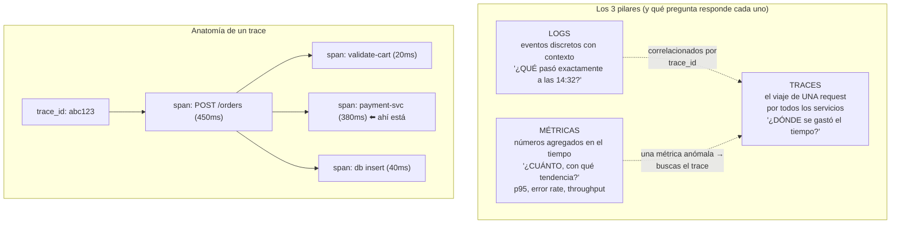
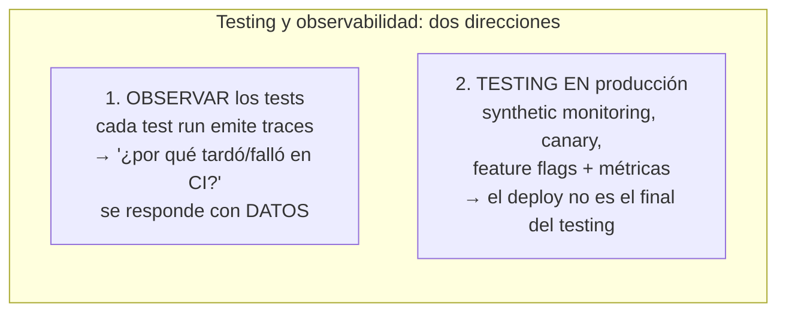

# Módulo 7 — Observabilidad para SDETs

> **Resultado:** tu framework emite traces OpenTelemetry de cada test run hacia un backend local (Jaeger), y tú dominas el vocabulario de logs/métricas/traces que el testing moderno comparte con SRE — la base directa de la observabilidad de LLMs del Curso 3.

## 🗺️ Mapa visual





## 📖 Concepto

### De "monitoreo" a observabilidad

Monitoreo clásico: dashboards de preguntas que ya sabías hacer ("¿CPU > 80 %?"). **Observabilidad**: la capacidad de responder preguntas que NO anticipaste, a partir de telemetría rica ("¿por qué los checkouts de usuarios con carritos grandes fallan solo los lunes?"). Para un SDET senior es doblemente central:

1. **Tu suite es un sistema distribuido** (shards, runners, SUT, browser) y cuando algo tarda o flakea, "creo que el runner estaba lento" no es diagnóstico. Instrumentada, tu suite responde con datos.
2. **Shift-right:** el testing no termina en el deploy. Synthetic monitoring (tests E2E corriendo CONTRA producción cada N minutos — tu suite hosted del M6 ya es esto), canary releases (deploy al 5 % + métricas deciden), feature flags como cinturón de seguridad. La frase de entrevista: *"production is the only environment that tells the truth; testing in production is about controlling the blast radius while you learn from it."*

### OpenTelemetry: el estándar que unificó todo

**OTel** define el modelo de datos (traces/métricas/logs), los SDKs y el protocolo (OTLP) — instrumentas UNA vez, exportas a cualquier backend (Jaeger, Grafana, Datadog, Honeycomb). Vocabulario mínimo: un **trace** (viaje completo, `trace_id`) se compone de **spans** (operaciones con duración, padre-hijo) decorados con **atributos** (clave-valor: `test.name`, `shard.id`). El **contexto se propaga** entre servicios vía headers (`traceparent`) — así el span del frontend y el del backend se hilan en un solo viaje.

La conexión con tu trabajo: el trace viewer de Playwright (C1-M5) ES un trace de spans con otro nombre. Y en el Curso 3, **Langfuse es literalmente esto aplicado a LLMs** — spans que son llamadas al modelo, atributos que son tokens y costos. Quien domina OTel aprende Langfuse en una tarde.

## 🔨 Lab guiado — Instrumentar el framework

**Paso 1 — Backend local de traces.** Jaeger all-in-one:

```bash
docker run -d --name jaeger -p 16686:16686 -p 4318:4318 jaegertracing/all-in-one:latest
# UI: http://localhost:16686 — recibe OTLP/HTTP en :4318
```

**Paso 2 — El reporter instrumentado.** Playwright permite **custom reporters** — el hook perfecto para emitir un span por test. Crea `packages/framework-core/src/otel-reporter.ts`:

```typescript
import type { Reporter, TestCase, TestResult, FullResult } from '@playwright/test/reporter';
import { NodeSDK } from '@opentelemetry/sdk-node';
import { OTLPTraceExporter } from '@opentelemetry/exporter-trace-otlp-http';
import { trace, SpanStatusCode } from '@opentelemetry/api';

export default class OtelReporter implements Reporter {
  private sdk = new NodeSDK({
    serviceName: 'toolshop-test-suite',
    traceExporter: new OTLPTraceExporter({ url: 'http://localhost:4318/v1/traces' }),
  });
  private tracer = trace.getTracer('test-runs');

  onBegin() { this.sdk.start(); }

  onTestEnd(test: TestCase, result: TestResult) {
    const span = this.tracer.startSpan(test.title, { startTime: result.startTime });
    span.setAttributes({
      'test.file': test.location.file,
      'test.project': test.parent.project()?.name ?? '',
      'test.status': result.status,
      'test.retry': result.retry,
      'test.duration_ms': result.duration,
      'ci.shard': process.env.SHARD ?? 'local',
    });
    if (result.status === 'failed')
      span.setStatus({ code: SpanStatusCode.ERROR, message: result.error?.message?.slice(0, 200) });
    span.end(new Date(result.startTime.getTime() + result.duration));
  }

  async onEnd(_: FullResult) { await this.sdk.shutdown(); }
}
```

Instala las deps (`@opentelemetry/sdk-node @opentelemetry/exporter-trace-otlp-http @opentelemetry/api`) y regístralo en la config: `reporter: [['html'], ['./packages/framework-core/src/otel-reporter.ts']]`.

**Paso 3 — Corre y explora.** `npx playwright test` y abre Jaeger (servicio `toolshop-test-suite`). Cada test es un span consultable: filtra por `test.status=failed`, por duración > 5 s, por retry > 0. Tu pregunta del M6 ("¿qué tests flakean y cuánto tardan?") ahora se responde con un query en vez de un grep de JSON.

**Paso 4 — Spans anidados: el viaje DENTRO del test.** Un span por test dice cuánto tardó; los spans hijos dicen EN QUÉ. Agrega a `framework-core` un helper `step()` que envuelva fases del test en spans hijos, y úsalo en el E2E de checkout (`setup-data`, `ui-flow`, `assertions`). Corre y mira en Jaeger la cascada: ¿qué fracción del E2E es preparación de data vs flujo real? (Spoiler frecuente: la mitad — y esa mitad podría ser API, C1-M6.) Documenta el hallazgo en `docs/observability-notes.md`.

**Paso 5 — Logs estructurados.** Los `console.log('algo pasó')` no escalan: log JSON con contexto (`{"level":"info","test":"checkout","step":"payment","cart_id":"abc","msg":"..."}`). Añade a core un logger mínimo (pino o hechizo propio) que incluya SIEMPRE el `trace_id` activo — y experimenta la correlación: del log al trace en un clic. Esa correlación logs↔traces es lo que pedirás a gritos cuando un agente LLM falle en C3.

**Paso 6 — Synthetic monitoring (shift-right real).** Tu workflow nightly contra `TEST_ENV=hosted` ya corre cada noche… conviértelo en monitor: schedule cada 6 horas, solo `@smoke`, y si falla → crea un issue automáticamente (action `actions/github-script` o `gh issue create`). Felicidades: tienes synthetic monitoring de un "production" real, con alerting. Es el mismo patrón que Datadog Synthetics cobra caro.

**Paso 7 — Commit/PR** (`C2-M7: framework instrumentado con OTel + synthetic monitoring`).

## 🎯 Reto

**La autopsia con datos.** Combina todo: corre la suite sharded del M6 cinco veces seguidas (`gh workflow run` en bucle o `--repeat-each` local con `SHARD` simulado). Luego, SOLO con Jaeger (sin abrir ningún log de CI), responde por escrito en `observability-notes.md`: (1) ¿cuál es el p95 de duración por proyecto (api/ui)? (2) ¿qué test es el más lento y en qué fase gasta el tiempo? (3) ¿hubo retries, y correlacionan con algún shard/momento? (4) propone las 2 optimizaciones de mayor impacto con evidencia. Si Jaeger no puede responder alguna, esa es tu lección: ¿qué atributo/span te faltó instrumentar? Agrégalo y repite. (Iterar la instrumentación hasta que responda preguntas reales ES el trabajo de observabilidad.)

## ✅ Checklist de dominio

- [ ] Puedo explicar logs vs métricas vs traces y qué pregunta responde cada uno
- [ ] Sé qué es un span, sus atributos y la propagación de contexto
- [ ] Instrumenté un sistema real (mi suite) con OTel y un backend de traces
- [ ] Puedo correlacionar un log con su trace vía trace_id
- [ ] Puedo explicar synthetic monitoring, canary y feature flags como herramientas de testing en producción
- [ ] Sé usar traces para optimizar mi propia suite con evidencia, no intuición

## 💬 Preguntas de entrevista

1. *"What's the difference between monitoring and observability?"*
2. *"How does testing change when you deploy 50 times a day?"* (shift-right: canary, flags, synthetic — el gate no desaparece, se redistribuye)
3. *"A checkout request is slow. Walk me through finding the bottleneck with distributed tracing."*
4. *"How would you instrument a test suite to understand its own performance and flakiness?"* (hiciste exactamente esto)
5. *"What is OpenTelemetry and why does vendor-neutrality matter?"*

## 🔗 Conexiones

- **Refuerza:** el trace viewer de [C1-M5](../curso-1-fundamentos/modulo-05-ui-testing-playwright.md) era un trace local — ahora tienes el modelo general; las métricas de salud del [M6](modulo-06-cicd-avanzado.md) ganan su backend de verdad; la correlación cliente-servidor que intuiste con `docker stats` en [M5](modulo-05-performance-k6.md) ahora tiene nombre y estándar.
- **Se reutiliza en:** M8 usa estos datos para las métricas organizacionales (DORA); en la aerolínea, "Langfuse self-hosted" + "dashboard ClickHouse" son este módulo aplicado a agentes; C3-S5 es LITERALMENTE este módulo con LLMs (spans = llamadas al modelo, atributos = tokens/costo) — llegarás sabiendo el 70 %; y el principio de la aerolínea *"determinismo donde se pueda, observabilidad donde no"* por fin tiene su segunda mitad construida.
