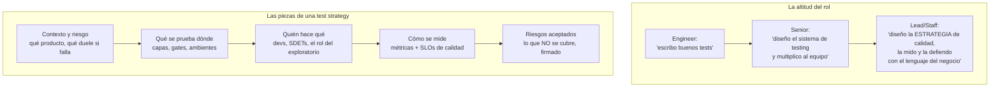
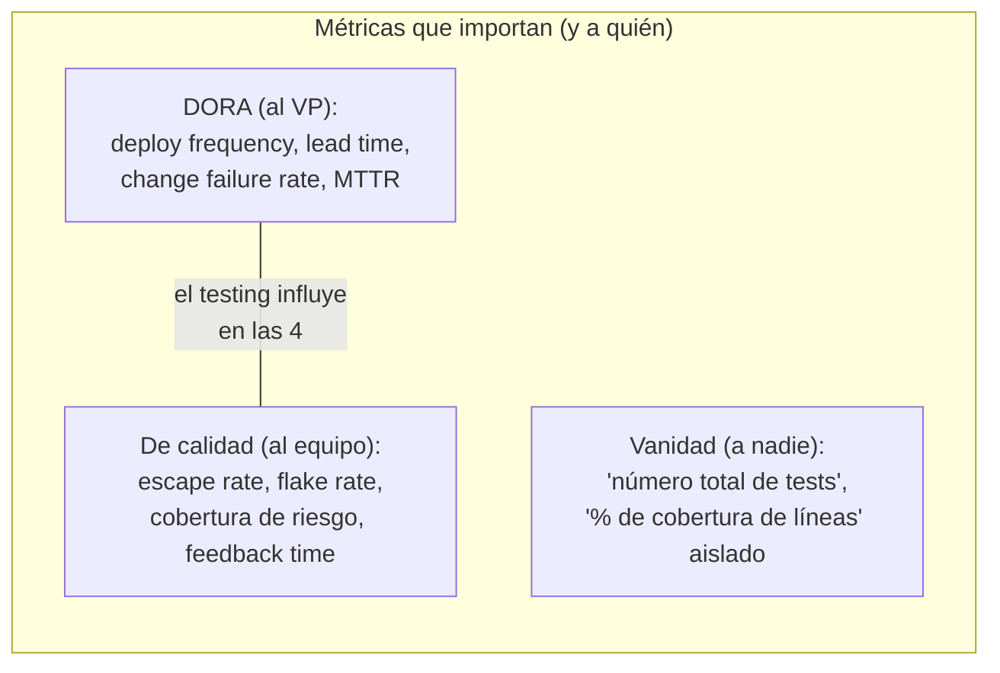

# Módulo 8 — Estrategia y liderazgo

> **Resultado:** una test strategy completa de Toolshop escrita como SDET Lead, métricas de calidad que un VP entiende, y los marcos de pensamiento (shift-left/right, DORA, quality budget) que convierten a un ingeniero fuerte en un líder técnico de calidad.

## 🗺️ Mapa visual

## 📖 Concepto

### La test strategy: el documento que casi nadie sabe escribir

Una test strategy NO es una lista de herramientas. Es la respuesta razonada a: **dado ESTE producto, ESTE equipo y ESTE apetito de riesgo, ¿cómo conseguimos la máxima confianza al mínimo costo?** Las piezas del mapa, con sus trampas:

- **Riesgo primero** (tu C1-M1, ahora a escala de organización): la estrategia de una fintech regulada y la de un juego casual difieren no por herramientas sino por consecuencias del fallo.
- **Qué-dónde:** tu matriz de gates del M6 es el corazón operativo. La estrategia añade el "por qué" y los ambientes (la aerolínea tiene 5 — cada uno con propósito y gate distintos).
- **Quién:** la pregunta organizacional que define todo: ¿los devs escriben tests? (sí, los de su capa); ¿qué hace entonces el SDET? (plataforma, estrategia, los tests transversales, el exploratorio profundo). El modelo "QA aparte que prueba lo de otros" murió; el SDET moderno es un **multiplicador**: construye el framework (M1), las reglas (lint), los gates (M6) y la visibilidad (M7) para que CUALQUIERA escriba tests buenos.
- **Riesgos aceptados:** la sección que distingue al senior — decir en voz alta "NO probamos X porque su riesgo no paga el costo, y lo firmamos". Sin esa sección, la estrategia promete infinito y entrega culpa.

### Métricas: hablar el idioma del negocio

- **DORA** (las 4 del mapa) mide la salud de entrega de software; un VP las conoce. Tu trabajo conecta directo: feedback time del PR (M6) acelera *lead time*; gates confiables bajan *change failure rate*; synthetic monitoring (M7) recorta *MTTR*.
- **Escape rate** (bugs que llegaron a producción / total) es LA métrica de efectividad del testing — con matiz: perseguir escape rate cero produce parálisis; el objetivo es el balance explícito con velocidad.
- **Anti-métricas:** "tenemos 4.000 tests" (¿y cuántos aportan señal?), "92 % de cobertura de líneas" (cubre líneas, no riesgo — útil como detector de huecos, tóxica como objetivo, cf. ley de Goodhart).

### Shift-left + shift-right = el testing como continuo

Junta las piezas que ya tienes: **left** — tipos (C1-M3), lint rules (M1), contracts en el CI del provider (M2), revisión de specs antes de codear; **right** — synthetic monitoring, canary, feature flags (M7). El deploy deja de ser la línea de meta y se vuelve un punto más del continuo. Tu frase para entrevistas: *"quality is built in at every stage; tests are how we measure it, not how we add it."*

### Influir sin autoridad

El Lead de calidad rara vez es jefe de los devs. Sus herramientas: **datos** (un flake rate del 8 % convence más que "los tests están mal"), **developer experience** (el camino correcto debe ser el fácil — si escribir un test bueno toma 5 minutos, se escriben), y **blameless culture** (un escape a producción dispara un post-mortem de proceso, no una cacería — el día que encuentres culpables, la gente esconderá los bugs).

## 🔨 Lab guiado — La test strategy de Toolshop

Hoy no escribes código: escribes EL documento. Imagina el contexto real: Toolshop es una scale-up de e-commerce, 4 squads (catálogo, checkout, cuentas, admin), 30 devs, 3 SDETs (tú lideras), deploys diarios, y el CTO te pidió la estrategia de calidad para el próximo año.

**Paso 1 — Estructura.** Crea `labs/toolshop-tests/docs/test-strategy.md` con las secciones: Contexto y perfil de riesgo / Principios / Qué se prueba dónde / Ambientes y gates / Roles y responsabilidades / Métricas y SLOs / Riesgos aceptados / Roadmap.

**Paso 2 — Contexto y principios.** Perfil de riesgo por área (tu matriz del C1-M1, elevada: ahora con squads dueños). Define 4-6 principios cortos y accionables — inspírate en los de la aerolínea pero hazlos tuyos (ej.: *"todo comportamiento se prueba en la capa más baja que lo verifique"*, *"un gate rojo se atiende antes que cualquier feature"*, *"la flakiness tiene presupuesto: 1 %"*).

**Paso 3 — Qué-dónde y gates.** Documenta tu pirámide REAL (la que construiste: unit/api/contract/ui/visual/a11y/perf) y tu matriz de gates del M6 — pero escrita para una audiencia que no leyó tus workflows: tabla de capa × gate × duración objetivo × qué bloquea. Añade los 2 ambientes que tienes y los que FALTARÍAN en la empresa imaginaria (staging, prod) con el propósito de cada uno.

**Paso 4 — Roles, métricas, riesgos.** Roles: qué escriben los devs de squad, qué posee el equipo SDET (framework, gates, observabilidad, contratos), dónde vive el exploratorio (C1-M7: sesiones con charter por release). Métricas: elige 5 con definición operativa exacta y SLO (usa tu `suite-health.csv` del M6 como fuente de 3 de ellas — tienes DATOS reales, úsalos). Riesgos aceptados: mínimo 4, honestos (ej.: "no hacemos device farm real: web responsive en 3 viewports cubre el riesgo actual; revisar si el tráfico móvil supera el 40 %").

**Paso 5 — Roadmap trimestral.** Q1-Q4 con un objetivo medible por trimestre (ej.: Q1 contract testing en los 4 squads; Q2 flake rate < 1 %...). Cada item con su métrica de éxito.

**Paso 6 — La prueba de fuego.** Lee el documento con tres sombreros y anota qué objetaría cada uno: el CTO (¿costo/beneficio claro?), un dev senior escéptico (¿esto me ayuda o me estorba?), un SDET junior de tu equipo (¿sé qué hacer el lunes?). Ajusta hasta que las tres lecturas sobrevivan. Commit/PR (`C2-M8: test strategy de Toolshop`).

## 🎯 Reto

**El memo de crisis.** Nuevo escenario: acabas de entrar como SDET Lead a una empresa donde la suite E2E (800 tests Selenium, 3 horas, ~40 % flaky) está tan rota que los devs deployan saltándosela. El VP te da 90 días. Escribe `docs/turnaround-memo.md` (máx. 1.5 páginas): diagnóstico (por qué se llegó ahí — sin culpar personas), plan 30/60/90 con acciones concretas y QUÉ DEJARÁ DE HACERSE (la parte que casi todos omiten: no puedes arreglar 800 tests Y construir lo nuevo con el mismo equipo), y los 3 números que le reportarás al VP cada viernes. Este memo es una pregunta de entrevista de Lead casi literal — guárdalo.

## ✅ Checklist de dominio

- [ ] Puedo escribir una test strategy completa y defenderla sección por sección
- [ ] Sé conectar el trabajo de testing con las métricas DORA en lenguaje de negocio
- [ ] Puedo explicar escape rate, sus matices, y por qué la cobertura de líneas como objetivo es tóxica
- [ ] Tengo una posición clara sobre "quién escribe los tests" y el rol multiplicador del SDET
- [ ] Puedo articular shift-left y shift-right como un continuo con ejemplos míos de este programa
- [ ] Sé qué es una sección de "riesgos aceptados" y por qué su ausencia es una señal de inmadurez

## 💬 Preguntas de entrevista

1. *"You're our first SDET hire. What do you do in your first 90 days?"* (tu memo del reto, adaptado)
2. *"How do you measure the success of a quality strategy? What do you report to a VP?"*
3. *"Developers say writing tests slows them down. How do you respond?"* (DX + datos + la capa correcta)
4. *"Should QA be a separate team? Defend your position."*
5. *"Tell me about a time you had to influence engineering practices without authority."* (prepara tu historia real — y este programa te dio material)

## 🔗 Conexiones

- **Refuerza:** es la cumbre del curso — el riesgo de [C1-M1](../curso-1-fundamentos/modulo-01-mentalidad-de-testing.md) a escala organizacional, los gates del [M6](modulo-06-cicd-avanzado.md) como corazón operativo, las métricas del M6/[M7](modulo-07-observabilidad.md) como evidencia, los principios de la aerolínea como plantilla de pensamiento.
- **Se reutiliza en:** el [Checkpoint 2](checkpoint-curso-2.md) es la defensa oral de TODO esto; en el Curso 3, cada especialización termina preguntando "¿cómo cambia la estrategia cuando el sistema es no-determinista?" — y tu respuesta partirá de este documento; el capstone 🏆 ES una decisión estratégica implementada: cuánta autonomía se le da a un agente, con qué barandillas, medida cómo.
