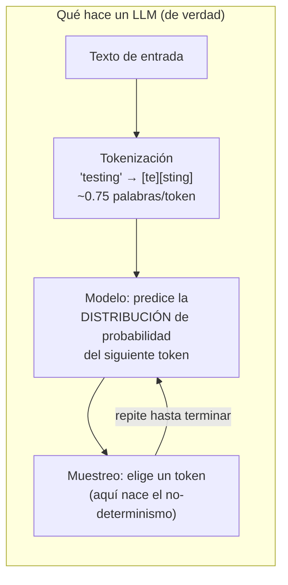
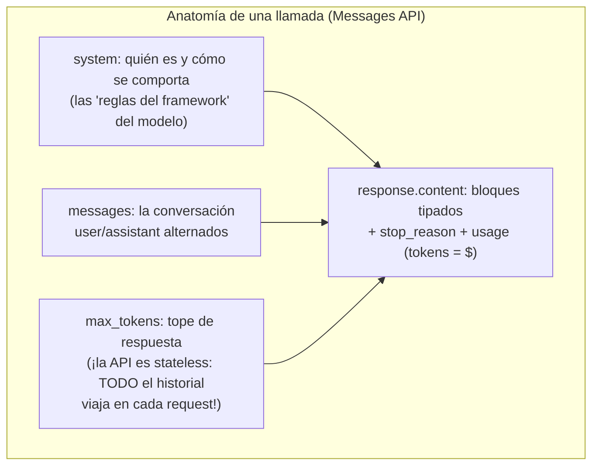

# Spec 00 · Módulo 1 — El modelo y la API

> **Resultado:** tu primer programa Python contra la API de Anthropic, y el modelo mental correcto de qué es un LLM — suficiente para razonar sobre sus modos de fallo, que es lo que un tester necesita.

## 🗺️ Mapa visual





## 📖 Concepto

### Un LLM es un predictor de siguiente token (y eso explica sus bugs)

Todo lo que un LLM hace — responder, razonar, llamar herramientas — emerge de predecir el siguiente token repetidamente. De ahí salen los modos de fallo que vas a testear el resto del curso:

- **Alucinación:** el modelo siempre produce el token *probable*, no el *verificado*. Si la respuesta correcta no está en su contexto, genera la más plausible — con total confianza. (Por eso existe RAG, spec-01: darle el contexto correcto.)
- **No-determinismo:** el muestreo elige entre tokens probables. Históricamente se controlaba con `temperature` (0 = casi determinista); en los modelos Claude actuales (Opus 4.7+) los parámetros de sampling **fueron eliminados de la API** — el comportamiento se guía con prompting. Lección de tester: **ni siquiera con configuración agresiva hay determinismo garantizado**; el módulo 2 lo mide.
- **Sensibilidad al contexto:** el modelo solo "sabe" lo que está en su ventana de contexto + sus pesos. Cambiar una palabra del prompt puede cambiar el output — versionar prompts importa tanto como versionar código (spec-05).
- **Tokens = costo y límite:** cada token de entrada y salida se factura y consume ventana. `usage` en cada response es tu primera métrica de observabilidad (spec-05).

### Vocabulario mínimo

| Término | Para un tester significa |
|---------|--------------------------|
| **Token** | Unidad de facturación, de límites y de medición de performance |
| **Context window** | El "RAM" del modelo: lo que no está ahí, no existe para él |
| **System prompt** | El contrato de comportamiento — y superficie de ataque (spec-04) |
| **Temperature/sampling** | Fuente clásica de variabilidad; eliminada en modelos Claude actuales, pero el concepto aparece en toda entrevista |
| **Embedding** | Vector que captura el *significado* de un texto; la base del retrieval (spec-01) y de las métricas de similitud semántica (spec-02) |
| **stop_reason** | POR QUÉ terminó la generación: `end_turn` (natural), `max_tokens` (¡truncado — bug común!), `tool_use` (quiere llamar herramienta), `refusal` (declinó) — un tester SIEMPRE assertea sobre esto |

## 🔨 Lab guiado — Primer contacto medido

**Costo aproximado del lab: < $0.50.**

**Paso 1 — Setup** (si no hiciste el del [README del curso](../README.md), hazlo ahora). Crea `labs/ai-evals/spec00/hello_llm.py`:

```python
import anthropic
from dotenv import load_dotenv

load_dotenv()
client = anthropic.Anthropic()  # lee ANTHROPIC_API_KEY del entorno

response = client.messages.create(
    model="claude-opus-4-8",
    max_tokens=500,
    system="Eres un asistente de QA conciso. Respondes en una sola oración.",
    messages=[{"role": "user", "content": "¿Qué es un test flaky?"}],
)

for block in response.content:
    if block.type == "text":
        print("Respuesta:", block.text)

print("\n--- Telemetría (¡esto es lo que un tester mira!) ---")
print("stop_reason:", response.stop_reason)
print("input_tokens:", response.usage.input_tokens)
print("output_tokens:", response.usage.output_tokens)
```

```bash
cd ~/Documents/sdet-mastery/labs/ai-evals && uv run python spec00/hello_llm.py
```

**Paso 2 — Provoca un truncamiento.** Cambia `max_tokens=500` por `max_tokens=20` y pide "explica en detalle la pirámide de testing". Observa: `stop_reason: "max_tokens"` y una respuesta cortada a mitad de frase. **Este es el bug #1 de integraciones LLM en producción** — el código lee el texto truncado como si fuera completo. Anota la regla: *siempre assertear stop_reason antes de consumir el contenido*.

**Paso 3 — La API es stateless.** Escribe `spec00/conversacion.py` con dos llamadas: la primera dice "Mi framework de tests se llama Aurora", la segunda pregunta "¿cómo se llama mi framework?" SIN incluir el historial. El modelo no sabe. Repite incluyendo los `messages` previos (user + assistant) — ahora sí. Lección: la "memoria" de un chat es una ilusión que TU código construye; cada request paga el historial completo en tokens (esto explica el prompt caching de spec-05).

**Paso 4 — Siente los tokens.** Usa el endpoint de conteo para medir tu test plan del C1-M1:

```python
count = client.messages.count_tokens(
    model="claude-opus-4-8",
    messages=[{"role": "user", "content": open("../toolshop-tests/docs/test-plan.md").read()}],
)
print("Tokens del test plan:", count.input_tokens)
```

Calcula a mano el costo de enviarlo 1.000 veces (precio actual de input en platform.claude.com). Los costos a escala son una pregunta de entrevista de arquitectura.

**Paso 5 — Streaming.** Para respuestas largas, la API entrega tokens a medida que se generan:

```python
with client.messages.stream(
    model="claude-opus-4-8",
    max_tokens=1000,
    messages=[{"role": "user", "content": "Lista 10 causas de flakiness en tests E2E"}],
) as stream:
    for text in stream.text_stream:
        print(text, end="", flush=True)
    final = stream.get_final_message()
print("\n\ntokens:", final.usage.output_tokens)
```

Cronometra mentalmente: ¿cuánto tardó el PRIMER token vs el último? Esa diferencia (TTFT vs duración total) es LA métrica de UX de los LLMs — la formalizarás en spec-05.

**Paso 6 — Embeddings: el concepto con las manos.** Sin proveedor externo, demuéstrate la idea con un modelo local pequeño:

```bash
uv add sentence-transformers
```

```python
from sentence_transformers import SentenceTransformer, util
model = SentenceTransformer("all-MiniLM-L6-v2")
frases = ["el test falla intermitentemente", "la prueba es flaky", "el café está caliente"]
emb = model.encode(frases)
print("similitud flaky vs intermitente:", util.cos_sim(emb[0], emb[1]).item())  # alta
print("similitud flaky vs café:", util.cos_sim(emb[0], emb[2]).item())          # baja
```

Dos frases con CERO palabras en común y significado igual → vectores cercanos. Eso es lo que el retrieval de spec-01 explota y lo que las métricas semánticas de spec-02 miden.

**Paso 7 — Commit** (`C3-S0-M1: primer contacto con la API + tokens + streaming + embeddings`).

## 🎯 Reto

Escribe `spec00/triage.py`: un script que reciba el texto de un reporte de bug (usa tu BUG-001 del C1-M7) y le pida al modelo un análisis de severidad. Requisitos de ingeniería (no de prompt): manejar `stop_reason != "end_turn"` como error explícito, reintentar con backoff si hay `RateLimitError` (el SDK ya trae reintentos — averigua cómo configurarlos con `max_retries`), registrar tokens y duración de cada llamada en un dict de telemetría, y un test pytest que verifique el manejo del truncamiento SIN llamar a la API real (pista: doblar el cliente — tus skills del C2-M3 aplican tal cual a este mundo).

## ✅ Checklist de dominio

- [ ] Puedo explicar la generación token a token y derivar de ahí alucinación y no-determinismo
- [ ] Sé qué es la ventana de contexto y por qué la API es stateless
- [ ] Asserteo `stop_reason` siempre y sé qué significa cada valor
- [ ] Sé leer `usage` y estimar costos de un caso de uso
- [ ] Puedo explicar qué es un embedding y qué mide la similitud coseno
- [ ] Sé que los modelos actuales de Claude no aceptan `temperature` y por qué eso NO da determinismo

## 💬 Preguntas de entrevista

1. *"Explain to a PM why the chatbot sometimes gives different answers to the same question."*
2. *"What is a context window and what happens when a conversation exceeds it?"*
3. *"Your LLM integration returns truncated JSON sometimes. What's your first hypothesis?"* (max_tokens + stop_reason)
4. *"What are embeddings and where would you use them in a testing context?"* (retrieval, similitud semántica en evals, deduplicación de bugs)
5. *"How would you estimate the monthly cost of an LLM feature before building it?"*

## 🔗 Conexiones

- **Refuerza:** HTTP+JSON de [C1-M2](../../curso-1-fundamentos/modulo-02-caja-de-herramientas.md) (la API de Anthropic es exactamente eso); el manejo de errores tipados que ya practicaste en TS; los dobles de [C2-M3](../../curso-2-profundizando/modulo-03-test-doubles.md) reaparecen en el reto.
- **Se reutiliza en:** TODO el curso 3 — el módulo 2 añade estructura y mide el no-determinismo; spec-01 usa embeddings para retrieval; spec-02 convierte `usage`/`stop_reason` en asserts sistemáticos; spec-05 convierte la telemetría manual del reto en Langfuse.
