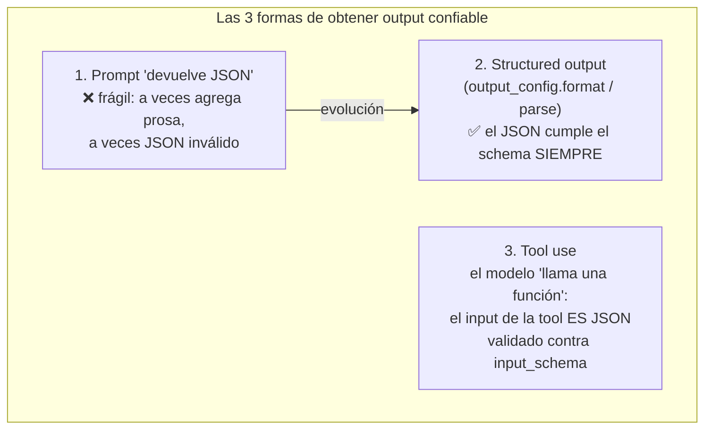
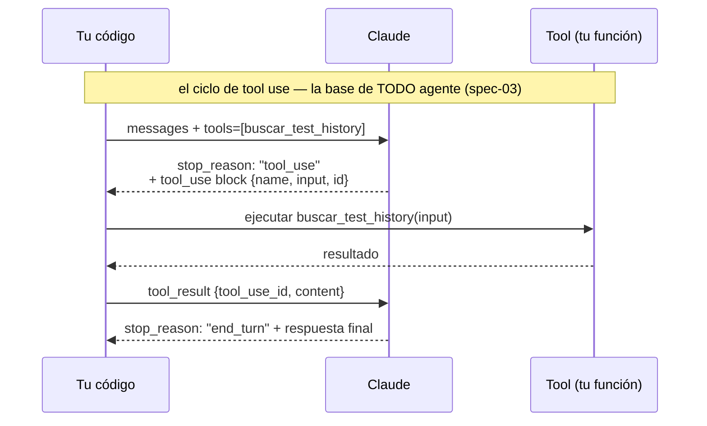

# Spec 00 · Módulo 2 — Structured output, tool use y el experimento del no-determinismo

> **Resultado:** un clasificador de reportes de bugs con output validado por schema, tu primera tool llamada por el modelo, y el experimento que cuantifica el no-determinismo — la evidencia empírica que citarás en entrevistas.

## 🗺️ Mapa visual





## 📖 Concepto

### Structured output: el contrato vuelve

En el C1-M4 aprendiste que un response sin schema validado es una bomba de tiempo. Con LLMs es peor: el modelo puede devolver prosa, JSON con campos extra, o JSON casi-válido. **Structured outputs** resuelve la mitad del problema: la API **garantiza que la respuesta cumple tu JSON Schema** (con Pydantic en el SDK de Python, la respuesta llega parseada y validada):

```python
from pydantic import BaseModel
from typing import Literal

class BugTriage(BaseModel):
    severity: Literal["critical", "high", "medium", "low"]
    component: str
    is_regression: bool
    reasoning: str

response = client.messages.parse(
    model="claude-opus-4-8",
    max_tokens=1000,
    messages=[{"role": "user", "content": f"Clasifica este bug:\n{bug_report}"}],
    output_format=BugTriage,
)
triage = response.parsed_output   # instancia BugTriage validada
```

La distinción crucial de tester: el schema garantiza la **FORMA**, no la **VERDAD**. `severity` siempre será uno de los 4 valores — pero ¿es el valor CORRECTO? Esa pregunta (la del oracle) no la responde ningún schema: la responde una **eval** (spec-02). Forma ≠ corrección es LA frase del módulo.

### Tool use: el modelo decide, tu código ejecuta

Una *tool* es una función que le describes al modelo (nombre, descripción, `input_schema` JSON Schema). El modelo no la ejecuta: **pide** ejecutarla (`stop_reason: "tool_use"`), tu código la ejecuta y le devuelve el resultado. Tres consecuencias para testing que serán el corazón de spec-03:

1. **El `input_schema` de una tool es un contrato** — el mismo concepto de C2-M2, ahora entre tu código y un modelo. Se testea: ¿el modelo llama la tool correcta? ¿con argumentos válidos? ¿en el momento correcto?
2. **La description es código** — el modelo decide CUÁNDO llamar la tool leyendo su descripción. Una descripción ambigua = tool calls erráticos. Las descriptions se versionan y se evalúan como prompts.
3. **El ciclo agéntico** (diagrama de arriba) repetido en loop = un agente. Si entiendes este diagrama, ya entiendes la arquitectura de spec-03.

### El no-determinismo se mide, no se discute

"El modelo a veces responde distinto" es anécdota. Un SDET responde con una **tasa de consistencia medida sobre N runs**. El experimento del lab define el patrón que usarás todo el curso: misma entrada → N ejecuciones → distribución de salidas → métrica. Los asserts dan paso a los **umbrales sobre distribuciones** (ej.: "≥ 95 % de consistencia en severity") — exactamente como los thresholds de k6 (C2-M5), pero sobre corrección en vez de latencia.

## 🔨 Lab guiado — El clasificador y su medición

**Costo aproximado: ~$2-3 (el experimento hace ~50 llamadas).**

**Paso 1 — Dataset.** Crea `labs/ai-evals/spec00/bugs_dataset.py` con 10 reportes de bugs sintéticos de Toolshop (usa los reales de tus `docs/bugs/` + inventa hasta completar 10), cada uno con la clasificación esperada según TU criterio:

```python
DATASET = [
    {
        "id": "BUG-001",
        "report": "Al pagar con tarjeta, el endpoint /payment devuelve 500 si el carrito tiene más de 10 items. Reproducible siempre.",
        "expected": {"severity": "critical", "is_regression": False},
    },
    # ... 9 más, variando severidades y ambigüedad (incluye 2 deliberadamente ambiguos)
]
```

Acabas de crear tu primer **golden dataset** — el artefacto central de toda evaluación de LLMs (spec-02 lo industrializa). Nota el detalle senior: incluiste casos ambiguos a propósito, porque ahí es donde el modelo (y los humanos) discrepan.

**Paso 2 — El clasificador.** Crea `spec00/classifier.py` con la clase `BugTriage` (arriba) y una función `classify(report: str) -> BugTriage` usando `client.messages.parse`. System prompt sugerido: define los criterios de severidad EXPLÍCITAMENTE (critical = pérdida de revenue o datos; high = bloquea flujo principal…). Pruébala con 2 bugs.

**Paso 3 — El experimento de consistencia.** Crea `spec00/experimento_consistencia.py`:

```python
from collections import Counter
from bugs_dataset import DATASET
from classifier import classify

N_RUNS = 5
resultados = {}
for caso in DATASET:
    outputs = [classify(caso["report"]) for _ in range(N_RUNS)]
    severities = Counter(o.severity for o in outputs)
    mas_comun, freq = severities.most_common(1)[0]
    resultados[caso["id"]] = {
        "esperado": caso["expected"]["severity"],
        "moda": mas_comun,
        "consistencia": freq / N_RUNS,          # ¿el modelo está de acuerdo CONSIGO MISMO?
        "accuracy_moda": mas_comun == caso["expected"]["severity"],
        "distribucion": dict(severities),
    }

consistencia_global = sum(r["consistencia"] for r in resultados.values()) / len(resultados)
accuracy = sum(r["accuracy_moda"] for r in resultados.values()) / len(resultados)
print(f"Consistencia media: {consistencia_global:.0%} | Accuracy de la moda: {accuracy:.0%}")
for id_, r in resultados.items():
    flag = "⚠️" if r["consistencia"] < 1.0 else "  "
    print(f"{flag} {id_}: esperado={r['esperado']} moda={r['moda']} dist={r['distribucion']}")
```

Córrelo y estudia el resultado con ojos de tester: ¿qué casos son inconsistentes? Apuesta: los 2 ambiguos. **El no-determinismo se concentra donde la tarea es genuinamente ambigua** — igual que los desacuerdos entre testers humanos. Anota tus números en `spec00/RESULTADOS.md`: son tu evidencia de entrevista.

**Paso 4 — Convierte el experimento en test.** Crea `spec00/test_classifier.py` (pytest):

```python
def test_consistencia_minima():
    """En los casos NO ambiguos, exigimos consistencia perfecta y accuracy total."""
    casos_claros = [c for c in DATASET if not c.get("ambiguo")]
    for caso in casos_claros:
        outputs = [classify(caso["report"]) for _ in range(3)]
        assert all(o.severity == caso["expected"]["severity"] for o in outputs), caso["id"]
```

Marca los 2 ambiguos con `"ambiguo": True` en el dataset. Acabas de tomar tu primera decisión de diseño de evals: **umbrales distintos para clases de casos distintas** (¿te suena? — equivalence partitioning de C1-M7, en su nueva vida).

**Paso 5 — Primera tool.** Crea `spec00/tool_demo.py`: dale al modelo una tool `get_test_history(test_name)` que devuelva (hardcodeado) las últimas 5 ejecuciones de un test, y pídele "diagnostica si checkout-e2e es flaky". Implementa el ciclo del diagrama a mano (detectar `stop_reason == "tool_use"`, ejecutar, devolver `tool_result`, recibir respuesta final). Hacer el loop manual UNA vez te hace entender lo que los frameworks de agentes automatizan — y lo que se rompe cuando fallan.

**Paso 6 — Commit** (`C3-S0-M2: clasificador estructurado + experimento de no-determinismo + primera tool`).

## 🎯 Reto

Mejora el prompt del clasificador para SUBIR la consistencia de los casos ambiguos sin romper los claros: añade criterios de desempate explícitos al system prompt (ej.: "si dudas entre high y critical, elige critical solo si hay pérdida de revenue directa"). Re-corre el experimento completo y documenta en `RESULTADOS.md`: consistencia antes vs después, con números. Acabas de hacer tu primera iteración de **prompt engineering dirigida por evals** — el flujo de trabajo central de spec-02. Pregunta final: ¿cuándo dejarías de iterar el prompt y aceptarías la inconsistencia residual como "riesgo aceptado" (C2-M8)?

## ✅ Checklist de dominio

- [ ] Puedo explicar la diferencia entre garantizar la FORMA (schema) y la CORRECCIÓN (eval)
- [ ] Sé implementar el ciclo de tool use a mano y explicar cada paso
- [ ] Entiendo por qué la description de una tool es código que se testea
- [ ] Diseñé un golden dataset con casos claros y ambiguos deliberados
- [ ] Puedo reportar no-determinismo como métrica (consistencia sobre N runs), no como anécdota
- [ ] Convertí umbrales sobre distribuciones en tests de pytest ejecutables

## 💬 Preguntas de entrevista

1. *"How do you test a feature whose output is non-deterministic?"* (tu experimento ES la respuesta: distribución + umbral + clases de casos)
2. *"Structured outputs guarantee valid JSON. Is the feature now fully testable with classic asserts?"* (forma ≠ corrección)
3. *"How does tool calling work under the hood? What can go wrong?"* (el ciclo + tool incorrecta, args inválidos, loops infinitos — spec-03)
4. *"What is a golden dataset and how do you build one?"*
5. *"The model classifies bugs correctly 92% of the time. Ship it or not? What else do you need to know?"* (¿92 % en qué clase de casos? ¿cuál es el costo del 8 %? ¿hay humano en el loop? — riesgo, C1-M1)

## 🔗 Conexiones

- **Refuerza:** los schemas de [C1-M4](../../curso-1-fundamentos/modulo-04-api-testing.md) (Pydantic es el Zod de Python); equivalence partitioning de [C1-M7](../../curso-1-fundamentos/modulo-07-diseno-de-casos.md) renace como diseño de datasets; los thresholds de [C2-M5](../../curso-2-profundizando/modulo-05-performance-k6.md) ahora miden corrección.
- **Se reutiliza en:** spec-02 industrializa este experimento (promptfoo/DeepEval corren tu dataset automáticamente); spec-03 convierte tu loop manual de tools en agentes reales; el clasificador de este módulo es el sistema bajo prueba de los evals de spec-02; el patrón "umbral por clase de caso" aparece en el capstone 🏆 como niveles de confianza del Healer.
