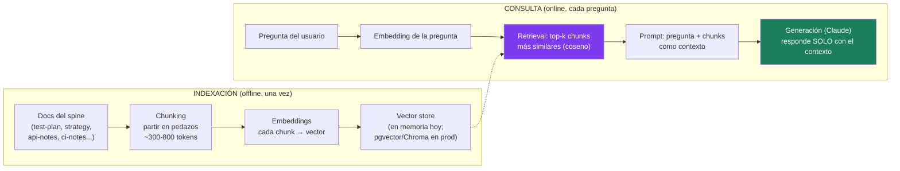
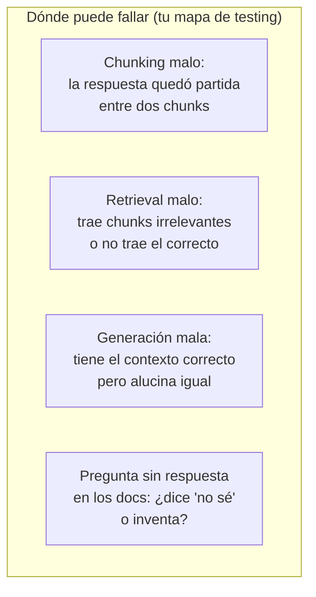

# Spec 01 · Módulo 1 — Construir el RAG (para poder romperlo)

> **Resultado:** un RAG funcional que responde preguntas sobre la documentación de tu spine project. Lo construyes tú, pieza por pieza — porque solo quien sabe dónde están las costuras sabe dónde probar.

## 🗺️ Mapa visual





## 📖 Concepto

### Por qué existe RAG

Un LLM solo sabe (a) lo que aprendió en entrenamiento — congelado y genérico — y (b) lo que está en su contexto. RAG conecta el modelo con TU conocimiento sin reentrenar: busca los fragmentos relevantes de tus documentos y se los pone en el contexto antes de generar. Es la respuesta estándar a "queremos un chatbot que sepa de NUESTROS docs/productos/políticas".

### Las decisiones de diseño (= tus variables de test)

**Chunking.** Los documentos se parten porque (a) el retrieval funciona mejor sobre piezas enfocadas y (b) el contexto cuesta tokens. El trade-off: chunks pequeños = retrieval preciso pero contexto fragmentado; grandes = contexto completo pero retrieval difuso y caro. Variables: tamaño, solapamiento (overlap, para no cortar ideas por la mitad), y respetar fronteras semánticas (headers de Markdown > cortes arbitrarios). **El chunking es la causa raíz silenciosa de la mitad de los RAG malos.**

**Retrieval.** Embedding de la pregunta vs embeddings de los chunks → top-k por similitud coseno (spec-00-M1). Variables: el modelo de embeddings, k (¿3? ¿10?), y refinamientos que verás nombrados en entrevistas: *hybrid search* (combinar con búsqueda léxica BM25), *re-ranking* (un segundo modelo reordena los top-k), *query rewriting* (reformular la pregunta antes de buscar).

**Generación.** El prompt que une contexto + pregunta. La instrucción crítica es el **grounding**: "responde SOLO con el contexto; si no está, di que no lo sabes". Sin ella, el modelo rellena huecos con su conocimiento de entrenamiento — plausible, incorrecto, e indetectable a simple vista.

### La intuición de testing que te llevas

El RAG es un pipeline de dos máquinas: **buscador** y **redactor**. Un fallo end-to-end no te dice cuál falló. El módulo 2 te da métricas que las aíslan — pero ya desde hoy, cuando veas una respuesta mala, tu primer reflejo será mirar QUÉ CHUNKS recuperó (por eso tu RAG va a loguearlos siempre).

## 🔨 Lab guiado — RAG sobre tus propios docs

**Costo aproximado: < $1.** Los embeddings son locales (sentence-transformers, spec-00); solo la generación llama a la API.

**Paso 1 — Corpus.** Tu spine tiene documentación real escrita por ti: `test-plan.md`, `test-strategy.md`, `api-notes.md`, `ci-notes.md`, `perf-notes.md`, etc. Crea `labs/ai-evals/spec01/rag/corpus.py` que las cargue (ajusta rutas a tu repo):

```python
from pathlib import Path

DOCS_DIR = Path(__file__).parents[3] / "toolshop-tests" / "docs"

def cargar_corpus() -> dict[str, str]:
    return {p.name: p.read_text() for p in DOCS_DIR.glob("**/*.md")}
```

**Paso 2 — Chunking.** Crea `spec01/rag/chunking.py` con un chunker que parta por headers de Markdown y luego por tamaño máximo (~500 tokens ≈ 2000 caracteres) con overlap de ~200 caracteres. Cada chunk conserva metadata (`doc`, `seccion`) — la trazabilidad chunk→fuente es lo que permite citar fuentes y debuggear retrieval. Escribe 3 tests pytest del chunker (¡es código determinista — testing clásico!): no parte headers por la mitad, respeta el tamaño máximo, el overlap existe.

**Paso 3 — Index + retrieval.** Crea `spec01/rag/retriever.py`:

```python
from sentence_transformers import SentenceTransformer, util

class Retriever:
    def __init__(self, chunks: list[dict]):
        self.model = SentenceTransformer("all-MiniLM-L6-v2")
        self.chunks = chunks
        self.index = self.model.encode([c["texto"] for c in chunks])

    def buscar(self, pregunta: str, k: int = 4) -> list[dict]:
        q = self.model.encode(pregunta)
        scores = util.cos_sim(q, self.index)[0]
        top = scores.argsort(descending=True)[:k]
        return [{**self.chunks[i], "score": scores[i].item()} for i in top]
```

Pruébalo a mano ANTES de conectar el LLM: `buscar("¿qué corre en cada PR?")` debería traer chunks de `ci-notes.md`. Si trae basura, arregla el chunking ahora — **la mitad del debugging de RAG ocurre aquí, sin ningún LLM involucrado**.

**Paso 4 — Generación con grounding.** Crea `spec01/rag/rag.py`:

```python
import anthropic

SYSTEM = """Eres el asistente de documentación del equipo de QA.
Responde ÚNICAMENTE con la información del contexto proporcionado.
Si la respuesta no está en el contexto, responde exactamente: "No encuentro esa información en la documentación."
Cita el documento fuente de cada afirmación entre corchetes, ej: [ci-notes.md]."""

def responder(pregunta: str, retriever) -> dict:
    chunks = retriever.buscar(pregunta)
    contexto = "\n\n".join(f"[{c['doc']} — {c['seccion']}]\n{c['texto']}" for c in chunks)
    response = anthropic.Anthropic().messages.create(
        model="claude-opus-4-8",
        max_tokens=1000,
        system=SYSTEM,
        messages=[{"role": "user", "content": f"Contexto:\n{contexto}\n\nPregunta: {pregunta}"}],
    )
    texto = next(b.text for b in response.content if b.type == "text")
    return {"respuesta": texto, "chunks": chunks, "usage": response.usage}  # ¡los chunks SIEMPRE se devuelven!
```

Nota la decisión de diseño: la función devuelve los chunks recuperados junto con la respuesta. **Un RAG que no expone su retrieval es indebuggeable** — y el módulo 2 necesita exactamente esos chunks para evaluar.

**Paso 5 — Sesión exploratoria (C1-M7 renace).** Hazle 10 preguntas en un script interactivo: 4 con respuesta directa en los docs, 3 que requieren combinar dos documentos, y 3 SIN respuesta en el corpus ("¿qué base de datos usa el data harvester?"). Para cada una anota en `spec01/exploracion.md`: ¿respondió bien? ¿citó la fuente? ¿los chunks recuperados eran los correctos? ¿dijo "no sé" cuando debía? Estás generando los casos del golden dataset del módulo 2.

**Paso 6 — Rompe el grounding a propósito.** Quita la instrucción de "responde ÚNICAMENTE..." del system prompt y repite las 3 preguntas sin respuesta. Observa cómo el modelo rellena con conocimiento genérico plausible. Esa diferencia — con y sin grounding — es la métrica **faithfulness** que formalizarás en el módulo 2. Restaura el prompt.

**Paso 7 — Commit** (`C3-S1-M1: RAG sobre docs del spine con retrieval inspeccionable`).

## 🎯 Reto

Experimento de chunking: re-indexa el corpus con 3 estrategias (chunks de 200 caracteres sin overlap, 2000 con overlap por headers — la tuya —, y documentos enteros sin partir) y corre tus 10 preguntas contra cada una. Documenta en `spec01/chunking-experimento.md` cuál gana, en qué tipo de preguntas difieren más, y POR QUÉ (mira los chunks recuperados, no solo las respuestas). Bonus: ¿qué pasa con el costo en tokens en cada estrategia? Acabas de hacer tu primer A/B de arquitectura RAG dirigido por datos — sin saber aún de RAGAS.

## ✅ Checklist de dominio

- [ ] Puedo dibujar el pipeline RAG completo y señalar los 4 puntos de fallo
- [ ] Entiendo los trade-offs del chunking y los he medido en mi propio corpus
- [ ] Sé qué es grounding y qué pasa exactamente cuando falta
- [ ] Mi RAG expone los chunks recuperados (y sé por qué es innegociable)
- [ ] Puedo explicar hybrid search, re-ranking y query rewriting a nivel de entrevista
- [ ] Testeé el chunker con pytest clásico (lo determinista se testea como siempre)

## 💬 Preguntas de entrevista

1. *"Walk me through a RAG architecture and where it can fail."*
2. *"How do you choose a chunking strategy? What trade-offs are involved?"*
3. *"The RAG answers correctly but never cites sources, and sometimes answers questions that aren't in the docs. What two problems do you see?"* (grounding + faithfulness)
4. *"What parts of a RAG pipeline can you test with classic deterministic tests?"* (chunker, retriever con corpus fijo, formato del prompt — ¡mucho más de lo que la gente cree!)
5. *"Why does retrieval quality matter more than the LLM's quality in most RAG failures?"*

## 🔗 Conexiones

- **Refuerza:** los embeddings de [spec-00-M1](../spec-00-fundamentos-llm/modulo-01-llm-y-api.md) ahora trabajan; el testing exploratorio de [C1-M7](../../curso-1-fundamentos/modulo-07-diseno-de-casos.md) genera el dataset; la lección "expone tu estado interno para poder debuggear" es observabilidad ([C2-M7](../../curso-2-profundizando/modulo-07-observabilidad.md)) aplicada a RAG.
- **Se reutiliza en:** el módulo 2 evalúa ESTE RAG con RAGAS usando los chunks que decidiste exponer; spec-05 traza este pipeline con Langfuse (cada paso = un span — ¿te suena de C2-M7?); en la aerolínea, el agente Analyst consulta documentación con exactamente este patrón.
