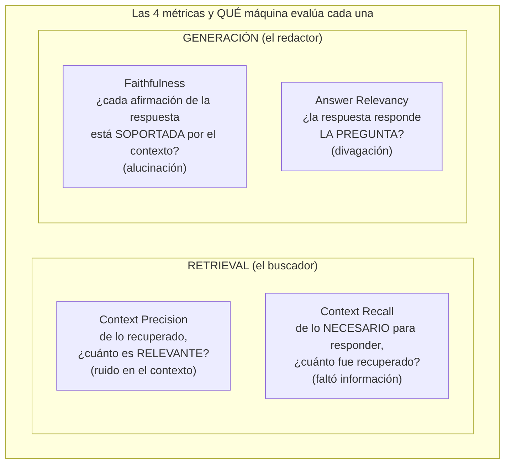
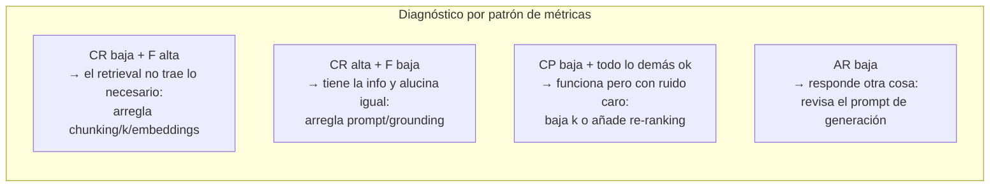

# Spec 01 · Módulo 2 — Evaluar el RAG con RAGAS

> **Resultado:** una suite de evaluación que separa los fallos de retrieval de los de generación usando las métricas RAGAS — y un veredicto cuantificado sobre TU RAG del módulo 1.

## 🗺️ Mapa visual





## 📖 Concepto

### El insight de RAGAS: una métrica por componente

Evaluar un RAG con "¿la respuesta es buena?" es como debuggear un pipeline de CI mirando solo el verde/rojo final. [RAGAS](https://docs.ragas.io) descompone la calidad en métricas que apuntan cada una a UNA pieza del pipeline (mapa de arriba) — y eso convierte la evaluación en **diagnóstico accionable**: el segundo diagrama es literalmente tu árbol de decisión de debugging.

¿Cómo calcula RAGAS estas métricas si la corrección semántica no se puede assertear? Usando **un LLM como evaluador**: para faithfulness, por ejemplo, descompone la respuesta en afirmaciones individuales y le pregunta a un modelo, afirmación por afirmación, si el contexto la soporta. Estás usando LLM-as-a-judge sin haberlo estudiado formalmente — spec-02 abre la caja, examina los sesgos del juez y cuándo confiar en él. Por hoy, la regla práctica: **las métricas de RAGAS son señales direccionales robustas, no verdades al tercer decimal**.

### El dataset de evaluación: la mitad del trabajo

Cada caso necesita: `question`, `answer` (la del RAG), `contexts` (los chunks que TU RAG expuso — por eso los devolvías) y, para context recall, una `ground_truth` (respuesta de referencia escrita por ti). Las reglas de diseño que ya conoces aplican:

- **Clases de equivalencia** (C1-M7): preguntas directas, multi-documento, sin-respuesta, ambiguas. Cada clase ejercita una pieza distinta del pipeline.
- **Los casos sin-respuesta son oro**: un RAG que responde el 100 % de las preguntas es un RAG que alucina — el "no encuentro esa información" correcto se evalúa explícitamente.
- **El dataset evoluciona**: cada bug real de producción se convierte en caso del dataset (regression testing, C1-M1 — mismo principio, nuevo artefacto).

## 🔨 Lab guiado — La suite de evaluación

**Costo aproximado: ~$2-4 (RAGAS hace varias llamadas de juez por caso).**

**Paso 1 — Instala y configura RAGAS con Claude como juez.**

```bash
cd ~/Documents/sdet-mastery/labs/ai-evals
uv add ragas langchain-anthropic datasets
```

RAGAS usa LangChain para hablar con el LLM juez. Configúralo con Claude en `spec01/evals/conftest_ragas.py`:

```python
from ragas.llms import LangchainLLMWrapper
from ragas.embeddings import LangchainEmbeddingsWrapper
from langchain_anthropic import ChatAnthropic
from langchain_community.embeddings import HuggingFaceEmbeddings

judge_llm = LangchainLLMWrapper(ChatAnthropic(model="claude-opus-4-8", max_tokens=2000))
judge_embeddings = LangchainEmbeddingsWrapper(HuggingFaceEmbeddings(model_name="all-MiniLM-L6-v2"))
```

(Si las versiones actuales de ragas/langchain difieren en imports, consulta docs.ragas.io — los nombres de los wrappers han cambiado entre versiones; parte del trabajo real de un SDET de IA es navegar este ecosistema joven.)

**Paso 2 — El golden dataset.** Convierte tu exploración del módulo 1 en `spec01/evals/golden_dataset.py`: 12 casos mínimo — 5 directos, 3 multi-documento, 3 sin-respuesta, 1 ambiguo — cada uno con `question`, `ground_truth` (escrita por TI: tú eres el experto de tus docs) y la clase como tag.

**Paso 3 — El runner de evaluación.** Crea `spec01/evals/run_eval.py`: para cada caso, ejecuta tu RAG (`responder()` del módulo 1), recoge `answer` y `contexts`, y evalúa:

```python
from ragas import evaluate, EvaluationDataset
from ragas.metrics import ContextPrecision, ContextRecall, Faithfulness, AnswerRelevancy

# construir los registros con question/answer/contexts/ground_truth por caso...
dataset = EvaluationDataset.from_list(registros)
resultado = evaluate(
    dataset,
    metrics=[ContextPrecision(), ContextRecall(), Faithfulness(), AnswerRelevancy()],
    llm=judge_llm,
    embeddings=judge_embeddings,
)
df = resultado.to_pandas()
print(df[["user_input", "context_precision", "context_recall", "faithfulness", "answer_relevancy"]])
df.to_csv("spec01/evals/resultados.csv")
```

**Paso 4 — Diagnóstico con el árbol de decisión.** Analiza tus resultados POR CLASE de caso (agrupa con pandas). Para cada caso con métricas bajas, aplica el segundo diagrama del mapa: ¿es retrieval o generación? Verifica tu diagnóstico mirando los chunks (los tienes). Documenta en `spec01/evals/diagnostico.md` los 3 peores casos con su causa raíz y el fix propuesto. **Este documento es el deliverable estrella del spec** — es exactamente el análisis que harías en un trabajo real.

**Paso 5 — Aplica UN fix y mide.** Elige el fix de mayor impacto de tu diagnóstico (¿subir k? ¿mejorar chunking? ¿endurecer grounding?), aplícalo y re-corre la suite. Tabla antes/después en `diagnostico.md`. Si mejoró lo que apuntaste sin degradar el resto: diagnóstico validado. Si no — también es un resultado, documenta por qué.

**Paso 6 — Umbral como gate.** Convierte la suite en test pytest con umbrales por clase: faithfulness media ≥ 0.85 global, y para la clase sin-respuesta, el 100 % debe contener "No encuentro esa información". Este test es el embrión del eval-en-CI que spec-02 industrializa.

**Paso 7 — Commit** (`C3-S1-M2: suite RAGAS + diagnóstico + fix medido`).

## 🎯 Reto

**El caso adversarial del retrieval.** Agrega a tus docs un archivo `deprecated-notes.md` con información OBSOLETA que contradiga a `ci-notes.md` (ej.: "la suite corre solo los viernes"). Re-indexa y pregunta sobre ese tema. ¿Qué chunks gana el retrieval? ¿Qué responde el RAG ante contexto contradictorio? Diseña y documenta la mitigación (pistas: metadata de frescura en los chunks, instrucción de resolución de conflictos en el prompt, o higiene del corpus — ¿cuál elegirías y por qué?). Los corpus reales SIEMPRE tienen contradicciones; las entrevistas de RAG senior siempre lo preguntan.

## ✅ Checklist de dominio

- [ ] Puedo explicar las 4 métricas RAGAS y qué componente evalúa cada una
- [ ] Uso el árbol de diagnóstico: patrón de métricas → componente culpable → fix
- [ ] Mi golden dataset tiene clases de equivalencia deliberadas, incluida sin-respuesta
- [ ] Sé que RAGAS usa un LLM como juez y trato sus números como señal direccional
- [ ] Cerré el ciclo completo: evaluar → diagnosticar → arreglar → re-medir
- [ ] Tengo umbrales por clase convertidos en tests ejecutables

## 💬 Preguntas de entrevista

1. *"How would you evaluate a RAG system? Which metrics and why?"* (las 4, CON el mapeo a componentes)
2. *"Context recall is high but faithfulness is low. Where's the bug?"* (generación: tiene la info y alucina — prompt/grounding)
3. *"How do you build an evaluation dataset for a RAG over internal docs?"* (clases, ground truth experta, casos sin-respuesta, evolución con bugs reales)
4. *"The PM says 'the chatbot feels better this sprint'. How do you replace 'feels' with numbers?"*
5. *"What happens when your knowledge base contains contradictory documents?"* (tu reto)

## 🔗 Conexiones

- **Refuerza:** el RAG del [módulo 1](modulo-01-construir-rag.md) (exponer chunks fue lo que hizo posible evaluar); el golden dataset de [spec-00-M2](../spec-00-fundamentos-llm/modulo-02-structured-output-no-determinismo.md) sube de nivel; el ciclo diagnóstico→fix→re-medición es el mismo de la flakiness ([C2-M6](../../curso-2-profundizando/modulo-06-cicd-avanzado.md)).
- **Se reutiliza en:** spec-02 abre la caja del LLM-juez que RAGAS usó hoy y mete estos evals en CI; spec-05 añade la dimensión que faltó (¿cuánto TARDA y CUESTA cada pregunta del RAG?); el patrón "métrica por componente del pipeline" reaparece en spec-03 para agentes (¿falló el plan, la tool o la síntesis?).
- **🔧 Aplícalo:** estas métricas ya están construidas y medidas en tu proyecto real → [Proyecto: llm-eval-harness](especial__proyecto-harness-repaso.md) (recall@3=1.00, precision=0.58 con el hallazgo del chunking). Repásalo al terminar el spec.
