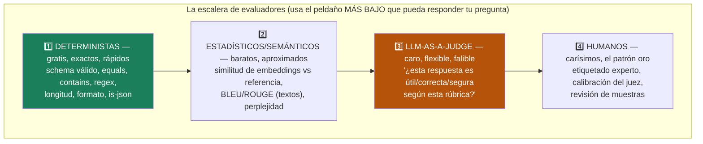
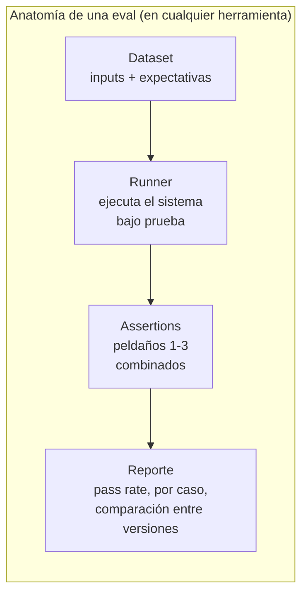

# Spec 02 · Módulo 1 — La escalera de evals + promptfoo

> **Resultado:** una suite promptfoo que evalúa el clasificador de bugs de spec-00 subiendo la escalera de evaluadores: lo determinista con asserts baratos, lo semántico con similitud, y SOLO lo subjetivo con un juez LLM.

## 🗺️ Mapa visual





## 📖 Concepto

### La escalera: el criterio que ordena todo

El error clásico es saltar directo al peldaño 3 ("que un LLM evalúe todo"). Caro, lento y añade no-determinismo al propio test. El criterio senior es **subir la escalera solo cuando el peldaño actual no puede responder la pregunta**:

- *"¿El output es JSON válido con el schema correcto?"* → peldaño 1. Ya lo haces gratis con structured outputs/Pydantic.
- *"¿La severity es exactamente 'critical'?"* → peldaño 1. Equals simple — porque diseñaste el output como enum (¡decisión de DISEÑO que hace testeable el sistema — testability by design, el shift-left de C2-M8 aplicado a IA!).
- *"¿El `reasoning` menciona la pérdida de revenue?"* → peldaño 1-2: contains/regex si la frase es predecible, similitud semántica si puede parafrasear.
- *"¿El `reasoning` es una justificación lógica y suficiente?"* → peldaño 3. No hay regex para "lógico".

Cuanto más estructura le diseñes al output, más abajo de la escalera vives. **Un sistema LLM bien diseñado para testabilidad minimiza la superficie que necesita juez.**

### promptfoo: la herramienta de la capa de prompts

[promptfoo](https://promptfoo.dev) es el estándar open-source para evaluar prompts: declaras prompts, providers, casos y assertions en YAML, y te da CLI + UI con matriz de resultados. Sus fortalezas: comparar **versiones de prompts lado a lado** (¿mi cambio mejoró sin romper nada? — regression testing de prompts), múltiples tipos de assert por caso, y cache de respuestas (itera sin re-pagar). Vocabulario clave: `providers` (el modelo/sistema), `tests` (casos con `vars` y `assert`), tipos de assert (`equals`, `contains`, `is-json`, `javascript`, `similar`, `llm-rubric`).

### El juez, presentado (el módulo 2 lo interroga)

`llm-rubric` le pasa output + rúbrica a un LLM evaluador. Hoy lo usas como caja negra en 2-3 asserts; el módulo siguiente abre la caja: sesgos (posición, verbosidad, auto-preferencia), diseño de rúbricas y calibración contra humanos. Regla de hoy: **rúbricas binarias y específicas** ("¿menciona el impacto en revenue? sí/no") superan a las difusas ("¿es buena la respuesta? 1-10").

## 🔨 Lab guiado — promptfoo sobre el clasificador

**Costo aproximado: ~$1-2 (el cache de promptfoo ayuda).**

**Paso 1 — Instala.** promptfoo es Node (¡tu otro mundo!):

```bash
cd ~/Documents/sdet-mastery/labs/ai-evals/spec02
npm init -y && npm install -D promptfoo
npx promptfoo --version
```

**Paso 2 — Configura la eval del clasificador.** Crea `spec02/promptfooconfig.yaml`:

```yaml
description: "Eval del clasificador de bugs (spec-00)"

prompts:
  - file://prompts/classifier_v1.txt    # extrae aquí tu system prompt de spec-00

providers:
  - id: anthropic:messages:claude-opus-4-8
    config:
      max_tokens: 1000

tests:
  - description: "bug crítico de pago — caso claro"
    vars:
      bug_report: "Al pagar con tarjeta, el endpoint /payment devuelve 500 si el carrito tiene más de 10 items. Reproducible siempre."
    assert:
      - type: is-json                                   # peldaño 1
      - type: javascript                                # peldaño 1: campo exacto
        value: JSON.parse(output).severity === 'critical'
      - type: javascript                                # peldaño 1: estructura
        value: typeof JSON.parse(output).is_regression === 'boolean'
      - type: llm-rubric                                # peldaño 3: SOLO el reasoning
        value: "El campo reasoning justifica la severidad mencionando el impacto en pagos o revenue. Responde PASS o FAIL."
```

Migra los 10 casos de tu `bugs_dataset.py` de spec-00 (los ambiguos: assertea que la severity esté EN un conjunto — `['high','critical']` — en vez de un valor exacto; tu política de umbrales por clase, ahora en YAML).

```bash
npx promptfoo eval && npx promptfoo view   # UI con la matriz de resultados
```

**Paso 3 — Lee la matriz como tester.** En la UI: ¿qué asserts fallan? ¿Son fallos del sistema (el clasificador se equivocó) o del test (tu assert era demasiado estricto)? Esa distinción — bug del SUT vs bug del test — es tu pan de cada día desde C1, y en evals es el 50 % del trabajo. Ajusta lo que sea bug del test; anota lo que sea bug del SUT.

**Paso 4 — Regression testing de prompts.** Copia tu prompt a `prompts/classifier_v2.txt` y aplica la mejora del reto de spec-00-M2 (criterios de desempate). Añade ambos al YAML y re-corre: promptfoo muestra v1 vs v2 **lado a lado, caso por caso**. ¿v2 mejora los ambiguos sin romper los claros? Acabas de hacer el A/B de prompts con red de regresión — la práctica que separa "prompt engineering" de adivinar.

**Paso 5 — La eval de la escalera completa.** Añade un caso nuevo con los 3 peldaños deliberados y documenta en comentarios del YAML POR QUÉ cada assert vive en su peldaño:

```yaml
  - description: "escalera completa: bug de UI menor"
    vars:
      bug_report: "El footer se ve desalineado 2px en Safari."
    assert:
      - type: is-json                          # P1: forma — gratis
      - type: javascript                       # P1: exacto — el enum lo permite
        value: "['low','medium'].includes(JSON.parse(output).severity)"
      - type: similar                          # P2: semántico — puede parafrasear
        value: "problema cosmético de presentación visual"
        threshold: 0.6
      - type: llm-rubric                       # P3: subjetivo — no hay regex para esto
        value: "El reasoning NO exagera la severidad de un problema cosmético. PASS/FAIL."
```

**Paso 6 — Commit** (`C3-S2-M1: suite promptfoo con escalera de evals + A/B de prompts`).

## 🎯 Reto

Diseña la eval de un sistema que NO controlas por completo: tu RAG de spec-01 (si no hiciste spec-01: el triage de spec-00-M1, que produce texto libre). El desafío: el output es prosa, no JSON — ¿cuánto puedes evaluar SIN llegar al peldaño 3? Exprime los peldaños 1-2: ¿el formato de citas `[doc.md]` es regex-eable? ¿la respuesta a preguntas sin-respuesta es un equals exacto? ¿la similitud semántica contra tu ground_truth captura corrección? Entrega el YAML + una nota: qué % de tu confianza total viene de cada peldaño, y qué costaría (en $ y en falibilidad) moverlo todo al peldaño 3.

## ✅ Checklist de dominio

- [ ] Puedo recitar la escalera y dar un ejemplo de pregunta para cada peldaño
- [ ] Diseño outputs estructurados PARA vivir en peldaños bajos (testability by design)
- [ ] Tengo una suite promptfoo corriendo con asserts de 3 peldaños
- [ ] Hice un A/B de prompts con comparación caso por caso
- [ ] Distingo bug del SUT vs bug del eval y sé ajustar cada uno
- [ ] Mis rúbricas de juez son binarias y específicas

## 💬 Preguntas de entrevista

1. *"How do you evaluate LLM outputs? Walk me through your toolbox."* (LA escalera, de abajo hacia arriba)
2. *"When would you NOT use LLM-as-a-judge?"* (cuando un peldaño inferior basta: forma, exactos, formato — y cuando el costo/no-determinismo del juez no se justifica)
3. *"How do you prevent a prompt change from silently breaking existing behavior?"* (eval suite como red de regresión + A/B lado a lado)
4. *"Design the evaluation for an LLM feature that summarizes support tickets."* (estructura el output primero → escalera → juez solo para calidad del resumen)
5. *"Your eval suite passes but users complain. What's missing?"* (dataset no representativo, métricas equivocadas, falta evals en producción — spec-05)

## 🔗 Conexiones

- **Refuerza:** el clasificador y golden dataset de [spec-00-M2](../spec-00-fundamentos-llm/modulo-02-structured-output-no-determinismo.md) son el SUT de hoy; las 3 capas de assert de [C1-M4](../../curso-1-fundamentos/modulo-04-api-testing.md) (status/schema/negocio) eran una escalera embrionaria; "bug del SUT vs bug del test" viene de toda tu práctica del C1-C2.
- **Se reutiliza en:** el [módulo 2](modulo-02-juez-y-ci.md) interroga al juez y mete TODO en CI; spec-03 evalúa trayectorias de agentes con esta misma escalera (¿llamó la tool correcta? = peldaño 1); spec-04 usa rúbricas de juez para detectar jailbreaks exitosos; el Healer del capstone 🏆 se acepta o rechaza con una eval de esta familia.
