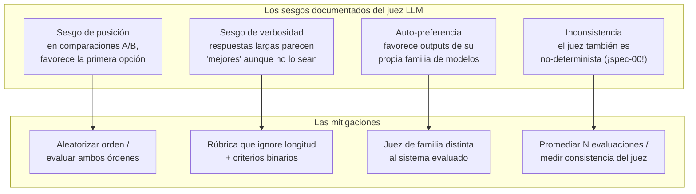
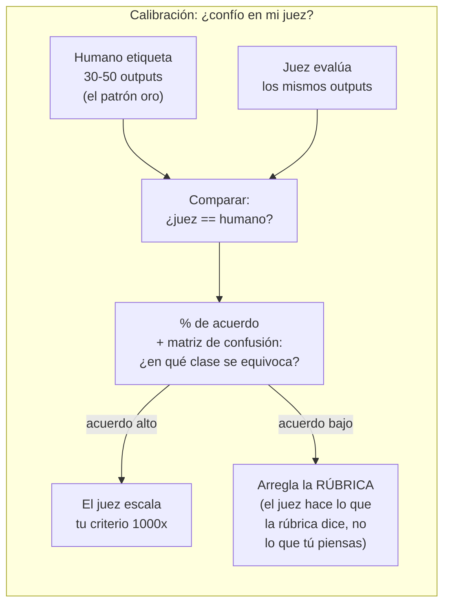

# Spec 02 · Módulo 2 — El juez bajo juicio + evals en CI

> **Resultado:** jueces con rúbrica implementados en DeepEval, la calibración que mide si tu juez coincide con humanos (tú), y el pipeline de CI que falla cuando las métricas caen. El eslabón que convierte evals en ingeniería.

## 🗺️ Mapa visual





## 📖 Concepto

### El juez es un sistema LLM más — con sus propios bugs

Usar un LLM para evaluar LLMs suena circular, y un senior enfrenta esa objeción de frente: el juez funciona porque **evaluar es más fácil que generar** (verificar una afirmación contra un contexto es una tarea más simple y verificable que redactar la respuesta completa) — pero el juez hereda todos los problemas de spec-00: no-determinismo, sensibilidad al prompt (la rúbrica ES un prompt), y los sesgos del mapa. La diferencia entre usar el juez bien y mal es **tratarlo como instrumento de medición: se calibra antes de confiar en él**.

### Calibración: el paso que casi todos se saltan

Un juez sin calibrar es un número que parece ciencia. El protocolo (segundo diagrama): etiqueta humanamente una muestra (30-50 outputs), corre el juez sobre la misma muestra, mide el acuerdo. Si el juez coincide contigo ≥ ~90 % en criterios binarios, escala tu criterio; si no, la rúbrica no captura tu criterio — itérala (¡con un A/B de promptfoo, módulo 1!). Y la trampa sutil: **el acuerdo se mide por clase** — un juez puede acertar el 95 % global y fallar sistemáticamente justo en la clase que más te importa (¿te suena? — el promedio que miente, C2-M5).

### DeepEval: evals como tests de pytest

[DeepEval](https://docs.confident-ai.com) trae el modelo mental que ya dominas: las evals SON tests. Métricas como objetos, `assert_test` como assert, pytest como runner — tu CI no nota la diferencia:

```python
from deepeval import assert_test
from deepeval.test_case import LLMTestCase
from deepeval.metrics import GEval

correccion = GEval(
    name="Severidad correcta",
    criteria="Determina si la severidad asignada en 'actual output' es apropiada para el bug descrito en 'input', usando: critical = pérdida de revenue o datos; high = bloquea flujo principal; medium = afecta sin bloquear; low = cosmético.",
    evaluation_params=["input", "actual_output"],
    threshold=0.8,
)

def test_triage_bug_critico():
    caso = LLMTestCase(input=bug_report, actual_output=respuesta_del_clasificador)
    assert_test(caso, [correccion])
```

`GEval` implementa el patrón juez-con-rúbrica con un refinamiento (genera pasos de evaluación desde tus criterios y pondera probabilidades). promptfoo y DeepEval se solapan; la división de trabajo práctica: **promptfoo para iterar prompts (matriz, A/B, UI), DeepEval para el gate de CI (pytest, métricas como código)**. Conocer ambos es lo que el mercado pide.

### Evals en CI: la matriz de gates aprende IA

Tu matriz de C2-M6 gana una fila. Las diferencias operativas que debes resolver (y que las entrevistas preguntan): las evals **cuestan dinero** por run (dataset pequeño y de alta señal en PR; el completo, nightly), **tardan** (paralelizar llamadas), y **flakean por diseño** (umbral sobre el agregado — "accuracy ≥ 0.9" — en vez de exigir 100 % de casos verdes; ¿reconoces la lección de flakiness de C2-M6?). Y la pregunta de gobernanza: ¿qué cambios disparan las evals? Cambios de prompt SIEMPRE (el prompt es código), actualización de modelo SIEMPRE, cambios de código del pipeline también — versionado de prompts + evals en CI = el control de cambios de la era LLM.

## 🔨 Lab guiado — Juez calibrado + gate de CI

**Costo aproximado: ~$3-5.**

**Paso 1 — Setup DeepEval con Claude como juez.**

```bash
cd ~/Documents/sdet-mastery/labs/ai-evals
uv add deepeval
```

DeepEval permite un modelo custom como juez; implementa el wrapper para Claude en `spec02/deepeval_claude.py` (subclase de `DeepEvalBaseLLM` que llama a `claude-opus-4-8` — la doc oficial trae la plantilla; si la API del wrapper cambió, adaptarla es parte del ejercicio).

**Paso 2 — Migra el caso juez a DeepEval.** Crea `spec02/test_triage_evals.py` con el `GEval` de arriba corriendo sobre tu golden dataset completo de spec-00 (parametrizado con pytest, como C1-M7). Corre `uv run pytest spec02/ -v` y mira las evals pasar/fallar como tests normales.

**Paso 3 — Calibración (el corazón del módulo).** Genera 30 outputs del clasificador (3 runs × 10 bugs). En `spec02/calibracion/etiquetas_humanas.csv`, etiqueta TÚ cada uno: ¿la severity es apropiada? (sí/no — binario, sin escala). Luego corre tu juez `GEval` sobre los mismos 30 y construye en `spec02/calibracion/analisis.py` la comparación: % de acuerdo global, y matriz de confusión (¿el juez es más laxo o más estricto que tú? ¿en qué severidades discrepa?). Documenta el veredicto en `spec02/calibracion/RESULTADOS.md`: ¿confías en este juez para CI? ¿con qué umbral?

**Paso 4 — Itera la rúbrica si hace falta.** Si el acuerdo < 90 %: estudia los desacuerdos uno a uno (¿quién tiene razón — tú o el juez? a veces el humano también se equivoca, y ESO también es un hallazgo), ajusta los criterios del `GEval` y re-mide. Documenta el antes/después. Si el acuerdo ya era alto: provoca el fallo — escribe una rúbrica vaga ("¿es buena la clasificación?") y mide cuánto cae el acuerdo. Necesitas VER la diferencia entre rúbrica buena y mala en números propios.

**Paso 5 — Demuestra un sesgo.** Experimento de verbosidad en `spec02/sesgos/verbosidad.py`: toma 5 outputs correctos y crea versiones infladas (mismo contenido + relleno pomposo: "tras un análisis exhaustivo y meticuloso…"). Pásale al juez pares (conciso vs inflado) preguntando cuál es mejor clasificación. ¿Favorece al inflado? Documenta el resultado — y la mitigación que aplicarías (rúbrica que puntúe SOLO corrección de severity, ciega a la longitud).

**Paso 6 — El gate en CI.** Crea `.github/workflows/llm-evals.yml` en el repo:

```yaml
name: LLM evals
on:
  pull_request:
    paths:
      - 'labs/ai-evals/spec00/prompts/**'      # cambios de prompt SIEMPRE evalúan
      - 'labs/ai-evals/spec00/classifier.py'
  schedule:
    - cron: '0 3 * * *'                         # suite completa nightly

jobs:
  evals:
    runs-on: ubuntu-latest
    steps:
      - uses: actions/checkout@v4
      - uses: astral-sh/setup-uv@v4
      - name: Evals de PR (subset de alta señal)
        if: github.event_name == 'pull_request'
        working-directory: labs/ai-evals
        run: uv run pytest spec02/ -v -m smoke_eval
        env:
          ANTHROPIC_API_KEY: ${{ secrets.ANTHROPIC_API_KEY }}
      - name: Suite completa (nightly)
        if: github.event_name == 'schedule'
        working-directory: labs/ai-evals
        run: uv run pytest spec02/ -v
        env:
          ANTHROPIC_API_KEY: ${{ secrets.ANTHROPIC_API_KEY }}
```

Marca 3-4 evals de máxima señal con `@pytest.mark.smoke_eval` (registra el marker en `pyproject.toml`). Añade el secret `ANTHROPIC_API_KEY` al repo. Abre un PR que cambie el prompt del clasificador y mira el gate correr. **Tu matriz de gates de C2-M6 acaba de aprender IA.**

**Paso 7 — Commit/PR** (`C3-S2-M2: juez calibrado + análisis de sesgos + evals como gate de CI`).

## 🎯 Reto

**El juez comparativo.** Implementa la evaluación A/B con juez: dado un bug y DOS clasificaciones (prompt v1 vs v2 del módulo 1), el juez decide cuál es mejor. Requisitos: mitigar el sesgo de posición evaluando ambos órdenes (A,B y B,A) y declarando empate si el juez se contradice; reportar % de victorias de cada versión + % de inconsistencia del juez. Compara el veredicto con tu A/B de promptfoo del módulo 1: ¿coinciden? Entrega `spec02/retos/ab_judge.py` + conclusiones. (Pairwise comparison es el formato de evaluación detrás de los leaderboards tipo Chatbot Arena — sabrlo implementar con sus mitigaciones es nivel staff del dominio.)

## ✅ Checklist de dominio

- [ ] Puedo nombrar los 4 sesgos del juez y la mitigación de cada uno
- [ ] Calibré un juez contra etiquetas humanas propias y tengo el % de acuerdo
- [ ] Sé por qué el acuerdo se mide por clase, no solo global
- [ ] Demostré un sesgo experimentalmente con números propios
- [ ] Tengo evals corriendo como gate de CI con la economía resuelta (subset en PR, full nightly)
- [ ] Puedo defender "evaluar es más fácil que generar" ante la objeción de circularidad

## 💬 Preguntas de entrevista

1. *"Isn't using an LLM to judge an LLM circular? Why does it work?"*
2. *"How do you know your LLM judge is trustworthy?"* (calibración contra humanos — tu paso 3 ES la respuesta, con números)
3. *"What biases do LLM judges have and how do you mitigate them?"*
4. *"How do you integrate LLM evals into CI without making the pipeline slow, expensive and flaky?"* (subset/full, umbrales agregados, cache, paths-filter)
5. *"A prompt change improved your main metric but you shipped a regression anyway. What was missing in your eval design?"* (cobertura del dataset, métricas secundarias, clases sin representar)

## 🔗 Conexiones

- **Refuerza:** el no-determinismo de [spec-00-M2](../spec-00-fundamentos-llm/modulo-02-structured-output-no-determinismo.md) aplicado al propio juez; "el promedio miente" de [C2-M5](../../curso-2-profundizando/modulo-05-performance-k6.md) → acuerdo por clase; la economía de gates y el manejo de flakiness de [C2-M6](../../curso-2-profundizando/modulo-06-cicd-avanzado.md) gobiernan el diseño del workflow.
- **Se reutiliza en:** spec-03 evalúa trayectorias de agentes con jueces de esta familia; spec-04 usa un juez calibrado para decidir si un ataque tuvo éxito; spec-05 corre estos mismos evals sobre tráfico de producción (online evals); en el capstone 🏆, el "score de confianza" que decide si el Healer puede auto-mergear sale de un juez calibrado EXACTAMENTE como el de hoy.
- **🔧 Aplícalo:** tu juez calibrado ya existe y da 100% de acuerdo con humanos → [Proyecto: llm-eval-harness](especial__proyecto-harness-repaso.md). Ahí está también la limitación que debes confesar en entrevista (juez y generador son el mismo modelo). Repásalo al terminar el spec.
