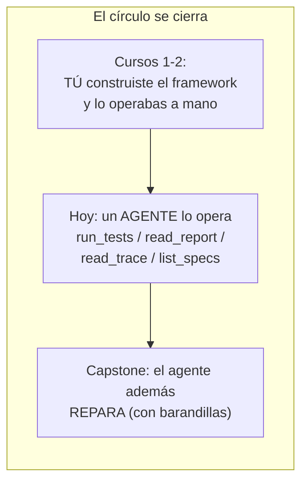
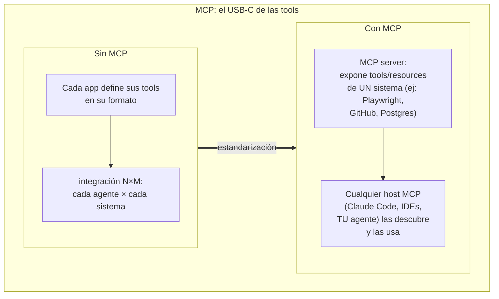

# Spec 03 · Módulo 2 — El agente QA: tu framework como herramienta

> **Resultado:** el cierre de círculo del programa — un agente que ejecuta tu suite Playwright del spine, lee los reportes y diagnostica fallos. Y el estándar que hace eso portable: MCP.

## 🗺️ Mapa visual





## 📖 Concepto

### Las tools de QA: diseño antes que código

El módulo 1 usó un mundo de juguete; hoy las tools tocan tu framework real. El diseño de la superficie de tools ES la decisión de arquitectura — y es donde tu criterio de SDET brilla, porque las preguntas son de testing puro:

| Tool | Qué envuelve | La decisión de diseño |
|------|--------------|----------------------|
| `list_specs()` | glob de `tests/**/*.spec.ts` | Darle el mapa ANTES de actuar (reduce alucinación de rutas — fallo F3) |
| `run_tests(spec?, grep?, project?)` | `npx playwright test ...` como subproceso | ¿Scope acotado o suite completa? ACOTADO: el agente itera; cada run debe ser barato |
| `read_report()` | el JSON reporter de Playwright, **resumido** | El reporte crudo puede medir 1MB → resumir programáticamente (status, fallos, errores, duración) ANTES de dárselo. La gestión del contexto es diseño de tools |
| `read_trace_summary(test)` | metadata del trace del test fallido | La evidencia para diagnosticar — el mismo trace que TÚ lees desde C1-M5 |

Dos principios generales que las entrevistas adoran: (1) **tools deterministas, agente no-determinista** — toda la lógica que PUEDA ser código normal (parsear el reporte, filtrar, resumir) VA en la tool, no se le pide al modelo; (2) **el output de una tool es UI para el modelo** — un error que dice `exit code 1` no ayuda; uno que dice `2 tests failed: checkout.spec.ts:12 TimeoutError waiting for [data-test=pay]...` le permite diagnosticar.

### MCP: el estándar que hace esto portable

Tus tools de hoy viven dentro de tu agente. **Model Context Protocol** (MCP, estándar abierto creado por Anthropic y adoptado por toda la industria) las saca a un proceso aparte — un *MCP server* — que cualquier *host* (Claude Code, IDEs, otros agentes) puede consumir. La arquitectura: el server expone `tools` (acciones), `resources` (datos) y `prompts`; el host los descubre por el protocolo (JSON-RPC sobre stdio o HTTP) y los ofrece a su modelo. Para el ecosistema QA esto ya es real: **Playwright tiene MCP server oficial** (`@playwright/mcp`) — está en la fila "UI tests" del stack de tu aerolínea precisamente por eso. En el lab usarás ambos enfoques: tus tools propias (control total) y el server MCP de Playwright (estándar).

## 🔨 Lab guiado — El agente que opera tu suite

**Costo aproximado: ~$3-5.** Necesitas el SUT de Toolshop corriendo (Docker) y tu spine del C2.

**Paso 1 — Las tools QA.** Crea `labs/ai-evals/spec03/qa_agent/tools.py` implementando las 4 tools de la tabla como funciones Python que invocan tu suite por subproceso:

```python
import subprocess, json
from pathlib import Path

SPINE = Path(__file__).parents[3] / "toolshop-tests"

def run_tests(spec: str = "", grep: str = "", project: str = "api") -> str:
    cmd = ["npx", "playwright", "test", f"--project={project}", "--reporter=json"]
    if spec: cmd.append(spec)
    if grep: cmd += ["--grep", grep]
    proc = subprocess.run(cmd, cwd=SPINE, capture_output=True, text=True, timeout=600)
    return resumir_reporte(proc.stdout)   # NUNCA el JSON crudo: resumen programático

def resumir_reporte(raw: str) -> str:
    """Reduce el reporte JSON de Playwright a lo que un diagnóstico necesita."""
    data = json.loads(raw or "{}")
    # extrae: total/passed/failed/flaky, y por cada fallo: file:line, título, error.message
    ...
```

Implementa `resumir_reporte` con calma y **testéala con pytest clásico** usando un reporte JSON real guardado como fixture (¡es código determinista!). La calidad de este resumen determina la calidad del diagnóstico del agente.

**Paso 2 — El agente QA.** `spec03/qa_agent/agent.py` reutiliza tu `run_agent` del módulo 1 con las tools nuevas y este system prompt como base (itéralo):

```
Eres un ingeniero QA senior. Diagnosticas fallos de la suite de tests de Toolshop.
Método: (1) entiende qué specs existen, (2) ejecuta el scope MÁS PEQUEÑO que responda
la pregunta, (3) ante un fallo, lee el detalle antes de concluir, (4) tu diagnóstico
final SIEMPRE distingue: bug del producto vs bug del test vs problema de ambiente,
con la evidencia que lo soporta. Nunca declares éxito sin haber visto el reporte.
```

**Paso 3 — Misión en verde.** Objetivo: *"Verifica que la API de productos funciona correctamente"*. Con el SUT sano, el agente debería: listar specs → correr `products.spec.ts` (¡scope acotado — vigílalo!) → leer reporte → concluir. Estudia la trayectoria: ¿corrió solo lo necesario o toda la suite? Si fue ineficiente, mejora el system prompt y repite (prompt engineering dirigido por trayectorias).

**Paso 4 — Misión de diagnóstico (la de verdad).** Rompe Toolshop sutilmente: detén el contenedor de la API (`docker compose stop laravel-api`) dejando la UI viva. Objetivo: *"La suite está fallando. Diagnostica la causa raíz."* El diagnóstico correcto es **problema de ambiente** (API caída), no bug de producto. ¿Tu agente llega? Observa CÓMO: ¿nota que TODOS los fallos son de conexión? ¿distingue el patrón? Guarda la trayectoria completa en `spec03/qa_agent/trayectorias/diagnostico-api-caida.json` — es el primer caso del dataset del módulo 3. Restaura el contenedor.

**Paso 5 — Segunda avería: el selector roto.** El clásico: rompe un `data-test` en un page object del spine (como en C1-M5). Misión: *"checkout.spec.ts está fallando. ¿Bug del producto o del test?"*. La respuesta correcta es **bug del test** (selector desactualizado) — el agente necesita leer el error del trace/reporte y razonar que el elemento existe pero el selector no matchea. Guarda la trayectoria. Restaura. **Acabas de ver el embrión exacto del Healer del capstone**: diagnosticar un selector roto es el paso previo a repararlo.

**Paso 6 — MCP de Playwright.** Prueba el enfoque estándar: el server oficial le da a un host las herramientas de navegador (navegar, click, snapshot del DOM). Conéctalo a Claude Code (tu host MCP más a mano):

```bash
claude mcp add playwright -- npx -y @playwright/mcp@latest
```

Abre una sesión y pídele: *"navega a http://localhost:4200, busca 'pliers' y dime cuántos resultados hay"*. Observa las tool calls MCP en acción. Reflexiona la diferencia arquitectónica en `spec03/qa_agent/notas-mcp.md`: tus tools (alto nivel, dominio QA: `run_tests`) vs las del MCP de Playwright (bajo nivel, dominio navegador: `click`, `snapshot`). ¿Cuándo quieres cada una? (Pista: ¿qué le darías a un agente explorador de bugs vs a uno que ejecuta regresión? — tu test plan de C1-M1 sabe la respuesta.)

**Paso 7 — Commit** (`C3-S3-M2: agente QA operando el spine + trayectorias guardadas + MCP`).

## 🎯 Reto

**El triage matinal.** Misión compuesta y realista: *"Corre el smoke de la suite. Si todo pasa, di OK. Si algo falla, diagnostica cada fallo, clasifícalo (producto/test/ambiente) y propón el siguiente paso para cada uno — sin ejecutar ninguna reparación."* Pruébala en 3 escenarios: todo verde, API caída, selector roto + un test genuinamente flaky (¡tu fabricado de C2-M6!). Evalúa con asserts sobre la trayectoria: en verde NO debe diagnosticar nada; el flaky NO debe clasificarse como bug de producto. Guarda las 3 trayectorias para el módulo 3. Este reto ES el agente "Analyst" de tu estrategia de aerolínea, versión 0.1.

## ✅ Checklist de dominio

- [ ] Diseñé tools QA con los 2 principios (determinista lo posible, output como UI del modelo)
- [ ] Mi agente acota el scope de ejecución (y sé inducirlo por prompt)
- [ ] El agente distingue bug de producto / bug de test / ambiente con evidencia
- [ ] Sé qué es MCP, qué expone un server y qué hace un host
- [ ] Puedo comparar tools de dominio propias vs MCP genérico y elegir según el caso
- [ ] Tengo trayectorias reales guardadas como dataset

## 💬 Preguntas de entrevista

1. *"How would you design the tool surface for a QA agent?"* (la tabla + los 2 principios)
2. *"What is MCP and why does it matter?"* (estándar de interoperabilidad de tools; N×M → N+M)
3. *"An agent runs your test suite and says 'all good'. What could be wrong with that claim?"* (éxito falso — ¿corrió el scope correcto? ¿leyó el reporte? — audit trail)
4. *"Why summarize tool outputs before giving them to the model?"* (contexto = costo + atención; gestión de contexto como diseño)
5. *"Your company wants AI agents to maintain the test suite. What guardrails do you demand before approving?"* (todo el programa responde esto — y el capstone lo implementa)

## 🔗 Conexiones

- **Refuerza:** TODO el spine de los Cursos 1-2 (la suite, el reporte JSON de [C2-M6](../../curso-2-profundizando/modulo-06-cicd-avanzado.md), los traces de [C1-M5](../../curso-1-fundamentos/modulo-05-ui-testing-playwright.md)) ahora es territorio del agente; el loop del [módulo 1](modulo-01-anatomia-agente.md) no cambió — cambiaron las tools.
- **Se reutiliza en:** el [módulo 3](modulo-03-trajectory-evals.md) evalúa sistemáticamente las trayectorias que hoy guardaste; spec-04 ataca este agente (¿y si un test contiene una instrucción maliciosa en su título?… prompt injection indirecta); spec-05 instrumenta sus runs con Langfuse; el capstone 🏆 le añade la capacidad de REPARAR con todas las barandillas.
