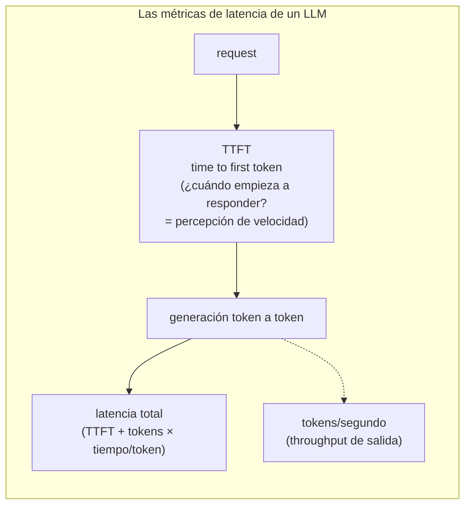
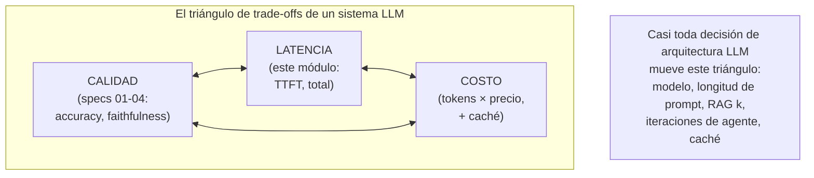

# Spec 05 · Módulo 1 — Performance de LLMs

> **Resultado:** medición y prueba de carga de las métricas que importan en un sistema LLM — TTFT, throughput, costo por request — con thresholds como gate. Es tu k6 de C2-M5, con unidades nuevas.

## 🗺️ Mapa visual





## 📖 Concepto

### Las métricas que C2-M5 no tenía

En k6 medías latencia de un request y throughput de requests. Los LLMs añaden dimensiones porque **la respuesta se genera incrementalmente**:

- **TTFT (Time To First Token):** cuánto tarda en empezar a responder. Es LA métrica de percepción — con streaming, un TTFT bajo se siente rápido aunque la respuesta total tarde. Tu experimento de streaming en spec-00-M1 ya la sintió; ahora la mides.
- **Tokens por segundo (output):** velocidad de generación. Determina cuánto tarda una respuesta larga.
- **Latencia total:** TTFT + (tokens_salida × tiempo/token). Crece con la LONGITUD de la salida — controlar `max_tokens` y la verbosidad del prompt es optimización de performance, no solo de costo.
- **Costo por request:** `(input_tokens × precio_in) + (output_tokens × precio_out)`. La métrica que no existía en software clásico y que aquí es de primera clase — un feature LLM puede ser técnicamente perfecto y económicamente inviable.

### Lo que cambia respecto a k6 clásico

Tu instinto de C2-M5 sigue valiendo (percentiles no promedios, smoke antes de load, thresholds como gate, baseline relativa) — con dos giros propios del LLM:

1. **Rate limits y costo son los cuellos de botella nuevos.** Un load test agresivo contra una API LLM no tumba un servidor tuyo: agota tu cuota (`429`) y tu presupuesto. "Carga" aquí mide cómo tu sistema se comporta bajo rate limiting (¿hace backoff? ¿encola? ¿degrada con gracia?), no cuántos servidores aguantan.
2. **El costo es un threshold de primera clase.** Junto a "p95 de TTFT < 2s" pones "costo medio por request < $0.02". Un gate de performance LLM que ignora el costo está ciego a la mitad del riesgo.

### El triángulo de trade-offs

Toda la calidad que construiste en specs 01-04 tiene un precio en latencia y costo (segundo diagrama). Subir k en RAG mejora recall pero añade tokens (costo) y contexto (latencia). Más iteraciones de agente = mejor outcome pero más caro y lento. Un modelo más potente = más calidad, más costo. **El SDET de IA hace visible ese triángulo con datos** para que producto decida con información, no con fe — y eso es exactamente el cost routing del reto de spec-03-M3.

## 🔨 Lab guiado — Medir y cargar

**Costo aproximado: ~$3-5 (el load test hace decenas de llamadas — mantenlo corto).**

**Paso 1 — El medidor.** Crea `labs/ai-evals/spec05/perf/measure.py` que instrumente una llamada con streaming capturando las 4 métricas:

```python
import time
import anthropic

def medir_llamada(prompt: str, model="claude-opus-4-8", max_tokens=500) -> dict:
    client = anthropic.Anthropic()
    t0 = time.perf_counter()
    ttft = None
    with client.messages.stream(model=model, max_tokens=max_tokens,
                                messages=[{"role": "user", "content": prompt}]) as stream:
        for _ in stream.text_stream:
            if ttft is None:
                ttft = time.perf_counter() - t0      # ¡el primer token!
        final = stream.get_final_message()
    total = time.perf_counter() - t0
    out_tokens = final.usage.output_tokens
    return {
        "ttft_s": round(ttft, 3),
        "total_s": round(total, 3),
        "tokens_por_s": round(out_tokens / (total - ttft), 1) if total > ttft else 0,
        "input_tokens": final.usage.input_tokens,
        "output_tokens": out_tokens,
        "costo_usd": estimar_costo(final.usage, model),   # usa precios de platform.claude.com
    }
```

Implementa `estimar_costo` con los precios actuales. Corre 10 veces el mismo prompt y observa la VARIABILIDAD de TTFT (la latencia también es no-determinista — reporta p50/p95, no el promedio: C2-M5 vive).

**Paso 2 — El experimento del triángulo.** `spec05/perf/triangulo.py`: mide la MISMA tarea (clasificar un bug, spec-00) variando una palanca a la vez y tabula calidad/latencia/costo:

- modelo: `claude-opus-4-8` vs `claude-haiku-4-5`
- `max_tokens`: 200 vs 1000
- prompt: tu system prompt completo vs una versión condensada

Para cada combo: TTFT, costo, y accuracy (re-usa tu eval de spec-02). Documenta en `spec05/perf/RESULTADOS.md` el triángulo con números reales — ¿cuánta calidad pierdes con Haiku y cuánto costo/latencia ahorras? Esta tabla es oro de entrevista de arquitectura.

**Paso 3 — Load test (k6 renace).** Tu sistema LLM bajo carga concurrente. Crea `spec05/perf/load_test.py` (Python con concurrencia, o k6 si prefieres — ambos válidos) que dispare N requests concurrentes contra tu RAG o clasificador y mida: distribución de TTFT bajo carga, cuántos `429` aparecen, y cómo tu código los maneja. **Empieza con N=3 y sube despacio — esto gasta cuota y dinero real.** El SDK de Anthropic ya reintenta `429` con backoff; verifica que tu código lo aprovecha (`max_retries`) en vez de explotar.

**Paso 4 — Degradación con gracia.** Provoca rate limiting deliberado (ráfaga corta y agresiva) y observa: ¿tu sistema encola, reintenta, o falla feo? Compara dos implementaciones de tu cliente RAG — una sin manejo de `429` y otra con backoff + cola. La diferencia de comportamiento bajo carga ES el resultado del lab. Documenta en `RESULTADOS.md`.

**Paso 5 — Thresholds como gate.** Convierte las mediciones en `spec05/perf/test_perf_gate.py`: `p95 TTFT < 3s`, `costo medio por request < $X`, `tasa de error bajo carga moderada < 5%`. Los mismos thresholds de k6 (C2-M5), ahora incluyendo costo. Añádelo al `llm-evals.yml` (nightly — la performance LLM deriva con cambios de modelo y de prompt).

**Paso 6 — Commit/PR** (`C3-S5-M1: métricas de performance LLM + load test + gate con costo`).

## 🎯 Reto

**El presupuesto de performance del RAG.** Producto define el SLO: "el chatbot de docs responde en < 4s percibidos (TTFT) y cuesta < $0.03 por pregunta". Tu RAG actual, ¿cumple? Mídelo, y si no cumple, encuentra la palanca: ¿bajar k? ¿condensar el prompt de generación? ¿modelo más rápido para la generación? ¿prompt caching del contexto (investiga `cache_control` — el contexto del RAG es estable entre preguntas similares)? Aplica la optimización de mayor impacto, re-mide y demuestra que ahora cumple el SLO sin haber degradado la calidad (corre tu eval RAGAS de spec-01 para probarlo). Entrega el antes/después en las 3 dimensiones del triángulo. Esto ES el trabajo de un SDET de IA: hacer cumplir SLOs sin romper calidad.

## ✅ Checklist de dominio

- [ ] Puedo explicar TTFT, tokens/s, latencia total y costo por request, y qué decide cada una
- [ ] Mido latencia en percentiles, sabiendo que también es no-determinista
- [ ] Entiendo que "carga" en LLMs es rate limiting + costo, no saturación de servidor
- [ ] Probé degradación con gracia ante 429 (con vs sin backoff)
- [ ] Tengo el costo como threshold de primera clase en mi gate
- [ ] Puedo razonar el triángulo calidad/latencia/costo con datos propios

## 💬 Preguntas de entrevista

1. *"What latency metrics matter for an LLM feature and why?"* (TTFT para percepción, total para tareas largas, tokens/s para throughput)
2. *"How is load testing an LLM API different from load testing a regular service?"* (rate limits + costo, no saturación; degradación con gracia)
3. *"How do you control the cost of an LLM feature?"* (modelo, max_tokens, prompt length, caching, k del RAG, iteraciones)
4. *"Quality went up but so did latency and cost. How do you present this trade-off to product?"* (el triángulo con números — tu reto)
5. *"What is prompt caching and when does it pay off?"* (contexto estable reutilizado; break-even por número de requests)

## 🔗 Conexiones

- **Refuerza:** k6 y los percentiles de [C2-M5](../../curso-2-profundizando/modulo-05-performance-k6.md) (mismo músculo, unidades nuevas); el streaming de [spec-00-M1](../spec-00-fundamentos-llm/modulo-01-llm-y-api.md) (de sentir el TTFT a medirlo); el cost routing de [spec-03-M3](../spec-03-agentic-flows/modulo-03-trajectory-evals.md) (el triángulo aplicado a modelos).
- **Se reutiliza en:** el [módulo 2](modulo-02-observabilidad-langfuse.md) lleva estas métricas de medición puntual a observabilidad continua en producción; en el capstone 🏆, el costo y la latencia del Healer son parte de su dashboard — un agente que repara pero cuesta una fortuna no se aprueba.
