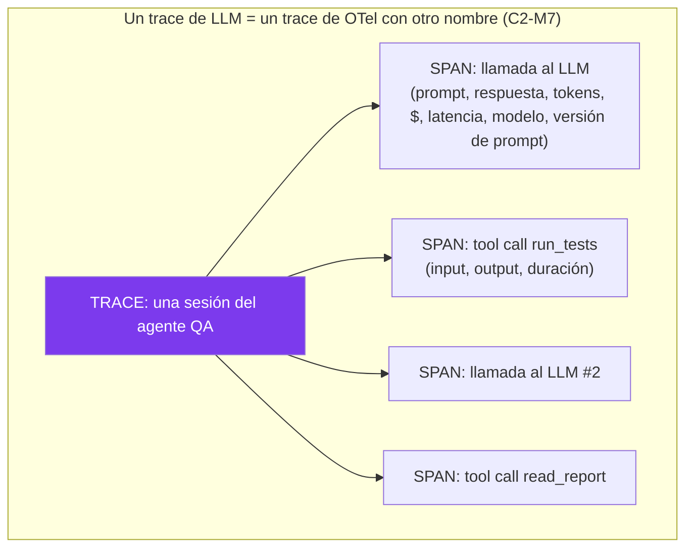
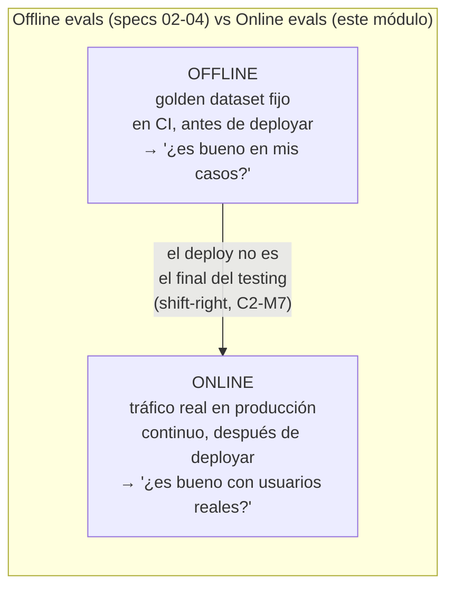

# Spec 05 · Módulo 2 — Observabilidad con Langfuse + evals en producción

> **Resultado:** tu agente QA instrumentado con Langfuse — cada llamada, tool call, costo y latencia trazados — y evals corriendo sobre tráfico real. Es C2-M7 (OpenTelemetry) aplicado a LLMs, cerrando el programa donde empezó: la arquitectura es determinista, el agente es observable.

## 🗺️ Mapa visual





## 📖 Concepto

### Observabilidad de LLMs: tu C2-M7, recontextualizado

En C2-M7 instrumentaste tu suite con OpenTelemetry: traces, spans, atributos, un backend (Jaeger). La observabilidad de LLMs es **exactamente eso**, con spans que son llamadas al modelo y tool calls, y atributos que son tokens, costos y versiones de prompt. Por eso predije que llegarías sabiendo el 70 %. La pregunta que responde es la misma — *"¿por qué tardó/falló/costó tanto ESTA ejecución?"* — sobre un sistema donde el flujo lo decidió un modelo.

[Langfuse](https://langfuse.com) (open-source, self-hostable — la fila "observabilidad LLM" de tu estrategia de aerolínea) es el Jaeger de los LLMs, especializado: además de la cascada de spans, agrega costos y tokens automáticamente, versiona prompts, guarda datasets, y corre evals sobre el tráfico trazado. Conceptualmente: un **trace** = una ejecución completa (una sesión del agente); cada **span/observation** = un paso (una llamada al LLM, una tool). Idéntico al modelo mental que ya tienes.

### Por qué los agentes EXIGEN observabilidad

Un agente toma N decisiones no-deterministas encadenadas. Cuando algo sale mal en producción, "el agente se comportó raro" es indebuggeable sin el registro completo de su trayectoria — que es justo el `AgentResult.trajectory` que diseñaste en spec-03-M1, ahora persistido y consultable. El principio de tu aerolínea — *"determinismo donde se pueda, observabilidad donde no"* — encuentra aquí su segunda mitad: el razonamiento del LLM no es determinista, así que se hace **observable**.

### Online evals: el deploy no es el final del testing

Tus evals de specs 02-04 son **offline**: golden dataset fijo, en CI, antes de deployar. Necesarias pero insuficientes — tu dataset nunca cubre lo que los usuarios reales preguntan. Las **evals online** corren sobre el tráfico real trazado: un juez (spec-02) evalúa una muestra de las interacciones de producción continuamente. Es el synthetic monitoring de C2-M7 evolucionado — de "¿el sistema responde?" a "¿el sistema responde BIEN?", medido sobre la verdad de producción. Y el bucle se cierra: las interacciones de producción que el juez marca como malas se convierten en casos del golden dataset offline (regression testing alimentado por producción).

## 🔨 Lab guiado — Instrumentar y monitorear

**Costo aproximado: ~$3-5. Langfuse self-hosted corre en Docker (gratis); también hay tier cloud gratuito.**

**Paso 1 — Langfuse local.** Levántalo con Docker (su `docker-compose` oficial) o usa el tier cloud. Obtén las keys (`LANGFUSE_PUBLIC_KEY`, `LANGFUSE_SECRET_KEY`, `LANGFUSE_HOST`) en tu `.env`:

```bash
uv add langfuse
```

**Paso 2 — Instrumenta el agente QA.** Modifica tu `run_agent` de spec-03 para emitir un trace por ejecución y un span por cada llamada LLM y cada tool. El SDK de Langfuse ofrece decoradores y un wrapper para el cliente de Anthropic; lo esencial:

```python
from langfuse import Langfuse
langfuse = Langfuse()

def run_agent_observado(goal, tools, ...):
    trace = langfuse.trace(name="qa-agent-session", input=goal)
    # por cada iteración:
    gen = trace.generation(name="llm-call", model="claude-opus-4-8",
                           input=messages, metadata={"iteration": i})
    response = client.messages.create(...)
    gen.end(output=response.content,
            usage={"input": response.usage.input_tokens, "output": response.usage.output_tokens})
    # por cada tool:
    span = trace.span(name=f"tool:{block.name}", input=block.input)
    out = tools[block.name](**block.input)
    span.end(output=str(out)[:2000])
    # ...
    trace.update(output=result.final_answer)
```

(La API exacta del SDK de Langfuse evoluciona — consulta langfuse.com/docs; mapear tu loop a sus primitivas es el ejercicio, y es trivial porque tu loop YA tenía la estructura de trace/span gracias a spec-03.)

**Paso 3 — Explora los traces.** Corre 3-4 misiones del portafolio de spec-03 y abre la UI de Langfuse. Navega la cascada de una sesión de diagnóstico: ¿cuántas llamadas LLM? ¿cuánto costó la sesión completa? ¿qué tool tardó más? ¿en qué iteración "decidió" el agente la causa raíz? Responde con Langfuse las mismas preguntas que respondías con Jaeger en C2-M7 — la transferencia es directa, y esa es la lección.

**Paso 4 — El dashboard de salud.** En Langfuse arma (o consulta) las métricas agregadas de tus sesiones: costo medio por misión, latencia p95, iteraciones medias, tasa de éxito. Es el `suite-health.csv` de C2-M6, ahora para tu agente. Define 3 SLOs (ej.: "costo medio por triage < $0.10", "p95 de latencia < 30s", "tasa de éxito > 90%") — los mismos SLOs que un SDET Lead presenta cada trimestre, ahora sobre un sistema agéntico.

**Paso 5 — Online eval.** Implementa el monitoreo de calidad continuo: un script `spec05/online_eval.py` que tome una muestra de los traces recientes de Langfuse y les pase tu juez de grounding de spec-03 (¿el diagnóstico está soportado por la trayectoria?), registrando el score de vuelta en el trace. Programa correrlo periódicamente (o como step nightly). Acabas de construir el detector de degradación en producción: si el agente empieza a alucinar diagnósticos tras una actualización de modelo, el score online cae y te enteras — sin esperar a un incidente.

**Paso 6 — El bucle producción→dataset.** Cierra el círculo: toma las 2 sesiones con peor score online del paso 5, conviértelas en casos nuevos de tu golden dataset offline (spec-03-M3) y verifica que tu suite de CI ahora las cubre. Documenta el flujo en `spec05/observabilidad-notes.md`: producción descubre el fallo → online eval lo marca → se vuelve caso offline → CI lo previene a futuro. Ese bucle ES la madurez de un sistema LLM observado.

**Paso 7 — Commit/PR** (`C3-S5-M2: agente instrumentado con Langfuse + online evals + bucle prod→dataset`).

## 🎯 Reto

**El panel de incidente.** Simula un incidente de producción: degrada deliberadamente el system prompt de tu agente QA (hazlo más ambiguo) y corre 10 misiones variadas instrumentadas. Luego, SOLO con Langfuse (sin mirar el código), juega al on-call: detecta que algo está mal (¿qué métrica se movió?), diagnostica la causa (¿más iteraciones? ¿peor grounding score? ¿más costo?), e identifica las sesiones afectadas. Escribe el post-mortem en `spec05/post-mortem.md` con el formato blameless de C2-M8: qué pasó, cómo lo detectó la observabilidad, qué SLO se violó, y qué guardarraíl/alerta lo habría atrapado antes. Restaura el prompt. Esto ES el trabajo de operar un sistema LLM en producción.

## ✅ Checklist de dominio

- [ ] Puedo explicar un trace LLM como un trace de OTel y mapear span↔llamada/tool
- [ ] Instrumenté un agente real con traces, costos y latencias por paso
- [ ] Distingo offline evals (CI, dataset fijo) de online evals (producción, tráfico real)
- [ ] Definí SLOs para un sistema agéntico y sé monitorearlos
- [ ] Implementé el bucle producción→dataset (regresión alimentada por producción)
- [ ] Puedo diagnosticar un incidente LLM solo con la observabilidad

## 💬 Preguntas de entrevista

1. *"How do you observe an LLM agent in production?"* (traces de spans = llamadas+tools, costos/tokens/versiones como atributos; Langfuse)
2. *"Offline evals vs online evals — when do you need each?"* (CI antes de deployar vs tráfico real continuo; ninguna sustituye a la otra)
3. *"Your agent worked great in eval but users report bad answers. How do you investigate?"* (online evals + traces de las sesiones reales)
4. *"How do you close the loop between production failures and your test suite?"* (prod → online eval marca → caso offline → CI previene)
5. *"What SLOs would you define for an LLM agent feature?"* (latencia p95, costo/request, tasa de éxito, grounding score — con su justificación)

## 🔗 Conexiones

- **Refuerza:** OpenTelemetry y synthetic monitoring de [C2-M7](../../curso-2-profundizando/modulo-07-observabilidad.md) (transferencia casi 1:1); los SLOs de suite de [C2-M6](../../curso-2-profundizando/modulo-06-cicd-avanzado.md); la trayectoria de [spec-03-M1](../spec-03-agentic-flows/modulo-01-anatomia-agente.md) (diseñada para ser trazable, ahora persistida); el juez de [spec-02](../spec-02-llm-as-a-judge/README.md) (ahora corre online); el post-mortem blameless de [C2-M8](../../curso-2-profundizando/modulo-08-estrategia-liderazgo.md).
- **Se reutiliza en:** el capstone 🏆 instrumenta el Healer con TODO esto — cada reparación es un trace auditable con su costo, su evidencia y su decisión de aprobación; es la materialización literal de "Langfuse self-hosted + dashboard ClickHouse" y del principio "toda acción del agente deja audit trail" de tu estrategia de aerolínea.
