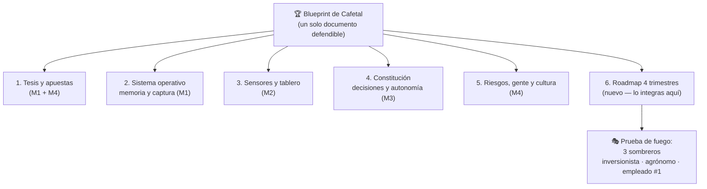

# C4 · 🏆 Capstone — El blueprint fundacional de Cafetal

> Los cuatro módulos produjeron piezas. El capstone las suelda en UN documento: el **blueprint fundacional** — el papel que le entregarías a un inversionista, a tu primer empleado o a ti mismo dentro de un año, y que responde la pregunta completa: *¿cómo se funda y se gobierna una empresa AI-native de café de especialidad?* Sin guía paso a paso esta vez: como todo checkpoint de la maestría, este es el examen.

## 🗺️ Mapa visual

## 📖 El encargo

**Entregable:** `labs/cafetal/BLUEPRINT.md` — máximo ~12 páginas equivalentes. No es pegar los labs uno tras otro: es **destilarlos**. Cada capítulo resume su artefacto en lo esencial y enlaza al documento completo. El blueprint se lee en 30 minutos; el vault de Cafetal respalda cada afirmación.

**Los 6 capítulos:**

1. **Tesis y apuestas** — qué es Cafetal, por qué AI-native es LA ventaja (no un adorno), los 3 supuestos frágiles y las 6 apuestas con señal de invalidación. Una página que un inversionista lee sin bostezar.
2. **El sistema operativo** — cómo la empresa recuerda: la estructura del vault, los protocolos de captura automática, la prueba de los dos lectores. Incluye el argumento de por qué esto no muere en burocracia.
3. **Sensores y tablero** — el mapa finca→taza resumido, los 5 números del lunes, la meta-eval de la cata, y los pares en tensión anti-Goodhart.
4. **La constitución** — la tabla de autonomía 🟢🟡🔴 completa, los contratos de ascenso/descenso, los 3 gates operativos, y el decision journal con las 3 decisiones reales ya documentadas.
5. **Riesgos, gente y cultura** — el registro de riesgos AI instanciado, los 3 primeros roles (y las 3 no-contrataciones), las áreas humanas-por-diseño del pitch inverso, y el board memo tipo.
6. **Roadmap de 4 trimestres** — lo único nuevo del capstone: Q1-Q4 con un objetivo medible por trimestre que despliega todo lo anterior en orden realista (¿qué se instrumenta primero? ¿cuándo entra el Selector a 🟡 y qué evidencia lo sube a 🟢? ¿cuándo entra el primer empleado?). Cada item con su métrica de éxito — el formato que ya dominas desde la test strategy de C2-M8.

## 🎯 La prueba de fuego — los 3 sombreros

Como en C2-M8, el documento no está terminado hasta que sobrevive tres lecturas hostiles. Escribe las objeciones REALES de cada lector y ajusta hasta que las tres lecturas pasen:

- **🎩 La inversionista escéptica:** *"todo el mundo me trae decks con 'AI'. ¿Dónde está el negocio? ¿Qué pasa si quito la palabra IA — queda una empresa de café que se sostiene? ¿Y si la dejo — dónde están los números que prueban que la IA paga su costo?"*
- **👒 El agrónomo de 30 años de experiencia:** *"yo sé de café más que tu computadora. ¿Esto me ayuda o me vigila? ¿Qué pasa cuando yo diga una cosa y el aparato otra?"* (si el blueprint no responde esto con respeto por su criterio — la constitución tiene un hueco cultural)
- **🧢 La empleada #1:** *"llego el lunes. ¿Sé qué puedo decidir sola? ¿Sé dónde encontrar por qué las cosas son como son? ¿Sé qué hacer cuando el Selector propone algo raro?"* (si duda, el sistema operativo falló su promesa)

## ✅ Criterios de aceptación

- [ ] El blueprint se lee completo en ~30 min y cada capítulo enlaza a su artefacto de respaldo en el vault
- [ ] Ningún capítulo describe una herramienta sin describir primero la decisión que habilita
- [ ] Las 6 apuestas tienen señal de invalidación numérica; los ascensos de autonomía tienen contrato con datos
- [ ] El roadmap tiene un objetivo medible por trimestre y un orden defendible
- [ ] Las objeciones de los 3 sombreros están escritas Y respondidas dentro del documento
- [ ] Releíste tu `00-tesis.md` del M1 y actualizaste lo que el curso te hizo cambiar de opinión (si no cambiaste nada de opinión en 4 módulos, uno de los dos no estaba prestando atención)
- [ ] Commit final (`C4-CAPSTONE: blueprint fundacional de Cafetal`)

## 💬 La defensa (30 minutos, como toda entrevista importante)

Simula la reunión de board fundacional — en voz alta, con reloj. Las cinco preguntas inevitables:

1. *"Dame el pitch de Cafetal en 90 segundos — sin decir 'inteligencia artificial' más de una vez."*
2. *"¿Cuál capítulo del blueprint se rompe primero en contacto con la realidad, y qué harás cuando pase?"*
3. *"¿Por qué tú? ¿Qué sabes tú de esto que otro fundador con plata no puede comprar?"* (pista: la respuesta honesta incluye una maestría entera sobre gobernar sistemas no-deterministas, un clasificador construido y una finca real)
4. *"Si esto funciona, ¿qué es Cafetal en 5 años — una finca tecnificada o una plataforma?"* (no hay respuesta correcta; hay respuesta PENSADA)
5. *"¿Cuánto necesitas y qué compra exactamente?"*

## 🔗 Conexiones

- **Integra:** [M1 — tesis y memoria](curso-4-ai-native__modulo-01-empresa-como-sistema.html) · [M2 — sensores](curso-4-ai-native__modulo-02-sensores-y-metricas.html) · [M3 — constitución](curso-4-ai-native__modulo-03-decisiones-y-autonomia.html) · [M4 — apuestas, gente, cultura](curso-4-ai-native__modulo-04-riesgo-gente-cultura.html) — y por debajo, toda la maestría: el capstone Healer fue el ensayo técnico de la constitución; la test strategy de C2-M8 fue el ensayo del blueprint.
- **Se reutiliza en:** la vida real. Este documento es la semilla de una empresa que puedes fundar de verdad — con tu finca, tu clasificador y tu sistema de memoria ya funcionando. El día que decidas hacerlo, no empiezas de cero: empiezas del blueprint.
