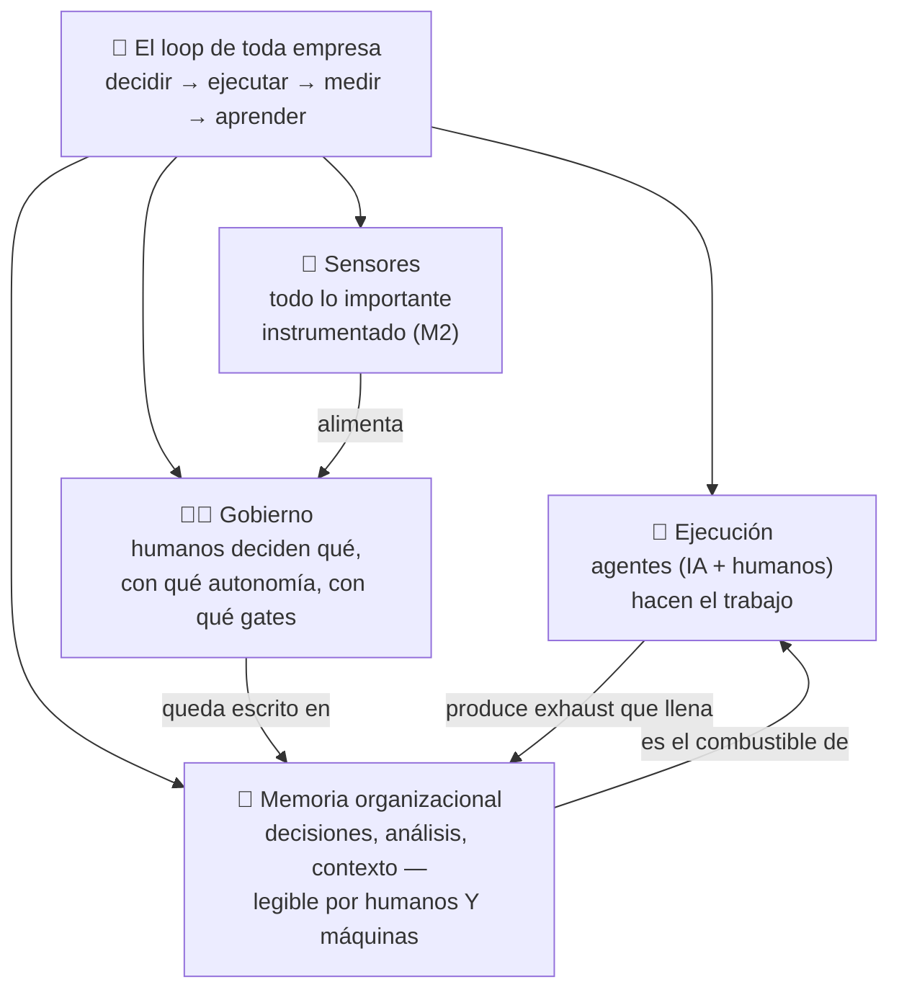

# C4 · Módulo 1 — La empresa como sistema: qué es AI-native de verdad + la memoria como sistema operativo

> **Cambio de altitud.** Hasta aquí la maestría te formó para dar confianza sobre sistemas. Este curso sube un nivel: la empresa ENTERA es el sistema — no-determinista, lleno de agentes (humanos y de IA), sin oracle. Y la pregunta del fundador es la misma del SDET: *¿cómo consigo la máxima confianza al mínimo costo?* Todo lo que sabes traduce. Este curso ES esa traducción.

**El caso de estudio de todo el curso: Cafetal** — startup colombiana de producción y selección de café de especialidad. Finca propia, beneficio propio, y un diferenciador: **el Selector**, un sistema de visión con IA que clasifica el grano verde por defectos (sí, es tu almendra con otro nombre — este curso es real disfrazado, y los artefactos que produzcas te sirven doble).

## 🗺️ Mapa visual

## 📖 Concepto

### AI-native no es "usamos ChatGPT"

La mayoría de empresas que se dicen "AI" hicieron *AI-washing*: pegaron un chatbot sobre los mismos procesos de siempre. **AI-native** es otra cosa — es diseñar la empresa desde el día cero asumiendo cuatro premisas:

1. **La ejecución es híbrida por diseño.** El trabajo se descompone asumiendo que agentes de IA son parte de la fuerza laboral: investigan, redactan, clasifican, monitorean, documentan. Los humanos no compiten con eso — **gobiernan**: deciden qué se delega, con qué autonomía y con qué barandillas (el módulo 3 es entero sobre esto).
2. **La memoria organizacional es un activo de primera clase.** No un wiki que nadie lee: EL sistema operativo de la empresa. Porque hay una ley nueva: *el rendimiento de la IA es proporcional a la calidad del contexto accesible*. Una empresa AI-native es **context engineering a escala organizacional** — la que documenta mejor, ejecuta mejor, porque sus agentes saben más.
3. **Todo lo importante está instrumentado.** Sensores físicos y de proceso (módulo 2). En lo no-determinista no recuperas certezas — gobiernas distribuciones, exactamente como aprendiste en el Curso 3.
4. **Las decisiones son hipótesis versionadas.** Con resultado esperado, métrica y fecha de revisión. Se evalúan en retrospectiva como evalúas un LLM: contra lo esperado, sin cazar culpables (módulo 3).

### La trampa mortal de "documentar todo"

Tu instinto de fundador dice: *que quede registro de todo lo que se hace, se decide y se analiza*. El instinto es correcto; la implementación clásica es un cementerio. Toda empresa que puso a HUMANOS a documentar como tarea extra murió de burocracia: la documentación se vuelve impuesto, se desactualiza en semanas, y termina siendo teatro.

El giro AI-native que lo resuelve tiene tres piezas:

- **La documentación es exhaust, no tarea.** Los agentes documentan lo que pasa como subproducto del trabajo: la reunión se transcribe y resume sola, la decisión tomada en un chat se captura al vault sola, el lote procesado registra sus datos solo. El humano corrige y curra; no llena formularios. (Tu Segundo Cerebro con su hook de cierre de sesión ya funciona así — a escala personal.)
- **Se escribe para dos lectores: humanos Y máquinas.** Cada nota es contexto potencial para un agente futuro. Eso impone estructura: metadatos, enlaces (`[[wiki-links]]`), convenciones de nombres — el equivalente organizacional del *structured output* del spec-00: la información estructurada ES más barata de consumir, para todos.
- **Lo que no se consulta, no se documenta.** La medida de una memoria no es cuánto guarda sino cuántas decisiones alimenta. Documentación write-only es deuda, no activo.

### La jerarquía de la memoria

No todo pesa igual. En orden de valor:

| Nivel | Qué es | Ejemplo en Cafetal |
|-------|--------|---------------------|
| **Decisiones** | Qué se decidió, por qué, qué se esperaba, cuándo se revisa | "Compramos el lote de la vereda X a $Y porque Z; esperamos taza ≥86; revisar post-trilla" |
| **Modelos del negocio** | Cómo creemos que funciona el mundo (tesis, supuestos) | "La calidad de taza se decide 70% en finca y beneficio, 30% después" |
| **Contexto operativo** | Estado de cosas: lotes, clientes, inventario, acuerdos | Ficha del lote 2026-014: origen, proceso, humedad, resultado del Selector |
| **Registro de actividad** | Qué pasó, cuándo (el log) | "2026-07-02: despachados 4 sacos a cliente A" |

El error común es invertir la pirámide: toneladas de registro de actividad, cero decisiones documentadas. Las decisiones son el golden dataset de la empresa — el activo que permite aprender.

> **La frase del módulo:** *una empresa AI-native no es la que más IA usa — es la que está diseñada para que la IA pueda trabajar en ella: memoria estructurada, señales instrumentadas y decisiones gobernadas.*

## 🔨 Lab guiado — Fundar Cafetal en papel

Hoy no escribes código: fundas una empresa en documentos. Crea el workspace `labs/cafetal/` en el repo. Todo en markdown con `[[wiki-links]]` — el vault de Cafetal nace hoy y crecerá los 4 módulos.

**Paso 1 — La tesis (`00-tesis.md`).** Una página, cuatro secciones: (a) qué vende Cafetal y a quién (café de especialidad seleccionado con precisión que nadie más puede garantizar); (b) por qué AI-native es LA ventaja y no un adorno — el Selector hace escalable lo que hoy depende de ojos expertos escasos, y la memoria/sensores hacen que cada cosecha aprenda de la anterior; (c) los 3 supuestos más frágiles de la tesis (sé honesto: son hipótesis, no verdades); (d) qué NO es Cafetal (tan importante como lo que es).

**Paso 2 — El mapa de trabajo híbrido.** Tabla: las ~12 actividades núcleo de la empresa (cultivo, cosecha, beneficio, secado, selección, catación, compra de lotes externos, ventas, logística, finanzas, marketing, calidad) × quién la ejecuta hoy (humano / agente IA / híbrido) × qué documentación genera como exhaust. Sé específico: "selección" la ejecuta el Selector con supervisión humana y genera ficha de lote automática; "catación" la ejecuta humano experto y un agente transcribe y estructura el resultado.

**Paso 3 — El sistema operativo (`01-sistema-operativo.md`).** Diseña el vault corporativo de Cafetal: estructura de carpetas (sugerencia de partida: `Decisiones/`, `Tesis-y-modelos/`, `Operacion/lotes/`, `Operacion/clientes/`, `Finanzas/`, `Log/`), la plantilla de cada tipo de nota (la de decisión es sagrada: contexto → opciones consideradas → decisión → resultado esperado → métrica → fecha de revisión), y las convenciones de nombres y enlaces.

**Paso 4 — Los protocolos de captura.** Para cada tipo de nota: ¿quién/qué la escribe? La regla del módulo: **si un protocolo depende de que un humano se acuerde de documentar, está mal diseñado**. Define mínimo 4 capturas automáticas (ej.: cada corrida del Selector → ficha de lote; cada reunión → resumen al vault; cada decisión en chat → capturada por el agente de cierre; cada venta → registro + actualización de cliente).

**Paso 5 — La prueba de los dos lectores.** Toma tu plantilla de ficha de lote y tu plantilla de decisión y pregúntate: ¿un empleado nuevo entiende esto sin ayuda? ¿un agente de IA puede responder "¿qué lotes del proceso lavado superaron 86 puntos este año?" solo con estas notas? Ajusta hasta que ambas respuestas sean sí.

**Paso 6 — Commit** (`C4-M1: tesis y sistema operativo de Cafetal`).

## 🎯 Reto

**Audita tu propio Segundo Cerebro como prototipo.** Tienes un sistema real funcionando a escala 1 persona: vault, protocolos, log, captura automática al cierre de sesión. Escribe `labs/cafetal/retos/auditoria-segundo-cerebro.md`: (1) mapea cada pieza de tu sistema personal a la pieza equivalente del sistema de Cafetal; (2) identifica qué escala a 10 personas sin cambios, qué escala con ajustes, y qué se rompe por completo (pista: piensa en concurrencia de escritores, en confianza entre autores, en notas privadas vs compartidas, y en quién arbitra cuando dos notas se contradicen); (3) la pregunta de fondo: ¿qué agregarías a TU sistema personal después de este análisis? — el reto tiene premio doble.

## ✅ Checklist de dominio

- [ ] Puedo definir AI-native en una frase sin mencionar ninguna herramienta
- [ ] Puedo explicar por qué "documentar todo" con humanos fracasa y cómo lo resuelve la documentación-como-exhaust
- [ ] Distingo los 4 niveles de la jerarquía de memoria y sé por qué las decisiones son el nivel más valioso
- [ ] Tengo la tesis de Cafetal escrita con sus 3 supuestos frágiles explícitos
- [ ] Mi vault corporativo pasa la prueba de los dos lectores (humano nuevo + agente)
- [ ] Ningún protocolo de captura depende de la memoria de un humano

## 💬 Preguntas de inversionista/board

1. *"¿Qué hace a esta empresa 'AI-native'? Todo el mundo dice eso hoy."* (las 4 premisas — y la prueba: enséñale el mapa de trabajo híbrido y la memoria, no un demo del chatbot)
2. *"¿Qué pasa si mañana OpenAI/Anthropic triplica precios o cierra tu modelo?"* (la ventaja no es EL modelo: es la memoria, los datos propios del Selector y el diseño de gobierno — los modelos son intercambiables, el contexto no)
3. *"¿Por qué la documentación no se les va a morir como a todo el mundo?"* (exhaust, dos lectores, y la medida: decisiones alimentadas, no notas acumuladas)
4. *"¿Cuál es el supuesto más frágil de tu tesis y cómo lo vas a validar?"* (directo de tu `00-tesis.md` — si no puedes responder esto, no has hecho el lab)
5. *"¿Dónde NO usan IA y por qué?"* (adelanto del módulo 3-4: la respuesta madura tiene límites explícitos, no entusiasmo infinito)

## 🔗 Conexiones

- **Refuerza:** el "cambio de paradigma" del [Curso 3](curso-3-especializaciones__spec-00-fundamentos-llm__modulo-01-llm-y-api.html) elevado a organización; el *structured output* de spec-00 reaparece como "escribir para dos lectores"; la test strategy de [C2-M8](curso-2-profundizando__modulo-08-estrategia-liderazgo.html) era el ensayo de escribir documentos que gobiernan.
- **Se reutiliza en:** el [módulo 2](curso-4-ai-native__modulo-02-sensores-y-metricas.html) instrumenta lo que aquí quedó definido; el [módulo 3](curso-4-ai-native__modulo-03-decisiones-y-autonomia.html) llena `Decisiones/` con su plantilla sagrada; el [capstone](curso-4-ai-native__capstone-blueprint-cafetal.html) 🏆 abre con tu `00-tesis.md` casi literal.
