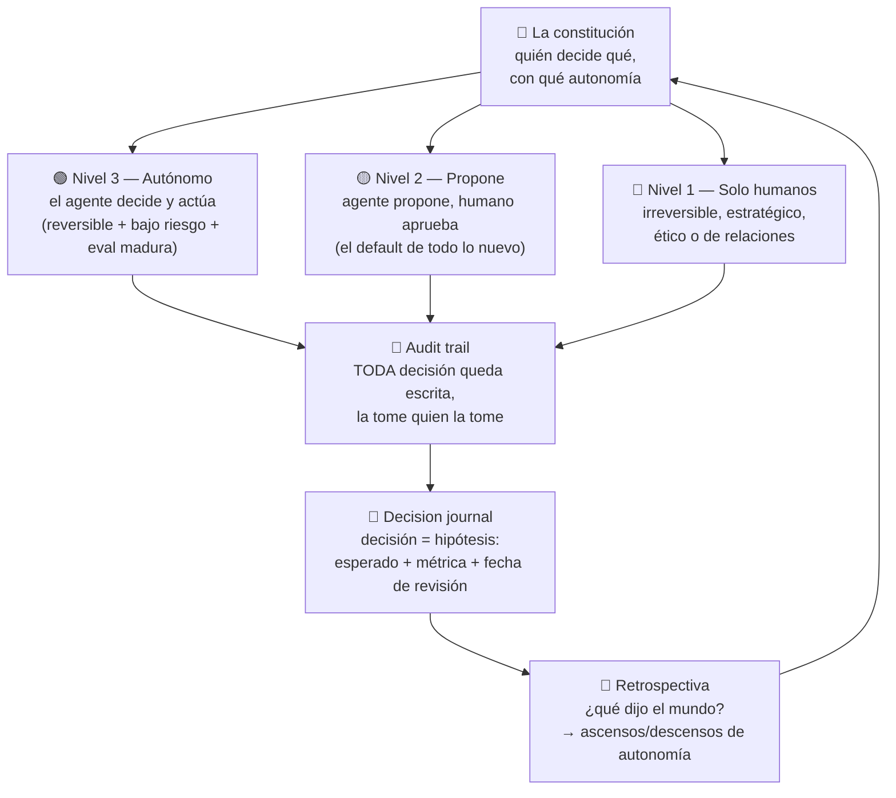

# C4 · Módulo 3 — Decisiones y autonomía: la constitución de la empresa

> En una empresa clásica, quién decide qué se resuelve por jerarquía y por costumbre. En una AI-native no puedes darte ese lujo: tienes agentes ejecutando 24/7 y cada uno necesita saber — por escrito — qué puede decidir solo, qué debe proponer, y qué no puede tocar. Ese documento es **la constitución**. Y las decisiones humanas entran por el mismo aro: hipótesis versionadas en un **decision journal**. Este módulo escribe ambos.

## 🗺️ Mapa visual

## 📖 Concepto

### La decisión como hipótesis: el decision journal

La mentira favorita de todo fundador es "yo sé por qué tomé esa decisión". Seis meses después, no: la memoria reescribe, el sesgo retrospectivo hace que todo parezca obvio, y la empresa no aprende nada. El antídoto es tratar cada decisión importante como tratas un experimento del Curso 3 — la plantilla sagrada del M1, ahora en serio:

- **Contexto**: qué sabíamos en ese momento (no lo que sabemos hoy).
- **Opciones consideradas** — incluida la descartada y por qué (las opciones descartadas son el material de aprendizaje más denso que existe).
- **Decisión y apuesta**: qué elegimos y qué esperamos que pase, con número.
- **Métrica y fecha de revisión**: cómo y cuándo sabremos si acertamos.

La retrospectiva evalúa **el proceso, no el resultado**: una buena decisión puede salir mal (el mundo es no-determinista — llevas un curso entero sabiéndolo) y una decisión pésima puede salir bien por suerte. Lo que se audita es: ¿la información disponible se usó? ¿los supuestos eran razonables? Esto es el post-mortem blameless aplicado a la estrategia. Y hay un beneficio que las empresas clásicas no tienen: **tu decision journal es el dataset con el que los agentes aprenden a proponer decisiones al estilo de la casa.** Cada decisión documentada entrena a tu empresa; ese archivo es, literalmente, el golden dataset organizacional.

### Reversible vs irreversible: el clasificador previo

Antes de decidir CÓMO decidir, clasifica: ¿esta puerta se puede volver a cruzar? Las decisiones **reversibles** (probar un canal de venta, ajustar un precio, un proceso nuevo de secado en UN lote) se toman rápido, con ~70% de la información, y se delegan agresivamente — el costo de equivocarse es menor que el costo de decidir lento. Las **irreversibles** (vender la finca, firmar exclusividad, la marca, despedir) merecen el proceso completo. La mayoría de empresas tratan todo como irreversible (parálisis) o todo como reversible (caos). La constitución escribe la diferencia.

### La constitución: la escalera de autonomía a escala empresa

Es EXACTAMENTE el diseño de tu capstone Healer, elevado a organización. Tres niveles, y la posición de cada decisión depende de **riesgo × reversibilidad × madurez de la eval**:

| Nivel | Quién decide | Condiciones de entrada | Ejemplo en Cafetal |
|-------|--------------|------------------------|---------------------|
| 🟢 **Autónomo** | El agente decide y actúa; humano audita muestras | Reversible + bajo riesgo + eval madura que lo vigila | El Selector clasifica granos; reorden de insumos bajo umbral; respuestas a preguntas frecuentes de clientes |
| 🟡 **Propone** | Agente propone con evidencia; humano aprueba | El default de TODA capacidad nueva | Precio sugerido para un lote; borrador de respuesta a un reclamo; compra de lote externo con score del Selector |
| 🔴 **Solo humanos** | Humanos, con el journal completo | Irreversible, estratégico, ético, legal o de relaciones | Contratar/despedir; firmar contratos; crédito; decisiones sobre la familia/finca; cambiar la tesis |

Las tres reglas que hacen que funcione:

1. **Los ascensos se ganan con datos, no con entusiasmo.** Una capacidad sube de 🟡 a 🟢 cuando su historial de propuestas aprobadas supera un threshold durante un período (ej.: "≥95% de las propuestas de reorden aprobadas sin cambios durante 2 meses"). Y — la parte que casi nadie hace — **se desciende** cuando la eval detecta deriva. La autonomía es un privilegio revocable, no un estado.
2. **Audit trail universal.** Toda decisión de nivel 🟢 y 🟡 deja registro estructurado: qué vio el agente, qué decidió, por qué (el trace de spec-05, a escala negocio). Sin audit trail no hay ascensos posibles — porque no hay datos para justificarlos.
3. **Los gates son la constitución hecha proceso.** Igual que un PR no llega a main sin pasar gates, un lote no pasa a tostión sin humedad en rango + Selector OK + (si es premium) cata ≥ threshold; una compra no se ejecuta sin las firmas de su nivel. Los gates convierten el documento en operación diaria — sin gates, la constitución es poesía.

> **La frase del módulo:** *la pregunta no es "¿confío en la IA?" — es "¿qué evidencia exige cada nivel de autonomía, y quién la audita?". Confianza sin evals es fe; con evals, es ingeniería.*

## 🔨 Lab guiado — La constitución de Cafetal + el journal

**Paso 1 — Inventario de decisiones (`03-constitucion.md`).** Lista ~20 decisiones recurrentes de Cafetal, de todas las áreas: cosecha (¿cuándo?), beneficio (¿proceso lavado o honey para este lote?), selección (¿aprueba?), compras (¿este lote externo? ¿a qué precio?), ventas (¿descuento? ¿nuevo cliente a crédito?), finanzas (¿inversión en equipo?), gente (¿contratar?). Para cada una: frecuencia y qué pasa si sale mal.

**Paso 2 — Clasifica y asigna nivel.** Añade columnas: reversible/irreversible → riesgo (bajo/medio/alto) → nivel de autonomía (🟢🟡🔴) → guardrail (límites: montos máximos, umbrales) → quién audita y con qué frecuencia. Regla del lab: **toda capacidad de IA nueva entra en 🟡** — si pusiste algo directo en 🟢, justifícalo con la eval que lo vigila o bájalo.

**Paso 3 — Los criterios de ascenso/descenso.** Para 3 decisiones 🟡 que aspiran a 🟢, escribe el contrato de ascenso: métrica, threshold, período de observación, y el criterio de descenso (qué señal lo devuelve a 🟡 automáticamente). Este es el corazón del lab — es lo que diferencia una constitución de un organigrama.

**Paso 4 — Los gates operativos.** Diseña los 3 gates principales del flujo físico: lote→tostión, compra-externa→ejecutada, pedido→despachado. Formato tabla: qué verifica × threshold × qué lo bloquea × quién puede hacer override (y TODO override queda en el journal — el override no documentado es el agujero por donde se desangra el sistema).

**Paso 5 — El decision journal en vivo (`Decisiones/` del vault).** Documenta 3 decisiones REALES con la plantilla completa: una del negocio de café real (p.ej. una compra de lote o una inversión reciente — tienes el contexto de verdad), una de producto (una decisión que hayas tomado en almendra), y una personal-estratégica (p.ej. una decisión de tu búsqueda de empleo). Ponles fecha de revisión de verdad y agéndala.

**Paso 6 — Commit** (`C4-M3: constitución de Cafetal + 3 decisiones en el journal`).

## 🎯 Reto

**La primera crisis del Selector.** Seis meses después: el Selector (en 🟢 para clasificación desde hace 3 meses) aprobó un lote que tu cliente premium devolvió por calidad — la primera devolución de la historia de Cafetal. El equipo está nervioso y alguien propone "volver a revisar todo a mano". Escribe `labs/cafetal/retos/postmortem-selector.md` como el post-mortem blameless completo: (1) la cadena de eventos SIN culpables (¿falló el modelo, la eval que lo vigila, el gate que lo dejó pasar, o la constitución que le dio 🟢 demasiado pronto? — nota: casi siempre es la eval o el gate, no el modelo); (2) la decisión inmediata sobre la autonomía del Selector, aplicando TU criterio de descenso del paso 3 (¿tu regla escrita cubría este caso? si no, ese es el hallazgo); (3) qué se agrega al golden dataset y a los gates para que ESTA clase de fallo no se repita; (4) qué le dices al equipo — la respuesta cultural: si la reacción a la primera falla es abandonar el sistema, nunca tuviste sistema; si es esconderla, tienes algo peor.

## ✅ Checklist de dominio

- [ ] Escribo decisiones como hipótesis: esperado + métrica + fecha de revisión, y distingo evaluar el proceso vs el resultado
- [ ] Clasifico reversible vs irreversible antes de elegir el proceso de decisión
- [ ] Mi constitución asigna nivel de autonomía por riesgo × reversibilidad × madurez de eval, no por hype
- [ ] Tengo criterios de ascenso Y de descenso escritos, con números
- [ ] Mis gates operativos tienen override auditado
- [ ] Puedo explicar por qué el decision journal es el golden dataset de la empresa

## 💬 Preguntas de inversionista/board

1. *"¿Qué decide la IA sola en tu empresa hoy, y por qué confías en eso?"* (la constitución + el historial de evidencia del ascenso — respuesta con números, no con fe)
2. *"¿Cuál fue tu peor decisión del último año y qué aprendiste?"* (con journal la respondes con el registro real de qué sabías entonces — sin él, improvisas una historia)
3. *"¿Qué pasa cuando tu IA se equivoca con un cliente importante?"* (el post-mortem del reto: descenso automático, dataset, gates — el sistema aprende, no entra en pánico)
4. *"¿Cómo evitas ser el cuello de botella de tu propia empresa?"* (reversible→delegar rápido; la constitución empuja decisiones hacia abajo con guardrails — el fundador solo decide lo 🔴)
5. *"Si te atropella un bus mañana, ¿qué se pierde?"* (la respuesta AI-native: casi nada de conocimiento — journal, tesis y constitución están escritos; se pierde el juicio, no la memoria)

## 🔗 Conexiones

- **Refuerza:** la escalera de autonomía del [capstone Healer](curso-3-especializaciones__spec-03-agentic-flows__modulo-02-agente-qa.html) elevada a organización; los gates de [C2-M6](curso-2-profundizando__modulo-06-cicd-avanzado.html) convertidos en gates de negocio; el audit trail y las trayectorias de [spec-03](curso-3-especializaciones__spec-03-agentic-flows__modulo-03-trajectory-evals.html); el post-mortem blameless de [C2-M8](curso-2-profundizando__modulo-08-estrategia-liderazgo.html).
- **Se reutiliza en:** el [módulo 4](curso-4-ai-native__modulo-04-riesgo-gente-cultura.html) apila el registro de riesgos sobre la constitución; el [capstone](curso-4-ai-native__capstone-blueprint-cafetal.html) 🏆 la integra como el capítulo central del blueprint.
