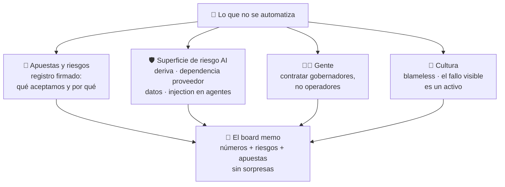

# C4 · Módulo 4 — Riesgo, gente y cultura: la parte que no se automatiza

> Los módulos 1-3 diseñaron la máquina: memoria, sensores, constitución. Este módulo es sobre lo que la máquina no puede darse a sí misma: **apuestas asumidas con los ojos abiertos, personas que saben gobernar IA, y una cultura donde los fallos salen a la luz**. Es el módulo menos técnico del curso — y donde más empresas AI-native van a morir.

## 🗺️ Mapa visual

## 📖 Concepto

### El registro de apuestas: riesgos aceptados a escala empresa

La sección "riesgos aceptados" de una test strategy — decir en voz alta qué NO se prueba y firmarlo — es exactamente lo que una empresa necesita a escala estratégica. Toda estrategia es una apuesta; la diferencia entre el fundador maduro y el que improvisa es que el primero tiene las suyas **escritas, con dueño y con señal de salida**:

- *"Apostamos a que la selección con IA es diferenciador suficiente para pagar premium — señal de salida: si en 4 cosechas el precio logrado no supera al del mercado en X%, la tesis está mal."*
- *"Aceptamos depender de UN comprador ancla el primer año — mitigación: no más del 60% del volumen; revisión trimestral."*
- *"NO invertimos en tostión propia todavía — riesgo aceptado: margen que dejamos en la mesa; revisar al superar Y kg/mes."*

La disciplina es idéntica a la del decision journal, pero al nivel de la tesis: cada apuesta con métrica de invalidación y fecha. Una apuesta sin señal de salida no es una apuesta — es una creencia, y las creencias no se auditan.

### La superficie de riesgo de una empresa AI-native

Tu spec-04 te enseñó a pensar en superficies de ataque. La de una empresa con IA en el centro tiene capas que un negocio clásico no tiene — y como CEO eres tú quien firma la exposición:

| Riesgo | Traducción de la maestría | En Cafetal |
|--------|---------------------------|------------|
| **Deriva silenciosa** | Deriva de modelo (spec-05) | El Selector se degrada sin que nadie lo note → por eso el disagreement con SLO del M2 no es opcional |
| **Dependencia de proveedor** | Vendor lock-in | Precios triplicados, modelo descontinuado, API caída en plena cosecha → capa de abstracción + plan B evaluado + lo crítico (el Selector) corre local, en TU hardware |
| **Datos** | Fuga / PII | Datos de clientes y precios de compra a modelos externos sin política → clasificación de datos: qué puede salir a un API, qué jamás |
| **Injection en agentes** | Prompt injection + excessive agency (spec-04) | El agente que lee correos de proveedores y puede ordenar compras ES el escenario de ataque — un correo malicioso ordena compras → least privilege + límites de monto + gates del M3 |
| **Automation bias** | El riesgo humano | El equipo deja de mirar porque "la IA sabe" → auditoría de muestras COMO RITUAL, no como excepción |
| **Regulatorio/reputacional** | Compliance | "Seleccionado con IA" como promesa de marketing te obliga: si el Selector falla en público, el daño es a la marca, no al lote |

La respuesta a todos es la misma arquitectura mental: guardrails en capas + evals que vigilan + auditoría humana de muestras. Ninguna capa es infalible; el diseño asume que cada una fallará.

### Gente: contratar gobernadores, no operadores

El error de contratación de la era IA es contratar para el trabajo que la IA ya hace. En una AI-native, cada humano que entra debe responder una pregunta: **¿qué gobierna esta persona que la IA ejecuta?** El perfil cambia:

- **Criterio de dominio sobre ejecución mecánica**: el catador que calibra al Selector vale oro; diez seleccionadores manuales, no. La persona de ventas que diseña la relación con el cliente ancla, sí; la que copia-pega respuestas, no.
- **Todo rol incluye supervisar IA**: leer un audit trail, cuestionar una propuesta del agente, escalar una anomalía — eso es alfabetización básica en tu empresa, del agrónomo al contador. Y se enseña con el mismo patrón del piloto + champion que ya conoces: primero se aprende a *evaluar* outputs de IA, después a construir con ella.
- **El plan de NO-contratación es tan importante como el de contratación**: qué roles clásicos no existirán en Cafetal porque son agentes (asistente administrativo, buena parte del back-office, reporting) — y qué se hace con ese presupuesto (mejores salarios para menos personas con más criterio).

### Cultura: el fallo visible es un activo

Todo el sistema — evals, journal, constitución, post-mortems — tiene un único punto de fallo: **el miedo**. El día que a alguien le cueste algo reportar que el Selector se equivocó, o que su decisión del journal salió mal, la gente esconderá los fallos, el golden dataset dejará de crecer y tus sensores mentirán. La cultura blameless no es amabilidad: es **integridad de datos**. Los mecanismos concretos: el post-mortem pregunta "qué le faltó al sistema", nunca "quién fue"; la retrospectiva del journal celebra la decisión bien tomada que salió mal; el que reporta el fallo del agente que él mismo supervisaba recibe crédito, no sospecha; y el fundador va primero — tu propia decisión fallida, documentada y discutida en público, vale más que cualquier charla de valores.

> **La frase del módulo:** *la máquina de los módulos 1-3 corre sobre confianza: apuestas firmadas hacia afuera, autonomía gobernada hacia adentro, y una cultura donde el fallo sale a la luz a tiempo. Pierde la confianza y los sensores mienten, el journal se maquilla y la constitución se ignora.*

## 🔨 Lab guiado — Apuestas, gente y el board memo

**Paso 1 — El registro de apuestas (`04-apuestas.md`).** Mínimo 6 apuestas estratégicas de Cafetal con el formato completo: apuesta → por qué la tomamos → qué aceptamos perder → **señal de invalidación (con número)** → fecha de revisión → dueño. Al menos una debe ser un "NO hacemos X" (la tostión, la exportación directa, el e-commerce propio — elige) y al menos una debe ser incómoda de escribir (esa es la real).

**Paso 2 — El registro de riesgos AI.** Instancia la tabla de superficie de riesgo para Cafetal: para cada uno de los 6 riesgos, su versión concreta aquí → mitigación existente → mitigación pendiente → apetito (¿cuánto de esto aceptamos?). El de injection hazlo en serio: lista qué agentes tienen qué permisos y busca la combinación lectura-de-input-externo + capacidad-de-actuar (esa dupla es SIEMPRE el agujero).

**Paso 3 — El plan de gente (`05-gente.md`).** Los primeros 3 roles humanos de Cafetal (además de ti): para cada uno, qué gobierna que la IA ejecuta, qué criterio de dominio trae, y cómo se ve su semana (que la supervisión de agentes aparezca como trabajo explícito, con horas). Después, la lista de NO-contratación: 3 roles clásicos que no existirán y qué agente los cubre. Cierra con el plan de alfabetización: cómo un agrónomo de 50 años aprende a auditar al Selector (pista: no es un curso — es el ritual de auditoría de muestras hecho en pareja).

**Paso 4 — El board memo (`06-board-memo.md`).** El documento mensual de una página que recibiría tu board (o tú mismo, como disciplina): los 5 números del tablero (M2) con tendencia → 1 decisión clave del mes (del journal, M3) → estado de las 2 apuestas más calientes → 1 riesgo que subió o bajó → en qué necesito ayuda. Escríbelo con datos inventados-pero-plausibles del primer trimestre de Cafetal. La regla del memo: **cero sorpresas** — nada que el board lea aquí por primera vez debería ser grave.

**Paso 5 — Commit** (`C4-M4: apuestas, riesgos, gente y board memo de Cafetal`).

## 🎯 Reto

**El pitch inverso.** El ejercicio que separa al fundador del evangelista: argumenta contra tu propia tesis. Escribe `labs/cafetal/retos/pitch-inverso.md` defendiendo, con la mejor evidencia que puedas reunir, **por qué Cafetal NO debería ser AI-native en al menos dos áreas**. Candidatas: ¿el trato con caficultores vecinos — donde la confianza personal ES el activo y un agente de por medio la destruye? ¿la cata — donde el ritual humano es parte del producto que compra el cliente premium? ¿la venta al cliente ancla? Para cada área: qué se gana automatizando, qué se pierde, y por qué lo perdido vale más. Termina con la regla general que extraes: ¿cuál es el criterio para declarar un área "humana por diseño"? (No es "donde la IA es mala hoy" — eso cambia cada seis meses. Es donde el valor ESTÁ en que sea un humano.) Si tu pitch inverso no te convenció al menos un poco, no lo hiciste en serio.

## ✅ Checklist de dominio

- [ ] Mis apuestas estratégicas tienen señal de invalidación numérica y fecha — no son creencias
- [ ] Puedo recitar la superficie de riesgo AI de una empresa y la mitigación en capas de cada una
- [ ] Identifico la dupla peligrosa (input externo + capacidad de actuar) en cualquier agente
- [ ] Cada rol humano de mi plan responde "qué gobierna que la IA ejecuta"
- [ ] Puedo explicar por qué blameless es integridad de datos, no amabilidad
- [ ] Mi board memo cabe en una página y no tiene sorpresas

## 💬 Preguntas de inversionista/board

1. *"¿Qué mataría a esta empresa? Dame las 3 formas más probables."* (tu registro de apuestas con señales de invalidación — el fundador que responde rápido y con números ya pasó el filtro)
2. *"¿Cuál es tu exposición real a los proveedores de IA?"* (capa de abstracción, Selector local, plan B evaluado — y el costo aceptado de esa independencia)
3. *"¿Por qué tu equipo es tan pequeño para lo que describes?"* (el plan de gente: gobernadores + agentes; el presupuesto de no-contratación reinvertido en criterio)
4. *"¿Qué área decidiste mantener humana y por qué?"* (tu pitch inverso — la respuesta con un límite pensado vale más que cualquier demo)
5. *"¿Cómo me entero yo de las malas noticias?"* (el board memo sin sorpresas + la cultura que las hace salir a tiempo — y un ejemplo real de una mala noticia bien manejada)

## 🔗 Conexiones

- **Refuerza:** los riesgos aceptados de [C2-M8](curso-2-profundizando__modulo-08-estrategia-liderazgo.html) elevados a apuestas de empresa; la superficie de ataque y guardrails de [spec-04](curso-3-especializaciones__spec-04-red-teaming-guardrails__modulo-01-superficie-de-ataque.html) como riesgo de negocio; la cultura blameless que atraviesa toda la maestría revela aquí su verdadera función: integridad de datos.
- **Se reutiliza en:** el [capstone](curso-4-ai-native__capstone-blueprint-cafetal.html) 🏆 — apuestas, riesgos, gente y memo son los capítulos finales del blueprint; y si Cafetal deja de ser un ejercicio, este módulo es el primero que releerás.
