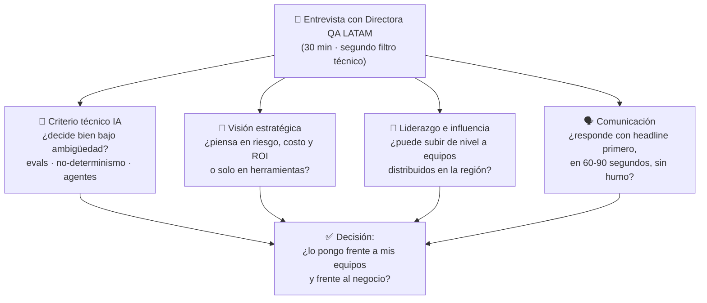

# 🎤 Especial — Entrevista: Directora de QA LATAM (QA AI Lead · 30 min)

> **Segundo filtro técnico, pero con una Directora.** Eso cambia el juego: ya demostraste que sabes hacer; ahora ella valida que sabes **decidir, comunicar y liderar**. Este módulo condensa toda la maestría en lo que necesitas mañana — sin lab, solo teoría destilada y un banco de preguntas con respuestas ocultas para auto-examinarte.

## 🗺️ Mapa visual — qué evalúa una Directora en 30 minutos

## 🧭 Qué esperar de esta entrevista (mi lectura)

Una Directora de QA para LATAM casi nunca hace un quiz de sintaxis — para eso estuvo el primer filtro. En 30 minutos, lo más probable es **una de estas tres formas (o una mezcla)**:

1. **Conversación estratégica** *(la más probable)*: tu visión de cómo la IA cambia el QA, cómo has aplicado IA en testing, hacia dónde crees que va el rol. Busca saber si tienes **opinión propia formada**, no definiciones de Wikipedia.
2. **Escenario abierto**: *"tenemos X producto/equipo, ¿cómo lo abordarías?"*. Busca ver tu **proceso de decisión**: si preguntas contexto antes de recetar, si hablas de riesgo y trade-offs, si dices qué NO harías.
3. **Deep-dive conductual-técnico**: recorrer tu experiencia real con preguntas de *"cuéntame una vez que..."*. Busca **evidencia**, no promesas.

**Lo que seguro evalúa, sea cual sea el formato:**

- **Seniority real** = hablar en trade-offs y riesgos aceptados, no en absolutos. El junior dice "hay que automatizar todo"; el lead dice "automatizamos donde el riesgo paga el costo, y esto es lo que decidimos NO probar".
- **El rol es LATAM** = equipos distribuidos, probablemente con niveles de madurez muy distintos entre países/squads. Espera algo sobre **estandarizar prácticas, subir de nivel gente con perfil manual/tradicional, e influir sin ser jefe directo**.
- **"AI Lead"** tiene dos caras y debes dominar ambas: testear sistemas **hechos con IA** (curso 3) y usar IA **como herramienta de QA** (tu capstone Healer). Muchos candidatos solo traen una.
- **Comunicación ejecutiva**: ella reporta hacia arriba. Si le respondes con claridad de headline-primero, te imagina presentando ante su VP. Eso pesa tanto como lo técnico.

**La aritmética de los 30 minutos:** ~5 min de apertura y contexto, ~18-20 min para 3-5 preguntas grandes, ~5 min para TUS preguntas. Traducción: cada respuesta tuya debe durar **60-90 segundos** e invitar a profundizar, no agotarlo todo. Y tus preguntas del final **son parte del examen** — llega con 3 preparadas (bloque F).

## 📖 Repaso condensado

### 1. Tu pitch de 90 segundos (prepáralo hoy, en voz alta)

La primera pregunta será alguna variante de *"cuéntame de ti"*. Estructura ganadora, tres frases:

1. **Quién eres**: ingeniero de software con 10+ años, especializado en calidad y automatización — del testing clásico (API, UI, contratos, CI/CD) al testing de sistemas con LLMs.
2. **Qué te diferencia**: no solo usas IA — sabes **evaluarla**: evals deterministas y model-graded, trajectory evals de agentes, red-teaming, observabilidad de LLMs. Y has construido tooling de QA **con** IA (agente que auto-repara selectores con human-in-the-loop y audit trail).
3. **Por qué este rol**: quieres liderar la transición de equipos QA hacia la era de IA — que es exactamente lo que el rol pide.

> Regla de oro para toda la entrevista: **headline primero, detalle después**. Responde la pregunta en la primera frase; luego da el porqué. Si quiere más, preguntará.

### 2. El núcleo clásico que sostiene todo (C1-C2)

Nada de IA se sostiene sin esto — y una directora lo huele en segundos:

- **Riesgo primero**: una test strategy no es una lista de herramientas; es la respuesta a *"dado ESTE producto, ESTE equipo y ESTE apetito de riesgo, ¿cómo conseguimos la máxima confianza al mínimo costo?"*
- **Capas y gates**: cada comportamiento se prueba en la capa más baja que lo verifique (unit → api/contract → ui/e2e). Los gates de CI son el corazón operativo de la estrategia: capa × gate × duración × qué bloquea.
- **Métricas que entiende el negocio**: DORA (lead time, deploy frequency, change failure rate, MTTR) + **escape rate** como métrica de efectividad del testing. Anti-métricas: "tenemos 4.000 tests" y cobertura de líneas como objetivo (ley de Goodhart).
- **Riesgos aceptados**: la sección que distingue al senior — decir en voz alta qué NO se prueba y por qué, firmado. Sin ella, la estrategia promete infinito y entrega culpa.
- **El SDET moderno es un multiplicador**: construye framework, reglas, gates y visibilidad para que cualquier dev escriba buenos tests. "QA aparte que prueba lo de otros" murió.
- **Shift-left + shift-right = continuo**: tipos y contratos antes del deploy; canary, feature flags y synthetic monitoring después. Tu frase: *"quality is built in at every stage; tests are how we measure it, not how we add it."*

### 3. El cambio de paradigma (curso 3 — tu ventaja competitiva)

> En el software clásico, el mismo input produce el mismo output y el test oracle es un `expect`. En sistemas con LLMs, **el output es no-determinista y el oracle es el problema**: evaluar reemplaza a assertear, las distribuciones reemplazan a los casos, y la observabilidad deja de ser opcional.

Esa frase, dicha con naturalidad, vale media entrevista. Sus consecuencias prácticas:

- **Evaluar ≠ assertear**: un test pasa o falla; una eval mide una **distribución** sobre un dataset (pass rate, score promedio) contra un **threshold**. Se corre N veces, no una.
- **La escalera de evals** (de barato/confiable a caro/falible): **peldaño 1** — asserts deterministas sobre forma y hechos (JSON válido, schema, tool correcta llamada, regex de formato); **peldaño 2** — similitud semántica contra ground truth (embeddings); **peldaño 3** — **LLM-as-a-judge** con rúbricas binarias y específicas, solo para lo genuinamente subjetivo. Diseña el output estructurado PARA vivir en peldaños bajos: *testability by design*.
- **El juez también se testea**: sesgos conocidos (posición, verbosidad, self-preference); se calibra con **meta-evaluación** — un golden dataset etiquetado por humanos mide el agreement del juez antes de confiarle nada.
- **Golden datasets** son el nuevo activo de QA: curados, versionados, con casos felices, edge cases y trampas. Crecen con cada bug de producción (regresión → dataset, igual que antes bug → test).
- **Evals en CI**: cada cambio de prompt o de modelo corre la suite (promptfoo / DeepEval) con thresholds; un A/B lado a lado detecta regresiones silenciosas. **Un prompt es código: se versiona, se revisa y se le hace regresión.**

### 4. Mapa por especialización — una frase y un término por spec

| Spec | La idea central en una frase | Términos que debes soltar con naturalidad |
|------|------------------------------|-------------------------------------------|
| **00 · Fundamentos** | El no-determinismo no se elimina (temperature 0 no basta) — se gestiona con structured output y evals estadísticas | tokens, temperature, structured output, tool use |
| **01 · RAG** | Evalúa retrieval y generation POR SEPARADO: si el contexto recuperado es malo, ningún prompt lo salva | RAGAS: faithfulness, answer relevancy, context precision/recall |
| **02 · LLM-as-a-Judge** | Sube la escalera solo cuando el peldaño inferior no alcanza; y al juez, júzgalo primero | escalera de evals, promptfoo, rúbricas binarias, meta-eval |
| **03 · Agentes** | Evalúa la **trayectoria**, no solo el resultado: qué tools llamó, en qué orden, con qué argumentos, a qué costo | trajectory evals, tool calling, MCP, loop de agente |
| **04 · Red-teaming** | La superficie de ataque de un LLM es el lenguaje mismo; los guardrails van en capas (input → modelo → output → acción) | prompt injection (≠ jailbreak), OWASP LLM Top 10, garak/PyRIT |
| **05 · Perf & Obs** | En producción no hay asserts: hay tracing de cada interacción + evals asíncronas sobre muestras | TTFT, tokens/s, costo por interacción, Langfuse, evals en producción |

Detalles que elevan cada tema si profundiza:

- **RAG**: los modos de fallo típicos son retrieval pobre (chunking malo, top-k mal calibrado) vs generation infiel (alucina sobre buen contexto). La métrica dice CUÁL de los dos arreglar.
- **Agentes**: el tool calling correcto es evaluable en el **peldaño determinista** (¿llamó la tool esperada con los args esperados?) — no necesitas un juez para eso. El juez entra solo para juzgar la calidad de la respuesta final.
- **Red-teaming**: **prompt injection** = instrucciones maliciosas entran por datos que el sistema procesa (un email, un documento del RAG); **jailbreak** = el usuario ataca directamente las instrucciones del sistema. Riesgo estrella en agentes: injection + tools = el atacante ejecuta acciones con los permisos del agente. Por eso: least privilege por tool y human-in-the-loop para acciones irreversibles.
- **Producción**: sample de interacciones → juez asíncrono → dashboards de score; las quejas de usuarios y los fallos reales alimentan el golden dataset. El ciclo se cierra: producción → dataset → eval en CI.

### 5. Las dos direcciones de "QA + IA" (el corazón del rol)

Un **QA AI Lead** vive en ambas direcciones — tenlas separadas y nómbralas así, porque estructurar esta distinción frente a ella es una señal de claridad enorme:

**Dirección 1 — Testear sistemas construidos CON IA** (todo el punto 3 y 4): el producto tiene LLMs dentro y hay que darle confianza al negocio de que funciona, es seguro y no se degrada.

**Dirección 2 — Usar IA como herramienta DE testing**: generación de casos de prueba y datos sintéticos, self-healing de selectores, agentes que exploran la app, copilots que escriben tests, análisis de fallos. Aquí el criterio del Lead es lo que vale:

- **Autonomía gradual**: la IA propone, el humano aprueba — hasta que las métricas demuestren que puede promoverse. Tu capstone (agente Healer) es EL ejemplo: repara selectores rotos, pero con **audit trail** y **human-in-the-loop**; el fix se acepta con una eval, no con fe.
- **ROI medible o no se adopta**: horas ahorradas, flake rate reducido, tiempo de mantenimiento. El anti-patrón que debes nombrar: adoptar IA por moda, sin métrica de éxito — eso genera más deuda que valor.
- **La IA no reemplaza el criterio**: genera cantidad, no criterio de riesgo. Un test generado que nadie revisa es cobertura falsa — peor que no tenerlo, porque da confianza sin señal.

### 6. Liderazgo — lo que una Directora pregunta de verdad

- **Primeros 90 días**: 30 escuchar y medir (estado real de suites, flake rate, escape rate, madurez por equipo — diagnóstico sin culpar personas) → 60 quick wins visibles que compren credibilidad (el gate más doloroso, la suite más flaky) → 90 estrategia escrita con roadmap, métricas y **qué dejará de hacerse**. Casi nadie dice la última parte; dila.
- **Influir sin autoridad**: datos (un flake rate de 8% convence más que "los tests están mal"), developer experience (el camino correcto debe ser el camino fácil) y cultura blameless (el día que un escape a producción dispare una cacería, la gente esconderá los bugs).
- **Subir de nivel a un equipo tradicional hacia IA** (pregunta MUY probable dado el alcance regional): no se hace con un curso genérico — se hace con un **proyecto piloto real** con métricas, champions por equipo que multiplican, y práctica deliberada sobre el producto propio. Primero enseñas a evaluar IA (pensamiento crítico sobre outputs), luego a construir con IA. Y upskilling explícito como parte del roadmap, no como hobby de los viernes.
- **Qué reportas hacia arriba**: 3-5 métricas con definición operativa y SLO — escape rate, lead time del pipeline, flake rate, y para sistemas IA: pass rate de evals por release + costo por interacción. En lenguaje de negocio: riesgo, velocidad, costo.

### 7. Técnica de respuesta para 30 minutos

- **Headline primero**: responde en la primera frase, desarrolla después. 60-90 segundos y cedes el turno.
- **Escenarios**: antes de recetar, pregunta 1-2 cosas de contexto (*"¿qué hace el producto y qué pasa si falla?"*). Eso ES la respuesta senior — demuestra riesgo-primero.
- **Conductuales**: STAR comprimido — situación en una frase, tu acción en dos, resultado con número. Lleva **2-3 historias reales preparadas** (un conflicto/influencia, un fallo del que aprendiste, un logro medible).
- **Honestidad estratégica**: si pregunta por algo que no has usado en producción: *"en producción no lo he operado, pero lo construí de punta a punta en mi programa de especialización — te cuento cómo lo resolví"*. Eso convierte una debilidad en evidencia de aprendizaje autodirigido.
- **Cierra fuerte**: al final, di explícitamente que quieres el rol y por qué encajas. Es sorprendente cuánta gente no lo dice.

---

## 💬 Banco de preguntas (haz clic para revelar cada respuesta)

Auto-examínate: lee la pregunta, respóndela EN VOZ ALTA en 60-90 segundos, y solo entonces abre la respuesta para comparar.

### Bloque A — Visión y estrategia (nivel Directora)

1. "¿Cómo cambia la IA generativa el rol de QA?"

**Headline:** cambia el *qué* probamos y el *cómo*, pero no el *para qué* — seguimos vendiendo confianza al mínimo costo.

- **Nuevo objeto de prueba**: sistemas no-deterministas donde el oracle es el problema — evaluar reemplaza a assertear, distribuciones reemplazan a casos.
- **Nuevas herramientas**: la IA genera tests, repara selectores, explora la app — el QA pasa de escribir cada test a **diseñar y supervisar sistemas de calidad**, con la IA como fuerza de trabajo.
- **El rol sube de nivel**: el QA que solo ejecutaba casos está en riesgo; el que define estrategia, diseña evals y ejerce criterio de riesgo se vuelve más valioso que nunca. El criterio no se automatiza.

2. "Vamos a lanzar un producto con un chatbot LLM. Diséñame la estrategia de calidad."

Primero pregunta contexto (¡eso es parte de la respuesta!): ¿qué hace el chatbot y qué pasa si falla? ¿tiene tools/acciones o solo conversa? ¿dominio regulado? Luego, por capas:

1. **Riesgo primero**: mapear los peores escenarios (alucinar precios, filtrar datos, ejecutar acciones indebidas) — eso prioriza todo lo demás.
2. **Pre-release**: golden dataset representativo + escalera de evals (deterministas para formato y hechos → semánticas → LLM-judge para tono/calidad) corriendo en CI ante cada cambio de prompt o modelo.
3. **Seguridad**: red-teaming (prompt injection, jailbreaks, OWASP LLM Top 10) + guardrails en capas con sus propios tests.
4. **Producción**: tracing de cada conversación (Langfuse), evals asíncronas sobre muestras, presupuesto de latencia (TTFT) y costo por interacción.
5. **Riesgos aceptados** por escrito: qué NO cubrimos y por qué — cerrar con esto es lo que suena a Lead.

3. "¿Qué métricas de calidad le reportarías a la dirección para un sistema con IA?"

Pocas, con definición operativa, en lenguaje de negocio:

- **Pass rate de evals por release** contra el golden dataset (¿mejoramos o regresionamos con cada cambio?).
- **Escape rate**: incidentes de calidad IA reportados por usuarios que nuestras evals no detectaron — mide la efectividad del sistema de calidad y alimenta el dataset.
- **Tasa de incidentes de seguridad IA** (injections logradas, respuestas fuera de política) desde red-teaming continuo y monitoreo.
- **Latencia (TTFT/p95) y costo por interacción**: la calidad que el usuario siente y la que Finanzas siente.
- Y el matiz senior: advertir de las **anti-métricas** ("tenemos 5.000 casos en el dataset" no dice nada — Goodhart aplica igual en IA).

4. "¿Dónde NO usarías IA en el proceso de testing?"

Pregunta trampa deliciosa — responder "en ningún lado, la IA sirve para todo" descalifica. Mi lista:

- **Como oracle único de cosas críticas**: un LLM no decide solo si un cálculo financiero, un flujo de pago o un dato regulado están bien — ahí mandan asserts deterministas.
- **Donde el determinismo es barato y suficiente**: usar un juez LLM para verificar un status code o un schema es pagar caro y no-determinista por lo que un assert hace gratis y confiable (la escalera: peldaño más bajo que funcione).
- **Sin humano en decisiones irreversibles**: auto-merge de fixes generados, borrado de tests "obsoletos", acciones destructivas de agentes.
- **Con datos sensibles sin control**: mandar PII o código propietario a modelos externos sin política clara.
- Regla general: la IA propone, el sistema de evals y el humano disponen — hasta que las métricas justifiquen más autonomía.

5. "Tenemos equipos QA en varios países de LATAM, con madurez muy dispareja y mayoría de perfil manual. ¿Cómo los llevas a la era de IA?" ⭐ (probable dado el rol)

- **Diagnóstico primero, no receta**: madurez real por equipo (automatización, CI, skills) — no puedes estandarizar lo que no has medido.
- **Piloto, no big bang**: un equipo, un caso de uso con dolor real (ej. generación de casos o triage de fallos con IA), métricas de éxito definidas ANTES. El piloto exitoso se vuelve la historia interna que vende el cambio.
- **Champions por país/equipo**: formar multiplicadores locales en vez de depender de mí — es la única forma de escalar en una región distribuida.
- **Los manuales no sobran — se reconvierten**: su criterio de dominio es justo lo que las evals necesitan (diseñar golden datasets, escribir rúbricas de juez, revisar outputs de IA es testing exploratorio de nueva generación).
- **Estandarizar el piso, no el techo**: prácticas y métricas comunes (evals en CI, prompts versionados, flake budget) con libertad local en herramientas cuando se justifique.
- Y honestidad de Lead: habrá resistencia — se maneja con datos, quick wins visibles y cultura blameless, no con mandato.

### Bloque B — Criterio técnico IA (el segundo filtro propiamente)

6. "¿Cómo pruebas un sistema cuyo output cambia en cada ejecución?"

**Headline:** dejando de buscar EL output correcto y evaluando la **distribución** de outputs contra criterios.

- Reducir el no-determinismo donde se pueda: **structured output** (el JSON es assertable aunque la prosa varíe), temperature baja — pero saber que temperature 0 **no garantiza** determinismo.
- Evaluar estadísticamente: dataset de casos, N ejecuciones, **pass rate contra threshold** (ej. "faithfulness ≥ 0.9 en el 95% de los casos"), no un assert único.
- Diseñar el sistema para ser testeable: cuanto más estructurado el output, más evaluación cae en peldaños deterministas baratos. *Testability by design.*

7. "¿Cómo evalúas outputs de LLM? Descríbeme tu toolbox."

**La escalera de evals**, de abajo hacia arriba — subes solo cuando el peldaño no alcanza:

1. **Deterministas**: JSON parseable, schema válido, campos exactos, regex de formato, ¿llamó la tool correcta? Baratos, confiables, corren en cada commit.
2. **Semánticas**: similitud por embeddings contra ground truth — para cuando el sentido importa y la forma varía.
3. **LLM-as-a-judge**: solo para lo genuinamente subjetivo (tono, calidad de razonamiento), con **rúbricas binarias y específicas** ("PASS si no exagera severidad"), nunca "califica del 1 al 10".

Herramientas: promptfoo / DeepEval en CI, con A/B lado a lado ante cambios de prompt. Y el principio: cada peldaño arriba cuesta más y es más falible — la madurez está en exprimir los de abajo.

8. "¿LLM-as-a-judge? ¿Y quién juzga al juez?"

Exacto — **al juez se le hace QA antes de confiarle nada**:

- **Meta-evaluación**: golden dataset etiquetado por humanos → mides el agreement del juez contra el humano. Si no supera un threshold, el juez no entra al pipeline.
- **Sesgos conocidos y mitigables**: posición (favorece la primera opción → aleatorizar orden), verbosidad (favorece respuestas largas), self-preference (favorece outputs de su propia familia de modelos → juez de familia distinta al SUT).
- **Rúbricas binarias y específicas**: un criterio por rúbrica, PASS/FAIL — las escalas numéricas son ruido.
- Y control de deriva: el juez se versiona (modelo + prompt fijados) y su agreement se re-mide periódicamente, porque el juez también regresiona.

9. "¿Cómo evalúas un sistema RAG?"

**Headline:** separando retrieval de generation — son dos fallos distintos con dos arreglos distintos.

- **Retrieval**: ¿recuperó los documentos correctos? — context precision / context recall (métricas RAGAS). Falla → problema de chunking, embeddings o top-k.
- **Generation**: dado buen contexto, ¿la respuesta es fiel? — **faithfulness** (¿inventó algo que no está en el contexto? = alucinación medible) y answer relevancy. Falla → problema de prompt o modelo.
- Dataset de evaluación con preguntas + ground truth + los docs que DEBERÍA recuperar, incluyendo **preguntas sin respuesta** en el corpus (el sistema debe decir "no sé", no inventar).
- Sin esta separación, ajustas el prompt cuando el problema era el chunking — y pierdes semanas.

10. "¿Cómo pruebas un agente que usa herramientas?"

**Headline:** evaluando la **trayectoria**, no solo el resultado final.

- Un agente puede llegar a la respuesta correcta por un camino desastroso (8 llamadas donde bastaba 1, tools con args inválidos, un loop casi infinito). El resultado final no lo cuenta.
- **Trajectory evals**: ¿llamó las tools correctas, en orden razonable, con argumentos válidos, en ≤ N pasos, a ≤ $X de costo? — casi todo esto es **peldaño determinista**, no necesita juez.
- El juez entra al final: calidad de la respuesta al usuario.
- Además: cada tool se testea aparte como función clásica (unit/contract — el agente no perdona una tool rota), límites de seguridad (least privilege por tool, human-in-the-loop para acciones irreversibles) y presupuestos de pasos/costo como asserts.

11. "¿Qué riesgos de seguridad te preocupan en sistemas LLM y cómo los pruebas?"

Marco: **OWASP LLM Top 10**. Los que destaco:

- **Prompt injection** — el número 1: instrucciones maliciosas entran por los DATOS que el sistema procesa (un email, un doc del RAG, una página web). Distinto de **jailbreak** (el usuario ataca directo). El escenario crítico: injection + agente con tools = el atacante actúa con los permisos del agente.
- **Fuga de datos**: el modelo revela system prompt, PII o datos de otros usuarios.
- **Excessive agency**: darle al agente más permisos de los que su función exige.
- **Cómo se prueba**: red-teaming automatizado (garak, PyRIT) con biblioteca de ataques corriendo como suite recurrente — no un pentest anual, porque cada cambio de prompt reabre la superficie. Defensa: **guardrails en capas** (input → modelo → output → acción), cada capa con sus propios tests, asumiendo que ninguna es infalible.

12. "¿Cómo evitas que un cambio de prompt (o de versión de modelo) rompa algo silenciosamente?"

**Headline:** tratando el prompt como código — se versiona, se revisa y tiene suite de regresión.

- **Prompts en git**, con PR review como cualquier cambio.
- **Eval suite como gate de CI**: cada cambio corre el golden dataset con thresholds; si el pass rate cae, el PR no pasa. Es el equivalente exacto de la regresión clásica.
- **A/B lado a lado** (promptfoo): prompt viejo vs nuevo caso por caso — porque el agregado puede subir mientras un caso crítico se rompe.
- **Cambios de modelo = mismo tratamiento**: nueva versión del proveedor → corre toda la suite antes de promover. Nunca "upgrade y a ver qué pasa".
- Red de seguridad final: evals en producción para atrapar lo que el dataset no representó.

13. "¿Qué significa 'evals en producción' y por qué las necesitas si ya tienes evals en CI?"

- Porque el golden dataset **nunca** representa todo lo que los usuarios reales hacen — en sistemas no-deterministas, el "pasó en CI" garantiza aún menos que en software clásico.
- Mecánica: **tracing de cada interacción** (Langfuse: prompt, contexto, respuesta, latencia, costo) → **muestreo** → juez asíncrono puntúa → dashboard con score por versión y alertas de deriva.
- Detecta lo que CI no puede: deriva del proveedor del modelo, patrones de uso nuevos, degradación gradual.
- Y **cierra el ciclo**: cada fallo real de producción se convierte en caso del golden dataset — igual que bug → test de regresión en el mundo clásico. Es shift-right aplicado a IA.

14. "¿Qué mides en performance de un sistema LLM?"

Las tres que el usuario y el negocio sienten:

- **TTFT (time to first token)**: la latencia percibida en streaming — el usuario perdona un total largo si empieza a ver respuesta rápido.
- **Tokens/segundo**: la fluidez de la generación.
- **Costo por interacción**: en LLMs el costo es variable por token — un prompt inflado o un agente que da vueltas queman presupuesto. El costo ES una dimensión de calidad y tiene presupuesto como assert.
- Matices senior: percentiles, no promedios (p95/p99); presupuestos por operación en CI (una conversación no puede exceder X tokens/$); y el trade-off calidad-latencia-costo es una **decisión de producto** que QA hace visible con datos.

### Bloque C — IA como herramienta de QA (la otra dirección)

15. "¿Has usado IA para generar tests? ¿Qué riesgos le ves?"

Sí — y el criterio importa más que la herramienta:

- **Dónde brilla**: borradores de casos desde specs/historias, datos sintéticos, variaciones de edge cases que a un humano le aburren, page objects/selectores iniciales.
- **Riesgo 1 — cobertura falsa**: un test generado que nadie revisa puede assertear trivialidades. Verde que no verifica nada es peor que rojo: da confianza sin señal.
- **Riesgo 2 — la IA no conoce tu riesgo**: genera cantidad, no criterio; prueba lo obvio, no lo que duele. El mapa de riesgo sigue siendo humano.
- **Mi regla**: la IA propone, el humano revisa con el mismo estándar que un PR de un junior — y medimos si esos tests atrapan bugs reales (señal), no cuántos son (volumen).

16. "¿Qué opinas del self-healing de tests? ¿Confiarías en él?" ⭐ (tu capstone ES esto)

Pregunta ideal — construí exactamente esto como capstone de mi programa: un agente **Healer** que auto-repara selectores rotos.

- **El riesgo real del self-healing ingenuo**: un "fix" que hace pasar el test enmascarando un bug real de UI — el remedio destruye la señal.
- **Mi diseño**: el agente propone el fix con **audit trail** completo (qué cambió y por qué), un humano aprueba (**human-in-the-loop**), y el fix se acepta pasando una **eval**, no por fe.
- **Autonomía gradual**: empiezas en modo propuesta; cuando la tasa de aciertos medida lo justifica, subes autonomía en casos de bajo riesgo (y nunca en flujos críticos).
- Respuesta corta: confío en self-healing **con evidencia y barandillas** — como en cualquier miembro nuevo del equipo.

17. "¿Los agentes de IA van a reemplazar a los QA?"

- **Van a reemplazar tareas, no el rol**: ejecución repetitiva, generación de casos, mantenimiento mecánico — sí, y qué bueno.
- **Lo que no se automatiza**: el criterio de riesgo (qué probar y qué no, qué es aceptable), el diseño del sistema de calidad, y la pregunta "¿esto le sirve al usuario?".
- **La ironía que me encanta**: cada agente que adoptas es un sistema no-determinista nuevo... que necesita QA. Los agentes no reducen la necesidad de criterio de calidad — la multiplican.
- El QA que compite contra la IA en ejecutar casos, pierde. El que dirige sistemas de calidad donde la IA ejecuta, se vuelve más valioso. Mi trabajo como Lead es mover al equipo del primer grupo al segundo.

### Bloque D — Liderazgo y conductuales

18. "Si entras como QA AI Lead, ¿qué haces en tus primeros 90 días?"

**30 — Escuchar y medir**: estado real de suites y pipelines (flake rate, duración, escape rate), madurez por equipo, dónde duele. Diagnóstico de proceso, sin culpar personas.

**60 — Quick wins visibles**: el gate más lento o la suite más flaky — algo que los devs sientan en semanas. Compra la credibilidad para todo lo demás. En paralelo: piloto de IA acotado con métricas definidas antes de empezar.

**90 — Estrategia escrita**: roadmap con objetivos medibles por trimestre, métricas con SLO, riesgos aceptados firmados y — la parte que casi todos omiten — **qué dejará de hacerse**, porque no puedes arreglar lo viejo Y construir lo nuevo con el mismo equipo.

Y cada viernes, 3 números al stakeholder. Sin sorpresas.

19. "Los devs dicen que escribir tests (o evals) los frena. ¿Qué les respondes?"

- **Primero escucho, porque suelen tener razón**: si escribir un test bueno cuesta 40 minutos de fricción, el problema es mío, no de ellos.
- **Developer experience**: el camino correcto debe ser el camino fácil — framework con fixtures listas, feedback en minutos, docs con ejemplos. Mi rol de multiplicador es construir eso.
- **Datos, no sermones**: mostrar el costo de NO probar (horas de hotfix, change failure rate, escapes) contra el costo de probar. El flake rate de 8% convence más que "los tests importan".
- **La capa correcta**: a veces "los tests frenan" significa que están escribiendo E2E donde bastaba un unit o un assert determinista donde pusieron un juez caro. Frenar es síntoma de testear en el lugar equivocado.

20. "Cuéntame de una vez que influiste en la práctica de ingeniería sin tener autoridad." (prepara TU historia real)

Prepara la tuya con STAR comprimido — plantilla de la estructura que funciona:

- **Situación** (1 frase): el equipo X tenía el problema Y que costaba Z.
- **Acción** (2 frases): medí y presenté datos, no opiniones; construí la alternativa fácil de adoptar; convencí a UN aliado primero y el resto siguió la evidencia.
- **Resultado** (con número): métrica antes/después + qué cambió en el comportamiento del equipo.

Los tres resortes que la entrevistadora quiere oír: **datos** en vez de jerarquía, **hacer fácil el camino correcto**, y **aliados/champions** en vez de mandato. Elige una historia real tuya HOY y ensáyala en voz alta — no la improvises mañana.

21. "Cuéntame de un bug que se te escapó a producción."

La trampa: quien dice "nunca se me escapó nada" o culpa a otros, falla. Estructura ganadora con tu caso real:

- **El escape, sin drama y sin culpables** (1 frase): qué salió y qué impacto tuvo.
- **La respuesta**: contener primero, y luego **post-mortem blameless de proceso** — la pregunta no es "¿quién fue?" sino "¿qué le faltó al sistema para atraparlo?".
- **El cierre del ciclo**: el hueco se convirtió en test/eval de regresión + qué cambió en el proceso (un gate nuevo, un monitoreo, una práctica).
- **La moraleja senior**: escape rate cero no es el objetivo — el objetivo es que cada escape haga al sistema más fuerte y que el costo del control no supere al del riesgo.

22. "El campo de IA cambia cada mes. ¿Cómo te mantienes actualizado — tú y tu equipo?"

- **Tú**: aquí tu programa ES la respuesta — diseñaste y ejecutaste un plan de estudio estructurado (fundamentos → especializaciones LLM → capstone construido), con labs reales, no solo lectura. Eso demuestra aprendizaje autodirigido con método, que es exactamente lo que un Lead debe modelar.
- **Filtro señal/ruido**: no perseguir cada modelo nuevo; los **principios** (evals, riesgo, observabilidad) son estables aunque las herramientas roten. Evaluar novedades con pilotos pequeños y métricas, no con hype.
- **El equipo**: tiempo de aprendizaje explícito en el roadmap (no hobby de viernes), sesiones internas donde quien pilotea algo lo enseña, y champions que multiplican.

### Bloque E — Habilidades blandas y estrategia general (madera de líder)

Aquí no hay respuestas "correctas" técnicas — hay patrones de pensamiento que ella reconoce como madera de líder. Adapta cada respuesta con TU historia.

23. "No estás de acuerdo con una decisión mía (o de la dirección). ¿Qué haces?"

Mide si sabes discrepar sin ser ni sumiso ni conflictivo:

- **Discrepo en privado, con datos y a tiempo** — antes de la decisión, no después en los pasillos. Mi trabajo es que decidas con el riesgo completo sobre la mesa.
- Si la decisión se mantiene: **disagree and commit** — la ejecuto como si fuera mía, porque un lead que sabotea con tibieza lo que no votó destruye al equipo.
- El matiz que muestra criterio: si el desacuerdo es sobre un **riesgo grave** (seguridad, datos, legal), lo dejo **por escrito** con el impacto estimado — no para cubrirme, sino porque documentar riesgo es parte del rol de calidad.
- Y la humildad: varias veces la decisión con la que no estaba de acuerdo resultó correcta — el negocio ve variables que yo no veo.

24. "El release sale mañana y tu recomendación es no salir. ¿Cómo lo comunicas?"

- **QA no veta — informa riesgo para que el negocio decida**. Mi trabajo no es decir "no", es que quien decide lo haga con los ojos abiertos.
- Formato: **riesgo en lenguaje de negocio** ("si sale así, X% de probabilidad de que los usuarios de Y no puedan pagar; costo estimado Z") + **opciones, no ultimátums**: salir completo aceptando el riesgo / salir sin la feature afectada (flag) / retrasar N días.
- **Sin sorpresas**: si esto se sabe la víspera, el fallo fue mío — la señal de riesgo debe ser visible semanas antes (gates, dashboards, reportes semanales).
- Y si el negocio decide salir: se documenta el riesgo aceptado, se monitorea de cerca (shift-right) y no hay "te lo dije" después — hay post-mortem blameless si algo pasa.

25. "Todo es urgente y el equipo no alcanza. ¿Cómo priorizas?"

- **Riesgo × impacto, explícito y visible**: la matriz de siempre, pero publicada — cuando la priorización es opaca, todo el mundo pelea; cuando es un criterio compartido, la conversación cambia de "hazme caso" a "discutamos el riesgo".
- **Decir NO en voz alta**: lo que no se hace se declara (riesgos aceptados), no se deja morir en silencio. El backlog infinito con todo "en progreso" es el fracaso clásico del lead que no sabe elegir.
- **Proteger la capacidad del equipo**: si la demanda supera la capacidad de forma crónica, el problema no se resuelve priorizando — se escala con datos (esto entra, esto no, esto necesita gente).
- La frase: *"priorizar es decidir qué se rompe primero — prefiero elegirlo yo con datos a que lo elija el azar."*

26. "Un senior del equipo se resiste al cambio (por ejemplo, a adoptar IA). ¿Qué haces?"

- **Primero escucho la objeción real** — detrás de "esto no sirve" suele haber algo legítimo: miedo a volverse irrelevante, una mala experiencia previa, o un problema técnico real que yo no vi. Cada uno se trata distinto.
- **Los escépticos técnicos son un activo**: los invito a romper el piloto — "ayúdame a encontrar dónde falla esto". Si tenía razón, el sistema mejora; si no, se convenció solo con evidencia que él mismo generó.
- **Nunca imponer por jerarquía** lo que puedo ganar con datos y participación — la adopción forzada se sabotea sola en tres meses.
- Límite claro: opinar distinto es sano; bloquear al equipo después de la decisión no. Si tras escuchar, involucrar y mostrar datos alguien sigue en bloqueo activo, esa ya es una conversación de desempeño, y no la evito.

27. "¿Cómo construyes confianza con stakeholders no técnicos?"

- **Hablar su idioma, no el mío**: nadie del negocio quiere oír "flake rate" — quiere oír riesgo, costo, velocidad. Traducir es mi trabajo, no el suyo.
- **Previsibilidad**: reportes cortos y regulares con los mismos 3-5 números — la confianza se construye con cadencia, no con presentaciones heroicas.
- **Sin sorpresas, especialmente malas**: la mala noticia se da temprano, con opciones. La primera vez que ocultas un rojo, la confianza no vuelve.
- **Cumplir lo pequeño**: decir "esto estará el jueves" y que esté el jueves vale más que cualquier roadmap ambicioso.

28. "Cuéntame un error tuyo como líder, o un feedback difícil que te dieron."

Prepara TU historia real — la estructura que funciona:

- **El error, concreto y sin excusas** (1 frase). Los errores creíbles de líder: retrasar una conversación difícil, hacer el trabajo yo mismo en vez de delegar, asumir contexto que el equipo no tenía, sobre-diseñar antes de validar.
- **Qué cambió** — la parte que importa: el hábito o mecanismo concreto que instalaste para que no se repita (no "aprendí a comunicar mejor" — vago — sino "desde entonces hago X").
- **Evidencia de que cambió**: una situación posterior donde actuaste distinto.
- Lo que ella descarta al instante: "soy muy perfeccionista" (humblebrag), culpar al contexto, o no tener ningún error que contar — eso es falta de autoconciencia, no de errores.

29. "¿Cómo tomas decisiones con información incompleta?"

- **Clasifico la decisión primero**: ¿es **reversible** (puerta de dos vías) o **irreversible**? Las reversibles se toman rápido con el 70% de la información — el costo de esperar supera el costo de equivocarse; las irreversibles sí ameritan más análisis.
- **Timebox a la investigación**: "decidimos el viernes con lo que tengamos" — la parálisis por análisis es una decisión también, y suele ser la peor.
- **Decidir + instrumentar**: toda decisión bajo incertidumbre lleva su métrica de validación y su criterio de reversa — es la misma mentalidad de las evals: no sé si es correcto a priori, pero sé cómo lo voy a medir.
- Es literalmente mi especialidad técnica convertida en hábito de gestión: trabajar con sistemas no-deterministas me entrenó para decidir sobre distribuciones, no certezas.

30. "¿Cómo delegas y desarrollas a tu equipo?"

- **Delego resultados, no tareas**: "necesitamos X medido por Y, tuyo el cómo" — con el nivel de detalle inversamente proporcional a la seniority de la persona.
- **Autonomía gradual** — el mismo patrón que uso con agentes de IA, y lo digo así porque es verdad: primero superviso de cerca, y a medida que los resultados lo justifican, suelto. Micromanagement permanente y abandono son los dos extremos que fallan.
- **El error es presupuesto de aprendizaje**: delegar implica aceptar que algo saldrá distinto a como yo lo haría — si intervengo cada vez, le enseño al equipo a no decidir.
- **Desarrollo deliberado**: cada persona con un reto que le quede un poco grande + espacio para fallar con red (blameless). Mi métrica de éxito como lead: cuántas decisiones toma el equipo sin necesitarme.

### Bloque F — Tus preguntas para ella (los últimos 5 minutos son parte del examen)

Las 5 preguntas que puedes hacerle — y por qué funcionan

Elige 3 según cómo fluya la conversación:

1. *"¿Cuál es hoy el estado de adopción de IA en los equipos de QA de la región, y cuál es tu ambición a 12 meses?"* — te posiciona pensando en SU problema y te da información para el resto del proceso.
2. *"¿Qué tendría que lograr la persona en este rol en los primeros 6 meses para que digas 'fue una gran contratación'?"* — señal clásica de seniority: piensas en resultados, no en tareas.
3. *"¿El rol pesa más hacia construir (evals, tooling, frameworks) o hacia habilitar equipos? ¿Cómo se reparte?"* — muestra que entiendes que un Lead vive en esa tensión.
4. *"¿Cuál es hoy el mayor dolor de calidad en la región — el que te quita el sueño?"* — abre conversación real; y su respuesta te dice más del trabajo que toda la vacante.
5. *"¿Cómo se mide hoy el éxito de QA aquí — qué métricas mira la dirección?"* — demuestra que piensas en el idioma del negocio desde antes de entrar.

**Cierre** (no lo saltes): *"Quiero este rol — une exactamente mis dos mundos: la ingeniería de calidad y la especialización en IA que he construido. ¿Cuáles son los siguientes pasos?"*

## ✅ Checklist pre-entrevista

**Hoy (horas de estudio):**

- [ ] Leer este módulo completo una vez, sin abrir respuestas: responder cada pregunta en voz alta primero
- [ ] Escribir y ensayar el pitch de 90 segundos (§1) — en voz alta, 3 veces
- [ ] Elegir y ensayar tus 2-3 historias STAR reales (influencia, escape a producción, logro medible)
- [ ] Repasar la tabla de especializaciones (§4) hasta poder dar la frase de cada spec sin mirar
- [ ] Poder recitar: la escalera de evals, la separación retrieval/generation, trajectory evals, y la distinción prompt injection vs jailbreak

**Mañana (antes de la entrevista):**

- [ ] Releer SOLO el banco de preguntas (respuestas cerradas, en voz alta)
- [ ] Elegir tus 3 preguntas del bloque F
- [ ] Buscar a la Directora en LinkedIn: su trayectoria te dice qué valora (¿viene de automatización? ¿de gestión? ajusta el nivel técnico de tus respuestas)
- [ ] Setup: cámara, micrófono, conexión, agua, cuaderno con 5 palabras clave visibles (riesgo · escalera · trayectoria · guardrails · ROI)
- [ ] Respirar. Sabes esto — construiste un programa entero que lo demuestra.

## 🔗 Conexiones

- **Refuerza:** [C2-M8 Estrategia y liderazgo](curso-2-profundizando__modulo-08-estrategia-liderazgo.html) (el memo de crisis y la test strategy son material directo del bloque D); [Spec 02 · escalera de evals](curso-3-especializaciones__spec-02-llm-as-a-judge__modulo-01-escalera-de-evals.html) y [el juez bajo juicio](curso-3-especializaciones__spec-02-llm-as-a-judge__modulo-02-juez-y-ci.html) (bloque B); [Spec 03 · trajectory evals](curso-3-especializaciones__spec-03-agentic-flows__modulo-03-trajectory-evals.html); [Spec 04 · superficie de ataque](curso-3-especializaciones__spec-04-red-teaming-guardrails__modulo-01-superficie-de-ataque.html); [Spec 05 · evals en producción](curso-3-especializaciones__spec-05-performance-observability-llm__modulo-02-observabilidad-langfuse.html).
- **Se reutiliza en:** la entrevista de mañana 🎯 — y cada entrevista que venga después: este módulo es tu plantilla de preparación para filtros con nivel directivo.
