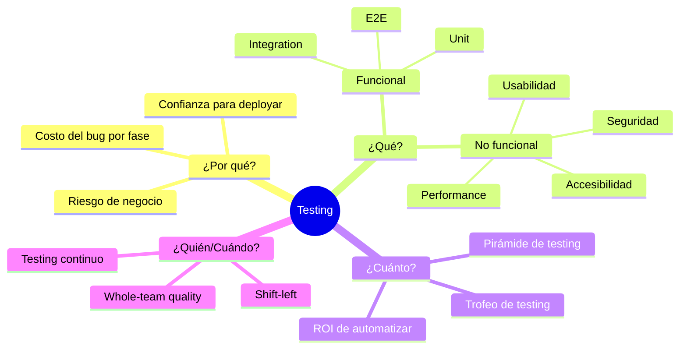
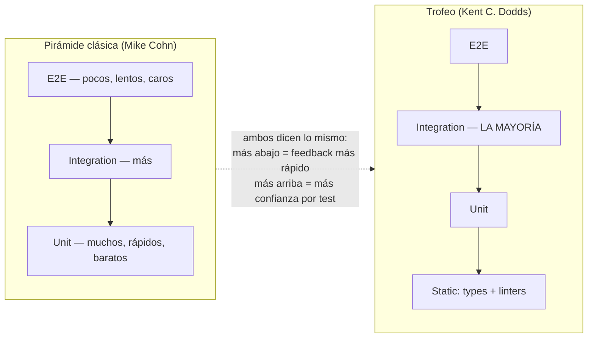

# Módulo 1 — Mentalidad de testing

> **Resultado:** un test plan de 1 página de Toolshop, priorizado por riesgo, que defenderías frente a un Engineering Manager.

## 🗺️ Mapa visual





## 📖 Concepto

### Testing es gestión de riesgo, no búsqueda de bugs

Un test no existe para "encontrar bugs": existe para **reducir la incertidumbre sobre si el sistema funciona** lo suficiente como para tomar una decisión (deployar, lanzar, mergear). De ahí se derivan las tres preguntas que un senior responde antes de escribir un solo test:

1. **¿Qué se rompe y a quién le duele?** → análisis de riesgo: `riesgo = probabilidad de fallo × impacto del fallo`. El checkout de una tienda tiene impacto crítico (pierde dinero directo); el footer, no.
2. **¿En qué capa pruebo esto?** → la regla práctica: prueba cada comportamiento **en la capa más baja donde puedas verificarlo con confianza**. La lógica de cálculo de descuentos → unit test. Que el descuento se aplique al pagar → E2E (uno, no veinte).
3. **¿Vale la pena automatizarlo?** → automatiza lo que se repite y es estable. El testing exploratorio humano no se reemplaza: se libera de lo repetitivo.

### Vocabulario que debes dominar (en inglés, porque así se entrevista)

| Término | Qué significa de verdad |
|---------|------------------------|
| **Regression testing** | Verificar que lo que funcionaba sigue funcionando tras un cambio |
| **Smoke test** | Subconjunto mínimo: "¿el sistema enciende?" — corre primero, siempre |
| **Sanity test** | Verificación rápida y enfocada de un cambio puntual |
| **Functional vs non-functional** | Qué hace el sistema vs qué tan bien lo hace (perf, seguridad, a11y) |
| **Black/white/grey box** | Sin conocer el código / conociéndolo / parcialmente |
| **Verification vs validation** | ¿Construimos bien el producto? vs ¿construimos el producto correcto? |
| **False positive / false negative** | Test falla sin bug real / test pasa habiendo bug. El primero erosiona confianza; el segundo es peligro silencioso |
| **Flaky test** | Pasa y falla sin cambios en el código. El cáncer de las suites E2E (lo atacamos en C2-M6) |
| **Test oracle** | El mecanismo que decide si el resultado es correcto. En IA esto se vuelve EL problema (Curso 3) |

### El costo del bug crece por fase

Un bug encontrado en diseño cuesta una conversación. En desarrollo, un fix. En QA, un ciclo. En producción, dinero + reputación + un incidente a las 3 a.m. **Shift-left** significa mover la detección lo más temprano posible: tipos estáticos, linters, unit tests, revisión de specs. Un SDET senior no es "el que prueba al final": es el que diseña el sistema para que los bugs no lleguen al final.

### Pirámide vs trofeo (y la respuesta de entrevista)

Ambos modelos dicen lo mismo con énfasis distinto: **maximiza el feedback rápido y barato; reserva los tests caros para lo que solo ellos pueden verificar.** El trofeo añade la base de análisis estático (TypeScript, ESLint) y privilegia los tests de integración porque dan el mejor balance confianza/costo en aplicaciones web modernas. En entrevista, la respuesta senior no es "uso la pirámide": es *"depende del perfil de riesgo del producto; te explico cómo lo decidiría para este sistema…"*.

## 🔨 Lab guiado — Test plan de Toolshop priorizado por riesgo

Vas a analizar Toolshop como lo harías en tu primera semana en un trabajo nuevo, y producir un test plan de 1 página.

**Paso 1 — Levanta el SUT (sistema bajo prueba).**

```bash
git clone https://github.com/testsmith-io/practice-software-testing.git
cd practice-software-testing
docker compose up -d
docker compose exec laravel-api php artisan migrate:fresh --seed
# UI: http://localhost:4200 — API: http://localhost:8091
# (si no puedes usar Docker: https://practicesoftwaretesting.com)
```

**Paso 2 — Tour de usuario (30 min, sin tomar notas técnicas todavía).** Usa la app como cliente: busca un producto, fíltralo por categoría, agrégalo al carrito, regístrate, completa una compra. Luego entra como admin (usuario `admin@practicesoftwaretesting.com`, password `welcome01`) y mira qué gestiona.

**Paso 3 — Inventario de funcionalidades.** Crea `labs/toolshop-tests/docs/test-plan.md` en este repo y lista TODO lo que la app hace, agrupado:

```markdown
## Inventario funcional de Toolshop
### Cliente
- Búsqueda y filtrado de productos (categoría, marca, precio, texto)
- Detalle de producto, productos relacionados
- Carrito (agregar, cambiar cantidad, eliminar)
- Checkout: login/registro → dirección → pago
- Cuenta: registro, login, perfil, historial, favoritos
- Devoluciones (rentals), contacto
### Admin
- CRUD de productos, marcas, categorías
- Gestión de usuarios, órdenes, mensajes de contacto
```

**Paso 4 — Matriz de riesgo.** Para cada grupo, asigna probabilidad de fallo (Alta/Media/Baja — ¿cuánta lógica tiene? ¿cuántas integraciones?) e impacto (¿qué pasa si falla en producción?). Agrégala al documento:

```markdown
## Matriz de riesgo
| Área | Probabilidad | Impacto | Riesgo | Por qué |
|------|--------------|---------|--------|---------|
| Checkout + pago | Alta (multi-paso, estado, integración) | Crítico (revenue directo) | 🔴 P1 | Si falla, la tienda no vende |
| Búsqueda/filtros | Media | Alto (descubrimiento de producto) | 🟠 P2 | ... |
| Registro/login | Media | Alto (bloquea todo lo demás) | 🟠 P2 | ... |
| Carrito | Media | Alto | 🟠 P2 | ... |
| CRUD admin | Baja | Medio (interno) | 🟡 P3 | ... |
| Contacto, favoritos | Baja | Bajo | 🟢 P4 | ... |
```

**Paso 5 — Decisión de capas.** Cierra el documento con la sección más importante — para las 3 áreas de mayor riesgo, decide QUÉ se prueba y EN QUÉ capa:

```markdown
## Estrategia por capa (top 3 riesgos)
### Checkout
- API: cálculo de totales, creación de orden, validaciones de stock → rápido, estable
- E2E (UNO solo): flujo completo búsqueda→carrito→pago como humo de revenue
- NO automatizar (por ahora): combinaciones de métodos de pago → exploratorio
```

**Paso 6 — Commit.**

```bash
cd ~/Documents/sdet-mastery && git add labs/toolshop-tests/docs/test-plan.md && git commit -m "C1-M1: test plan de Toolshop priorizado por riesgo"
```

## 🎯 Reto

Tu Engineering Manager te dice: *"Tenemos presupuesto para automatizar solo **10 tests** este trimestre. Elige cuáles."*

Agrega al test plan una sección `## Los 10 primeros tests` con: el test, la capa (API/UI/E2E), el riesgo que cubre y una frase de justificación. Restricción: **máximo 3 pueden ser E2E**. Si tu lista no incluye nada de búsqueda, justifica por qué.

## ✅ Checklist de dominio

- [ ] Puedo explicar la diferencia entre pirámide y trofeo, y cuándo cada modelo aplica mejor
- [ ] Puedo definir riesgo como probabilidad × impacto y usarlo para priorizar
- [ ] Puedo explicar por qué "probar en la capa más baja posible" ahorra dinero
- [ ] Puedo distinguir smoke, sanity y regression sin dudar
- [ ] Puedo explicar false positive vs false negative y cuál es más peligroso
- [ ] Sé qué es un test oracle (y por qué lo mencionaré de nuevo en el Curso 3)
- [ ] Mi test plan cabe en 1 página y un EM lo entendería sin contexto

## 💬 Preguntas de entrevista

1. *"How do you decide what to automate and what to leave to manual/exploratory testing?"*
2. *"Your E2E suite takes 2 hours. The team wants to ship 10 times a day. What do you do?"* (pista: redistribuir capas, no acelerar mágicamente)
3. *"What's the difference between verification and validation? Give an example of a product that passed verification but failed validation."*
4. *"Walk me through how you'd design a test strategy for a checkout flow from scratch."*
5. *"A test passes locally but the feature is broken in production. List every hypothesis you'd investigate."*

## 🔗 Conexiones

- **Refuerza:** nada — es la base de todo.
- **Se reutiliza en:** el test plan guía QUÉ automatizas en M4-M6; las técnicas de priorización vuelven formalizadas en M7; la estrategia por capas se convierte en quality gates en C2-M6 y en una test strategy completa en C2-M8; el concepto de *test oracle* es el corazón del problema en C3-S2 (LLM-as-a-judge): cuando el output es no-determinista, ¿quién decide qué es "correcto"?
