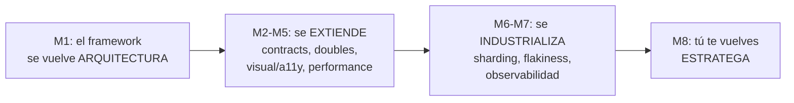

# Curso 2 — Profundizando

**Objetivo:** convertir tu suite del Curso 1 en un **framework de calidad industrial** — y convertirte a ti en alguien que puede diseñar, defender y liderar la estrategia de testing de una organización. Este es el curso que separa a un automation engineer de un **SDET senior**.

**Duración:** ~9 semanas a 10 h/semana. **Prerequisito:** Checkpoint 1 aprobado.

## Módulos

| # | Módulo | Resultado tangible |
|---|--------|--------------------|
| 1 | [Arquitectura de frameworks](modulo-01-arquitectura-frameworks.md) | Spine refactorizado a monorepo de paquetes |
| 2 | [Contract testing](modulo-02-contract-testing.md) | Contracts Pact consumer/provider funcionando |
| 3 | [Test doubles e integración](modulo-03-test-doubles.md) | UI testeada en aislamiento + DB en contenedor |
| 4 | [Visual regression + a11y](modulo-04-visual-a11y.md) | Capa visual y de accesibilidad en el spine |
| 5 | [Performance testing con k6](modulo-05-performance-k6.md) | Load tests con thresholds como quality gate |
| 6 | [CI/CD avanzado](modulo-06-cicd-avanzado.md) | Pipeline sharded con gestión de flakiness |
| 7 | [Observabilidad](modulo-07-observabilidad.md) | Framework instrumentado con OpenTelemetry |
| 8 | [Estrategia y liderazgo](modulo-08-estrategia-liderazgo.md) | Test strategy completa, defendible |
| ✓ | [Checkpoint](checkpoint-curso-2.md) | Defensa del framework estilo system design interview |

## El arco del curso

El Curso 1 te enseñó a escribir tests. El Curso 2 te enseña todo lo que rodea a los tests en una empresa grande: cómo escalan, cómo no se degradan, cómo se mide su valor y cómo se defiende su presupuesto. Cada módulo abre con un problema real que tu spine YA tiene — y lo resuelve.
