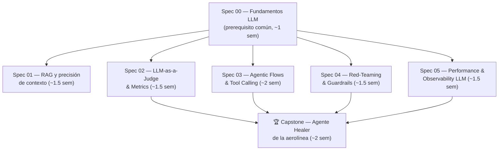

# Curso 3 — Especializaciones: Testing de Sistemas con IA

**Objetivo:** dominar el testing de sistemas construidos sobre LLMs — el territorio donde los SDETs senior se están diferenciando hoy. Al terminar puedes diseñar, construir y defender la estrategia de calidad de un producto con RAG, agentes y tool calling — y el capstone implementa una rebanada real de tu estrategia de la aerolínea.

**Prerequisito:** Cursos 1 y 2 (el spine project es el sistema bajo prueba y la herramienta de varios labs). **Stack:** Python + [uv](https://docs.astral.sh/uv/) en `labs/ai-evals/`; el spine TS sigue vivo como SUT.

## El cambio de paradigma en una frase

> En el software clásico, el mismo input produce el mismo output y el test oracle es un `expect`. En sistemas con LLMs, **el output es no-determinista y el oracle es el problema**: evaluar reemplaza a assertear, las distribuciones reemplazan a los casos, y la observabilidad deja de ser opcional.

Todo lo que aprendiste sigue valiendo (capas, riesgo, contratos, CI, observabilidad) — pero cada concepto necesita una traducción. Este curso ES esa traducción.

## Las especializaciones (estudiables por separado)



| Spec | Carpeta | Lo que dominas |
|------|---------|----------------|
| 00 | [spec-00-fundamentos-llm/](spec-00-fundamentos-llm/README.md) | Tokens, prompting, embeddings, structured output, tool use, por qué el no-determinismo cambia el testing |
| 01 | [spec-01-rag-y-contexto/](spec-01-rag-y-contexto/README.md) | Chunking, retrieval, métricas RAGAS, datasets de evaluación |
| 02 | [spec-02-llm-as-a-judge/](spec-02-llm-as-a-judge/README.md) | Evals deterministas vs model-graded, promptfoo, DeepEval, sesgos del juez, evals en CI |
| 03 | [spec-03-agentic-flows/](spec-03-agentic-flows/README.md) | Arquitecturas de agentes, tool calling, MCP, trajectory evals |
| 04 | [spec-04-red-teaming-guardrails/](spec-04-red-teaming-guardrails/README.md) | Prompt injection, OWASP LLM Top 10, garak/PyRIT, guardrails (testing defensivo de TU sistema) |
| 05 | [spec-05-performance-observability-llm/](spec-05-performance-observability-llm/README.md) | TTFT, tokens/s, costos, Langfuse, evals en producción |
| 🏆 | [capstone-aerolinea.md](capstone-aerolinea.md) | Integrarlo todo: el agente Healer con audit trail y human-in-the-loop |

**Órdenes sugeridos según tu objetivo:**
- *Entrevistas de QA + IA ya:* 00 → 02 → 03 → 04 (las preguntas más frecuentes hoy).
- *Construir el capstone completo:* 00 → 02 → 03 → 04 → 05 → 🏆 (01 es independiente del capstone).
- *Solo lo esencial:* 00 → 02 → 03.

## Setup del workspace Python (una vez)

```bash
cd ~/Documents/sdet-mastery/labs/ai-evals
uv init --python 3.12
uv add anthropic pytest python-dotenv
# tu API key de Anthropic (https://platform.claude.com) en .env — NUNCA en git:
echo "ANTHROPIC_API_KEY=sk-ant-..." > .env && echo ".env" >> .gitignore
uv run python -c "import anthropic; print('SDK ok:', anthropic.__version__)"
```

**Presupuesto:** los labs están diseñados para gastar poco (< USD $5-10 en total con uso normal): inputs cortos, `max_tokens` acotados y datasets pequeños. Cada lab indica su costo aproximado.
